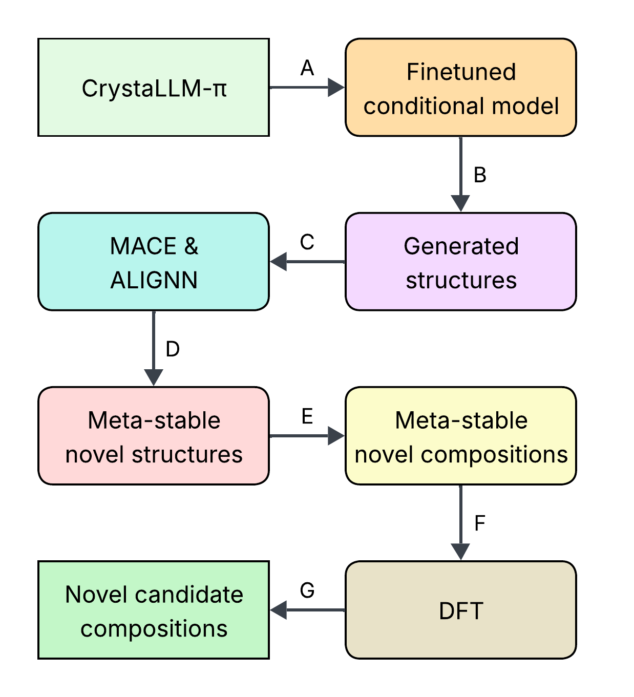
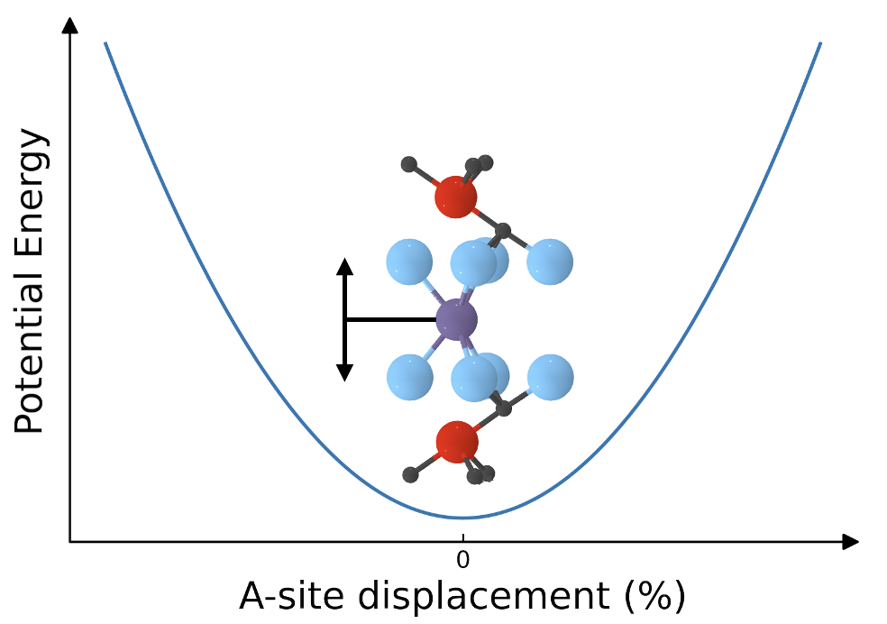
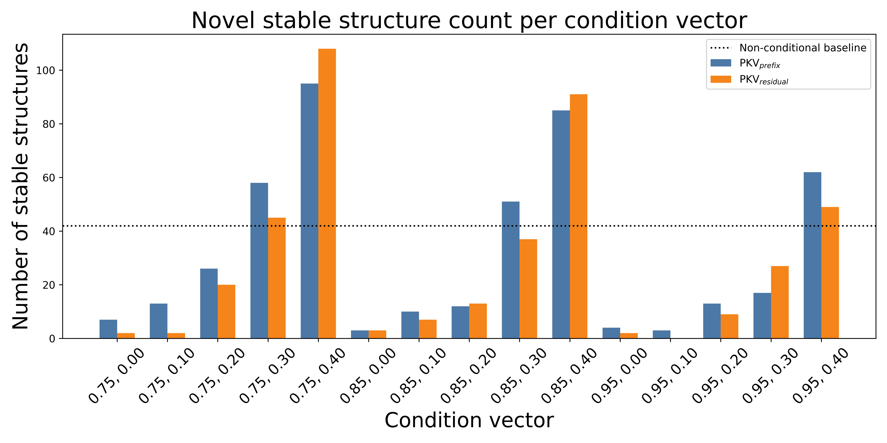
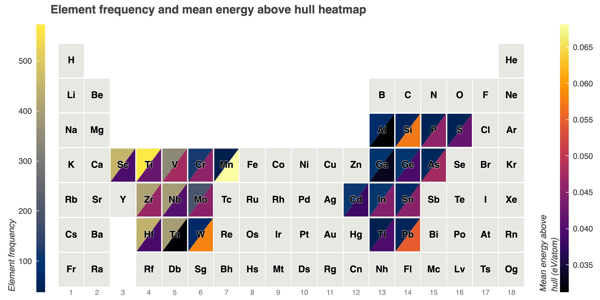

# 結晶構造を「言語」として生成する：条件付き大規模言語モデルによるMAXフェーズ逆設計

- 執筆日：2026-05-03
- トピック：条件付き生成モデルを用いたMAXフェーズ材料の逆設計と新規組成探索
- Computation and Theory / Inverse Design / Machine Learning / Surrogate Modeling
- 注目論文：Swain et al., "Conditional Generative Models Enable Targeted Exploration of MAX Phase Design Space", arXiv:2604.27709 (2026)
- 参照論文数：6

---

## 1. なぜ今この話題なのか

材料科学において「新しい機能を持つ材料を設計する」という行為は、長い間、直感と経験と膨大なコストを要する実験の繰り返しに依存してきた。第一原理計算（DFT）の普及によって候補材料の安定性評価が計算機上でできるようになったが、それでも探索空間の広大さがボトルネックであり続けている。たとえばMAXフェーズ（後述）という材料ファミリーだけでも、理論的な候補組成は数千から数万に上り、すべてをDFT計算で評価するのは現実的ではない。

こうした状況を一変させようとしているのが、機械学習を利用した「生成モデル」による材料設計だ。なかでも近年急速に注目を集めているのが、大規模言語モデル（Large Language Model、LLM）を結晶構造の生成に応用するアプローチである。言語モデルは本来テキストを扱うために設計されたが、結晶構造を記述するファイル形式であるCIF（Crystallographic Information File）も、ある種の「言語」として捉えることができる。原子種、座標、格子定数、空間群といった情報がテキスト形式で並ぶCIFは、文法と語彙を持つ構造化されたテキストだ。この洞察に基づき、2023年から2024年にかけて、CrystaLLMをはじめとするいくつかの研究グループがLLMを百万規模のCIFファイルで学習させ、新規結晶構造を「文章を書くように」生成するという手法を実証した。

しかしこれらの初期研究には一つの根本的な制約があった。それは「どんな材料でも生成できるが、狙った性質の材料を生成することは難しい」という点である。従来の生成モデルは「安定な構造を確率的に生成する」ことはできても、「MXene（後述）が得やすい組成」や「Aサイト結合が弱い構造」を意図的に生み出すことは苦手だった。これはちょうど、多様な文章を生成できる言語モデルが、「悲しい気持ちを伝える詩」を明示的に指定して書かせるには追加の工夫が必要なのと同じ状況だ。

2026年4月に投稿されたSwainら（ユニバーシティ・カレッジ・ロンドン）の論文は、この制約を正面から突破しようとする試みである。彼らはCrystaLLM-πと呼ばれる条件付き自己回帰モデルを6,179個のダブル遷移金属MAXフェーズのCIFで微調整し、「MXene誘導体の多い組成」と「Aサイトの結合エネルギーが弱い構造」という二つの化学的に意味のある条件ベクトルを注入することで、MXene前駆体として有望な新規組成を標的生成することに成功した。10件の新規候補のうち5件がDFT計算で熱力学的安定性（$E_\text{hull} < 0.050$ eV/atom）を示したという結果は、条件付き生成モデルが「闇雲な探索」から「意図を持った設計」へのパラダイムシフトを実現しうることを示している。

---

## 2. 未解決問題は何か

**問い①：巨大な組成空間をいかに効率的に探索するか**

MAXフェーズ一族のように化学式で記述される材料では、M（遷移金属）・A（13〜14族元素）・X（C、N、B）サイトの元素の組み合わせだけで理論上数千を超える三元化合物候補が存在する。さらにダブルMAXフェーズ（M・Aサイトに2種類の元素が入る）では爆発的に候補数が増える。すべてをDFT計算で評価するのは計算コストの観点から現実的でなく、どの候補を優先すべきかを事前に判断するための効率的な手法が求められている。生成モデルは「ランダムな候補」ではなく「安定性が期待される候補」を大量生成できるため、DFT計算の計算対象を事前に絞り込むフィルターとして機能する可能性がある。

**問い②：「条件付き生成」は本当に目標誘導になっているか**

条件付き生成モデルが出力する構造は、指定した条件を本当に満たす方向にシフトしているのか、それとも単にその条件と相関した既知の組成を再現しているだけなのか、という問いは未解決のままだ。生成物が「新規かつ安定」である割合が条件付きで向上したとしても、それが「条件を理解して設計した」結果なのか、「条件と相関したデータパターンを記憶した」だけなのかは、モデルの解釈可能性という観点から依然として曖昧である。

**問い③：生成した候補の実験合成可能性はいかに予測するか**

熱力学的安定性（$E_\text{hull}$）が低いことは合成可能性の必要条件の一つではあるが、十分条件ではない。動力学的障壁、合成温度や雰囲気依存性、前駆体の利用可能性など、実際の合成に影響する要因は熱力学だけでは捉えきれない。MXeneへの変換可能性は特に、Aサイト元素の選択的エッチング（化学的除去）のしやすさに強く依存しており、これを計算だけで精度よく予測するモデルはまだ確立されていない。

---

## 3. 注目論文の核心

### MAXフェーズとMXeneという舞台

本論文の対象であるMAXフェーズ（$\text{M}_{n+1}\text{AX}_n$）は、早期遷移金属M・主族元素A・非金属Xからなる積層セラミックス材料の一族で、金属的な電気伝導性と耐食性・高硬度を兼ね備えるという珍しい特性で知られる。核材料のコーティング、エネルギー貯蔵、触媒など幅広い応用が研究されており、2024年時点で342種類の組成が実験合成されている。

特に重要なのが、MAXフェーズがMXeneの前駆体として機能する点だ。MXene（$\text{M}_{n+1}\text{X}_n\text{T}_x$、Tは表面官能基）は、MAXフェーズのAサイト元素を選択的にエッチングして除去することで得られる二次元材料で、電磁シールド、エネルギー貯蔵、センサーなどで注目を集めている。つまり「どのMAXフェーズからMXeneが作れるか」を予測することは、MXene探索の鍵ともなる。しかし現在MXeneに変換可能と判明しているMAXフェーズは一部に過ぎず、その条件を明らかにすることが大きな課題となっている。

### CrystaLLM-πによるMAXフェーズの条件付き生成


*図1. CrystaLLM-πによる結晶構造生成ワークフロー。CIFを「テキスト」として扱い、条件ベクトルをアテンション機構に注入しながら自己回帰的に構造を生成する。(Swain et al., arXiv:2604.27709, CC BY 4.0)*

論文の核心的なアプローチは次の通りだ。まずCrystaLLM-πは、CIFファイルを「テキスト」として扱い、条件ベクトルをアテンション機構に直接注入することで条件付き生成を実現するモデル（詳細は後述）を、6,179個のダブル遷移金属MAXフェーズのデータセットで微調整（ファインチューニング）した。

条件として用いたのは二つの量だ。一つ目は**MXene誘導体カウント**：各MAXフェーズのM元素の組み合わせから得られうるMXene派生物の数を統計的に算出し、min-maxスケーリングで0〜1に正規化した。この値が大きいほど多様なMXeneを派生できる組成を意味する。二つ目は**Aサイト結合エネルギーサロゲート**：Aサイト原子層をc軸方向に±1%変位させてMACE（後述）でエネルギーを評価し、テイラー展開による曲率（力定数）を計算した。この曲率が小さいほどAサイトが「外れやすい」、つまりエッチングしやすいことを意味し、MXene合成に有利であると解釈できる。


*図2. Aサイト結合エネルギーサロゲートの計算概念図。c軸方向の微小変位に対するエネルギー曲率を有限差分展開で求める。(Swain et al., arXiv:2604.27709, CC BY 4.0)*

これら二つの条件ベクトルを組み合わせてモデルへ入力すると、「MXene誘導体数が多く、Aサイト結合が弱い」という化学的に意味のある標的に向けて生成が誘導される。

### 主要結果：条件付き生成は新規安定構造の発見率を2倍にする


*図3. 条件付き（CV=1.0/0.0）対無条件生成における新規安定構造の生成割合。特定の条件ベクトルが新規安定構造の発見率を約2倍に向上させた。(Swain et al., arXiv:2604.27709, CC BY 4.0)*

定量的な成果として、特定の条件ベクトル（MXene誘導体カウント最大＋Aサイト曲率最小を組み合わせた条件）では、新規安定構造の生成割合が無条件ベースラインと比べて約2倍に向上した。さらに組成的に既存データベースにない10件の候補を生成し、DFT計算（PBEレベル）で評価した結果、5件が$E_\text{hull} < 0.050$ eV/atomという熱力学的安定性基準を満たした。これは「生成モデルが単にデータを記憶しているだけでなく、化学空間の外挿が可能」であることを示唆する重要な結果だ。


*図4. 条件付き・無条件生成で出現する元素の周期表上の分布比較。条件付きではM・A・Xサイトの元素の選好が変化しており、モデルが化学的傾向を捉えていることを示す。(Swain et al., arXiv:2604.27709, CC BY 4.0)*

また副次的な知見として、MABフェーズ（XサイトにBを含むMAXフェーズの亜種）への低ショット適応実験も実施している。MABフェーズは探索の歴史が浅く、学習データが少ない（低ショット学習）にもかかわらず、CrystaLLM-πは未知の構造モチーフを生成し、それらもDFT計算で安定性が確認された。これは微調整済みモデルの汎化能力の高さを示している。

### 以前に何がわかっていたか、今回どこが前進したか

以前の研究では、CrystaLLM（無条件バージョン、2307.04340）が「条件なし」で多様な無機結晶構造をCIFとして生成できることが示されていたが、特定の材料系や性質を狙った生成は困難だった。また拡散モデル系（CDVAE等）は安定性の物理的バイアスを組み込んでいるが、特定の材料ファミリーへの特化や「意味のある条件」による誘導は実証が限られていた。

本研究の前進点は、①微調整によりMAXフェーズという特定材料系への特化を実現したこと、②化学的に解釈可能な条件（MXene誘導体数・Aサイト結合強度）を使ったこと、③DFT検証まで含めた完全なパイプラインを実証したこと、の三点に集約される。一方で、生成された候補の「実験合成可能性」はまだ仮説段階であり、実際にMXeneが得られるかどうかの実験的検証は今後の課題として残されている。

---

## 4. 背景と研究史

### 結晶構造生成モデルの系譜

生成モデルによる結晶構造探索の歴史は、2022年前後から急速に発展した。代表的な初期研究であるCDVAE（Crystal Diffusion Variational Autoencoder、arXiv:2110.06197）は、変分自己符号化器（VAE）と拡散過程を組み合わせ、原子種と座標の同時ノイズ除去によって材料を生成する。この手法は結晶の平行移動・回転・置換対称性を明示的に組み込んだ等変モデルであり、物理的整合性の高い構造を生成できる一方、多様な元素の組み合わせを扱う際のスケーラビリティに限界があった。

この問題を異なる角度から解決しようとしたのが、Gruverら（arXiv:2402.04379、ICLR 2024）だ。彼らはLLaMA-2（70Bパラメータ）をCIFファイルでファインチューニングすることで、安定無機材料を生成する手法を提案した。最強モデルは約49%の構造でメタ安定性が予測され、CDVAEの28%を大きく上回ることを示した。この研究は「LLMは結晶化学の『世界モデル』を学習できる」という仮説の最初の大規模検証であり、テキストとしての柔軟性（条件付き生成、部分構造補完、元素インフィリング）もデモンストレーションされた。

一方でMicrosoftのMatterGen（arXiv:2312.03687、Nature 2025）は、拡散モデルの路線で重要な前進を遂げた。MatterGenは元素種・座標・格子を同時にノイズ除去する等変スコアネットワークを周期表全体をカバーする大規模データで事前学習し、さらに化学組成・対称性・機械的・電子的・磁気的性質など多様な制約でファインチューニングすることで、性質指定の材料生成を実現した。生成構造の2倍以上が新規かつ安定であり（従来手法比）、DFT最適化後のエネルギーも既存手法の10倍近くローカルミニマムに近いという定量的優位を示している。

### CrystaLLMの登場とMAXフェーズへの展開

LLMアプローチの体系化に最も大きな貢献をしたのが、Antunes、Butler、Grau-Crespo（UCL）によるCrystaLLMシリーズだ。2023年に投稿されたCrystaLLM（arXiv:2307.04340）は、数百万件のCIFファイルで事前学習したデコーダー型トランスフォーマーモデルで、与えられた元素組成から結晶構造を自己回帰的に生成する能力を実証した。モンテカルロ木探索（MCTS）と生成エネルギー予測モデルを組み合わせることで生成品質を向上させる仕組みも導入されており、生成される構造の物理的妥当性は第一原理計算でも確認されている。

しかし無条件CrystaLLMには「どの性質の材料を生成するか」を制御する仕組みがなかった。これを解決したのがBoneら（arXiv:2511.21299）によるCrystaLLM-πだ。この手法では、連続値の性質ベクトルをトランスフォーマーのアテンション機構に直接注入するPKV（Property-Key-Value）アテンションという新しいアーキテクチャが導入された。CIFをテキストとして扱う自己回帰生成の枠組みはそのままに、性質ベクトルが各アテンション層の「キー」と「バリュー」に加算されることで、生成プロセスが指定した性質の方向へ誘導される。CrystaLLM-πは、太陽電池用光吸収材料の探索（バンドギャップ最適化）や粉末X線回折パターンからの構造回復といった多様なタスクで有効性が検証されており、本研究（2604.27709）はこのCrystaLLM-πをMAXフェーズに特化したファインチューニングとして位置づけられる。

### 材料探索アプローチの多様化

注目論文とは別のアプローチとして、Bastoneroら（arXiv:2604.25756）によるベイズ能動学習フレームワークも2026年4月に登場した。彼らはオンザフライで第一原理ポテンシャルを学習する確率的自己無撞着調和近似（SSCHA）とベイズ推論を組み合わせ、CsPbI₃ペロフスカイトの相転移温度を数十件のDFT計算で精密に予測することに成功した。このアプローチはCrystaLLMとは全く異なる「最小計算コストで自由エネルギー計算を行う」という方向性で材料設計の計算効率化を狙うものだ。両アプローチは相補的であり、CrystaLLM系が「広い化学空間から候補を生成する」段階に強みを発揮するとすれば、ベイズ能動学習は「絞り込まれた候補の熱力学的安定性を精密評価する」段階で威力を発揮する。

---

## 5. どの解釈が最も妥当か

### 条件付け効果の実体：統計的相関か、真の制御か

本研究の最も重要な問いは「条件ベクトルによる誘導は、真に目標の性質を持つ新規構造を生み出しているのか」である。観察された事実は、特定の条件ベクトルを設定することで**新規安定構造の生成割合が約2倍に向上した**というものだ。これは統計的には有意な向上であり、条件付けが効いていることは疑いない。

しかし「条件付けが効く」には二つの異なるメカニズムが考えられる。一つは「モデルが条件と構造の関係を本当に学習した」という解釈で、もう一つは「条件と相関した既存データの分布を再現した」という解釈だ。著者らは10件の新規組成（学習データに含まれない組成）でDFT安定性を確認しており、単純なデータ再現を超えた汎化能力の存在を示す証拠となっている。一方で、生成物が真に「条件を満たす設計」になっているか（例えば、MXene誘導体カウントが高い条件で生成した構造のMXene変換可能性）の実験的検証は今後に残されており、現段階では解釈に慎重さが求められる。

### 拡散モデルとLLMアプローチの比較

MatterGen（拡散モデル）とCrystaLLM-π（LLM）を比較すると、両者にはトレードオフが見える。拡散モデルは等変性という物理的対称性を明示的に組み込んでいるため、生成される構造が物理的に整合した座標を持ちやすい。一方でLLMアプローチは、CIFというテキスト表現を通じてデータ全体の文脈（元素の電気陰性度、典型的な結合距離、空間群の統計など）を暗黙的に学習しており、特定の材料系へのドメイン特化（ファインチューニング）が容易だ。MAXフェーズという高度にドメイン特化した材料ファミリーを対象とする本研究では、LLMアプローチが優位性を発揮しやすい状況にある。

ただし注意すべき点として、CrystaLLM-πはDFTレベルの検証を必要としており、生成後のスクリーニングコストを考慮した全体の効率は、MACE等の機械学習ポテンシャルを一次フィルターとして使うことで大きく向上できる。実際に本研究でもMACEによる一次評価後にDFT計算を実施するというパイプラインを採用しており、計算コストを現実的な範囲に抑えている。

### 強く支持される結論と、まだ弱い結論

**強く支持される結論**：(1) LLMのファインチューニングはMAXフェーズという複雑な化学系にも有効であり、学習データに含まれない組成を生成できる。(2) 条件付き生成は無条件生成に比べて新規安定構造の発見率を定量的に向上させる。(3) MABフェーズへの低ショット適応は、少数データ体制でも意味のある生成が可能であることを示す。

**まだ弱い結論**：(1) 生成された構造が実際にMXeneへ変換可能かどうかは未検証。(2) 条件が「Aサイト結合エネルギーのサロゲート」として本当に適切かどうかの独立した検証がない。(3) 5/10という安定性確認率が、ランダム生成と比較してどの程度改善しているかのベースライン比較が限定的。

---

## 6. 何が一般化できるのか

### 他の材料系への展開

本研究のアプローチはMAXフェーズ固有の手法ではなく、「特定の材料ファミリーをCIFで微調整し、その材料系に意味のある物理量を条件として注入する」という汎用的なフレームワークである。条件ベクトルとして用いる物理量さえ適切に設計できれば、ペロフスカイト（バンドギャップ、相転移温度）、ゼオライト（細孔径）、合金（生成エンタルピー、弾性係数）など、多様な材料系に展開できる。

特に、合成が困難だが有望な二次元材料（MXene以外のMBene、ニオビウムカルバイドなど）の前駆体探索、あるいは固体電解質（リチウムイオン電池用）の候補探索など、「合成ルートが限られるが応用価値が高い材料系」においてこのアプローチは特に価値を発揮すると考えられる。

### 材料インフォマティクスのパラダイム転換への示唆

今回の研究は、材料インフォマティクスにおける二つの重要なパラダイム転換を体現している。一つ目は「データベース検索からジェネレーション（生成）へ」の転換：従来は既存データベース（Materials Project、AFLOWlib等）に含まれる材料を検索・分類することが主流だったが、生成モデルはデータベース外の未知組成も探索できる。二つ目は「フォワード予測からインバース設計へ」の転換：「この材料の性質は？」と問うのではなく、「この性質の材料を生成せよ」という問い方への移行であり、CrystaLLM-πの条件付き生成はまさにこの逆設計（インバースデザイン）の実践だ。

一方で現時点の限界として、生成モデルはまだ「なぜその構造が安定なのか」という物理的因果関係の説明ができない。解釈可能性の欠如は、材料科学者が新規生成物を信頼し、次の実験設計に活かすうえでの障壁となっている。生成モデルと説明可能AI（XAI）を組み合わせる研究は今後の重要な方向性だろう。

---

## 7. 基礎から理解する

### 結晶構造とCIFファイル：「言語」としての結晶

結晶は原子が周期的に並んだ固体だ。この周期的配列は**格子**（lattice）と**基底**（basis）という二つの情報で記述される。格子は三次元空間における繰り返し単位（**単位格子**）の形を定義し、格子定数（$a, b, c$）と格子角（$\alpha, \beta, \gamma$）という6つのパラメータで表現される。基底は、単位格子内の原子種と位置（分率座標で表す）の情報だ。

さらに結晶は**空間群**（space group）という対称性によって分類される。空間群は点群操作（回転・反転）と並進操作を組み合わせたもので、結晶学では230種類が存在する。この空間群の情報は、「等価位置」（Wyckoff位置）と呼ばれる対称性で結ばれた原子位置の組を定義する。例えば、ある原子が特定のWyckoff位置に座れば、対称性操作によって等価な位置にも自動的に原子が配置される。

CIF（Crystallographic Information File）はこれらの情報をテキスト形式で記述した標準フォーマットだ。

```
_cell_length_a   3.08
_cell_length_b   3.08
_cell_length_c   18.70
_symmetry_space_group_name_H-M  'P 63/m m c'
loop_
  _atom_site_label
  _atom_site_type_symbol
  _atom_site_fract_x
  _atom_site_fract_y
  _atom_site_fract_z
  Ti1  Ti  0.33333  0.66667  0.08500
  Al1  Al  0.33333  0.66667  0.25000
  C1   C   0.00000  0.00000  0.00000
```

このようにCIFは数値と文字列が決まった規則で並ぶ「言語」的構造を持っている。LLMはまさにこの「文法」を学習することで、有効なCIFを生成できるようになる。

### MAXフェーズの結晶構造

MAXフェーズ $\text{M}_{n+1}\text{AX}_n$ は六方晶系（P6₃/mmc空間群）の層状構造を持つ。$n=1$の場合（211相）では、[M₂X]層と[A]単原子層が交互に積層した構造となり、M原子はXを取り囲む八面体配位を形成する一方、A原子はMとより弱い共有結合性の結合を形成している。この「強い共有結合層（M-X）と弱い結合層（M-A）の交互積層」という構造的特徴が、セラミックス的な硬さと金属的な延性を同時に持つという特異な物性の起源となっている。

MXeneは、このMAXフェーズのAサイト元素（通常Al）を選択的化学エッチング（HF溶液処理等）で除去することで得られる二次元材料だ。エッチング後の表面には-OH、-O、-Fなどの官能基（$\text{T}_x$）が付着する。最も研究されているMXeneはTi₃C₂T_x（Ti₃AlC₂からAlを除去）で、高い電気伝導性と親水的な表面化学が電磁シールドやエネルギー貯蔵への応用を可能にしている。

### 大規模言語モデルの仕組み：トランスフォーマーと自己回帰生成

LLMの根幹をなすのが**トランスフォーマーアーキテクチャ**だ。トランスフォーマーは、入力列の各トークン（単語や文字などの最小単位）間の関係を**アテンション機構**（attention mechanism）を通じて学習する。

アテンション機構の本質は、「クエリ（Q）」・「キー（K）」・「バリュー（V）」という三つのベクトルを使った加重和だ。ある位置のトークンが他のどの位置のトークンと「関連しているか」を、QとKの内積から計算される注目スコアで重み付けし、Vの加重和を取る：

$$\text{Attention}(Q, K, V) = \text{softmax}\left(\frac{QK^\top}{\sqrt{d_k}}\right) V$$

ここで $d_k$ はキーの次元数で、内積のスケールを調整するための正規化因子だ。この操作が複数のヘッドで並列に行われる（マルチヘッドアテンション）ことで、モデルは局所的・大局的な多様な依存関係を同時に学習できる。

**デコーダー専用のトランスフォーマー**（GPT系）は、前の全トークンを条件として次のトークンを予測するという**自己回帰生成**（autoregressive generation）を行う。CIFのコンテキストで言えば、「これまでの格子定数・空間群・原子位置情報」を条件に、「次に来るべきトークン（数値や元素記号）」の確率分布を学習する。学習された確率分布からサンプリングすることで、新規のCIF文字列＝新規の結晶構造が生成される。

### 条件付き生成：PKVアテンション

CrystaLLM-πで採用されたPKV（Property-Key-Value）アテンションは、通常のアテンション機構に性質ベクトルを「追加のキーとバリュー」として注入する手法だ。具体的には、性質ベクトル $\mathbf{p}$ を線形変換して $K_\text{prop}$ と $V_\text{prop}$ を得て、これを通常のKとVに付加した拡張アテンションを計算する。

この方法には重要な利点がある。性質ベクトルは連続値（実数）として扱えるため、離散トークン化（整数的な量子化）による情報損失がない。また性質ベクトルは「追加情報」として注入されるため、事前学習で獲得した知識を破壊するカタストロフィック忘却（catastrophic forgetting）が起きにくい。CrystaLLM-πを開発したBoneらの検証では、この特性が特に少数データ（低ショット）条件で有効であることが示されている。

### ファインチューニングとドメイン適応

汎用LLMを特定の材料系に適応させる際に使われるのが**ファインチューニング**（fine-tuning）だ。事前学習で獲得した一般的な言語知識（文法・語彙）を保ちながら、ターゲットドメインのデータ（ここではMAXフェーズのCIF）でモデルの重みを微調整する。ファインチューニングによって、モデルはMAXフェーズに特有の傾向（Mサイトに多い元素の種類、Aサイトに来る元素の傾向、格子定数の統計的分布など）を内面化する。

この過程は、「英語で書かれた広大なテキストで学習した言語モデルを、医学論文だけで追加学習することで医学的文書の生成能力を向上させる」ことと概念的に同じだ。ただし過度のファインチューニングは「元の知識を忘れる」カタストロフィック忘却を引き起こすリスクがあり、PKVアテンションはこのリスクを低減するよう設計されている。

### 熱力学的安定性とコンベックスハル

生成した候補構造の安定性評価に使われるのが**コンベックスハル**（凸包、convex hull）だ。二元系（A-B）を例に取ると、様々な組成比（$x$ of $A_{1-x}B_x$）に対して全エネルギーをプロットしたとき、その凸包（最も安定な端点を結ぶ凸型の下界）より上にある構造は、より安定な別の構造の混合物に分解することで熱力学的に有利になる。

**ハル上のエネルギー**（$E_\text{hull}$、energy above convex hull）は、ある構造が凸包よりどれだけ上にあるかを示す量で、

$$E_\text{hull} = E_\text{structure}/\text{atom} - E_\text{convex hull}/\text{atom}$$

として定義される。$E_\text{hull} = 0$ は凸包上（熱力学的に安定）、$E_\text{hull} > 0$ は準安定または不安定を意味する。本研究では$E_\text{hull} < 0.050$ eV/atomを安定性の基準としているが、これは実験合成された実際の材料でも少量の準安定相が観測されることを考慮したやや緩い基準であり、工学的に現実的なしきい値と解釈できる。

---

## 8. 専門用語の解説

**MAXフェーズ（MAX phase）** : $\text{M}_{n+1}\text{AX}_n$ （M：早期遷移金属、A：主族元素、X：C/N/B）という化学式で表される積層セラミックス材料群。六方晶系の層状構造を持ち、高い電気伝導性・熱伝導性・耐食性・機械的強度を兼ね備える。2018年以降急速に新規組成が発見されており、現在342種類が実験合成されている。本研究では「MXene前駆体として有望なMAXフェーズを設計する」という文脈で中心的な役割を担う。

**MXene（エムキシーン）** : MAXフェーズのAサイト元素を選択的化学エッチングで除去して得られる二次元材料（$\text{M}_{n+1}\text{X}_n\text{T}_x$）。高い電気伝導性と親水性を持ち、電磁シールド・エネルギー貯蔵・センシングなどへの応用が盛んに研究されている。Ti₃C₂T_xが最も代表的。本研究では「どのMAXフェーズからMXeneが得やすいか」を条件として設計に組み込んでいる点が重要だ。

**CIF（Crystallographic Information File、結晶学情報ファイル）** : 結晶構造の情報（格子定数、空間群、原子の種類と分率座標）をテキスト形式で記述した標準フォーマット。CrystaLLMはこのCIFを「テキスト言語」として扱い、LLMで学習・生成する。CIFの「文法」には物理的制約（分率座標は0〜1、格子定数は正の実数など）が暗黙的に含まれており、LLMが正しい構文を学習することが有効な構造生成の前提となる。

**自己回帰モデル（autoregressive model）** : 過去のトークン列を条件として次のトークンを予測するモデル。GPTやCrystaLLMはこの方式を採用し、格子定数の数値→空間群→原子種→座標という順でCIFトークンを一つずつ生成する。生成は確率的サンプリングによって行われるため、同じ入力条件でも毎回異なる構造が生成される。この確率的な多様性が、探索における新規性の源泉となる。

**ファインチューニング（fine-tuning）** : 大量の汎用データで事前学習したモデルを、特定ドメインの少量データで追加学習することで、そのドメインへの適応を図る手法。本研究では汎用CIF約200万件で学習したCrystaLLMを、6,179件のMAXフェーズCIFで微調整している。事前学習で獲得した「結晶化学の文法」を保ちつつ、MAXフェーズ固有の傾向（Mサイト元素の選好、格子定数の範囲など）を追加で内面化できる。

**コンベックスハル／$E_\text{hull}$（エネルギーハル）** : 多成分系における熱力学的安定性の評価指標。組成-エネルギー空間における凸包（convex hull）からのエネルギー距離で定義され、$E_\text{hull} = 0$ が熱力学的に安定、値が大きいほど不安定。本研究では$E_\text{hull} < 0.050$ eV/atomを合成可能性の目安として採用。この閾値は実験的に合成されたが準安定な材料の典型的な範囲を参考に設定されている。

**MACE（Message Passing Atomic Cluster Expansion）** : グラフニューラルネットワーク（GNN）と原子クラスター展開（ACE）を組み合わせた機械学習原子間ポテンシャル（MLIP）。DFT精度の原子間力計算をDFTより何桁も高速に実行できる。本研究ではDFT計算の前段スクリーニングとして使用され、生成構造の一次安定性評価とAサイト曲率計算に使われている。汎用モデルMACE-MP-0は元素周期表全体をカバーする。

**PKVアテンション（Property-Key-Value attention）** : CrystaLLM-πで採用された条件付き生成機構。性質ベクトルを線形変換してアテンション機構のキー（K）とバリュー（V）に付加することで、生成プロセスに継続的に条件を注入する。従来のプロンプトベースの条件付け（テキストとして条件を前置）と比べて、連続値の性質を高精度で制御でき、事前学習知識の破壊（カタストロフィック忘却）を避けやすい。

**インバースデザイン（逆設計）** : 材料の設計において、「性質→構造」という方向で解を求める手法。通常の「フォワード」設計（構造を与えて性質を予測）の逆である。条件付き生成モデルはインバースデザインのための強力なツールで、「バンドギャップが1.5 eVの太陽電池材料を生成せよ」のような要求を直接満たす候補を提示できる。材料探索の効率を飛躍的に向上させる可能性があるが、「設計した性質が本当に実現されているか」の実験検証が不可欠。

**等変性（equivariance）** : 入力の変換（例えば回転・並進）に対して、出力が同じ変換を受けるという性質。結晶構造の生成では、原子座標の回転に対して予測される構造も同じように回転すべきという物理的制約を意味する。MatterGenなど拡散モデル系はこの等変性を明示的に設計に組み込んでいる（E(3)-等変ネットワーク）。CIFベースのLLM系ではこの制約は暗黙的な学習に委ねられており、これが両アプローチの物理的整合性の差の一因となっている。

**低ショット学習（low-shot learning）** : 少数のサンプル（例えば数十〜百件程度）から学習する能力。本研究のMABフェーズ実験では、大量のMAXフェーズ学習データで微調整済みのモデルを、少量のMABフェーズデータで追加適応させるという低ショット設定が試された。事前学習とファインチューニングの組み合わせがあるからこそ可能な能力であり、探索データが少ない未開拓材料系への展開可能性を示す。

---

## 9. 今後の展望

条件付き生成モデルによるMAXフェーズ探索の分野は、いくつかの点でかなり確からしい状況になってきている。LLMが百万規模のCIFを学習することで結晶化学の文法と傾向を内面化し、特定材料系へのファインチューニングによってドメイン知識を効果的に付加できることは、複数の独立した研究で裏付けられている。また、MACEのような汎用MLIPとの組み合わせによって、DFT計算の前段スクリーニングを大幅に効率化できることも実証されつつある。本研究が示した「条件付き生成が新規安定構造の発見率を2倍にする」という知見は、逆設計アプローチの実用性を示す重要な一歩だ。

一方で未確定な問題も多く残されている。最大の問いは、計算で安定性が予測された候補が実際に合成できるかどうかだ。DFT安定性は必要条件に過ぎず、実際のMAXフェーズ合成（通常は高温焼結）には動力学的因子が大きく影響する。さらにMXeneへの変換可能性（エッチング収率、表面官能基の制御）は計算だけでは予測が難しい。今後1〜3年で特に注目すべき論点は、(1) 生成された新規MAXフェーズ候補の実験合成報告、(2) 条件付き生成モデルと実験フィードバックを組み合わせた「自律的材料探索ループ」（autonomous laboratory）の構築、(3) MAXフェーズ以外のより複雑な多成分系（ハイエントロピー合金、ペロフスカイト酸窒化物など）への展開、(4) 生成モデルの解釈可能性向上（なぜその組成が安定か）だろう。生成AIと実験合成の緊密な連携によって、材料発見のサイクルタイムが数年から数ヶ月へと短縮される時代が、すでに視野に入ってきている。

---

## 参考論文一覧

1. **[arXiv:2604.27709]** Swain J, Bone C, Darby MT, Galloway E, Butler KT, "Conditional Generative Models Enable Targeted Exploration of MAX Phase Design Space", 2026. https://arxiv.org/abs/2604.27709
   *注目論文。CrystaLLM-πをMAXフェーズにファインチューニングし、MXene誘導体数とAサイト結合強度を条件として新規組成を標的生成した研究。*

2. **[arXiv:2307.04340]** Antunes LM, Butler KT, Grau-Crespo R, "Crystal Structure Generation with Autoregressive Large Language Modeling", Nature Communications 15, 10570 (2024). https://arxiv.org/abs/2307.04340
   *CrystaLLMの原著論文。CIFをテキストとして扱いLLMで無条件な結晶構造生成を実現した先駆的研究。*

3. **[arXiv:2511.21299]** Bone C et al., "Discovery and recovery of crystalline materials with property-conditioned transformers", 2025. https://arxiv.org/abs/2511.21299
   *CrystaLLM-πの方法論論文。PKVアテンション機構を導入した条件付き生成フレームワークを提案し、光起電力材料探索と回折パターンからの構造回復に応用した。*

4. **[arXiv:2312.03687]** Zeni C et al., "MatterGen: a generative model for inorganic materials design", Nature 637, 357–363 (2025). https://arxiv.org/abs/2312.03687
   *拡散モデルアプローチによる汎用材料生成モデル。元素種・座標・格子を同時にノイズ除去する等変ネットワークで、多様な性質制約に対応したインバースデザインを実現。*

5. **[arXiv:2110.06197]** Xie T, Fu X, Ganea O-E, Barzilay R, Jaakkola T, "Crystal Diffusion Variational Autoencoder for Periodic Material Generation", ICLR 2022. https://arxiv.org/abs/2110.06197
   *CDVAE。材料安定性の物理的バイアスを組み込んだ拡散VAEモデルで、周期境界条件と対称性を明示的に扱う先駆的な結晶生成モデル。*

6. **[arXiv:2604.25756]** Bastonero L et al., "Predicting challenging phase transitions with Bayesian active learning", 2026. https://arxiv.org/abs/2604.25756
   *ベイズ能動学習によるオンザフライ第一原理ポテンシャル学習。少数DFT計算でCsPbI₃の相転移温度を精密予測した、生成モデルとは異なるアプローチによる材料計算効率化。*
