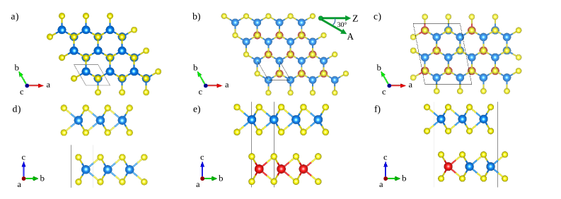
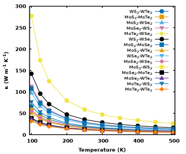
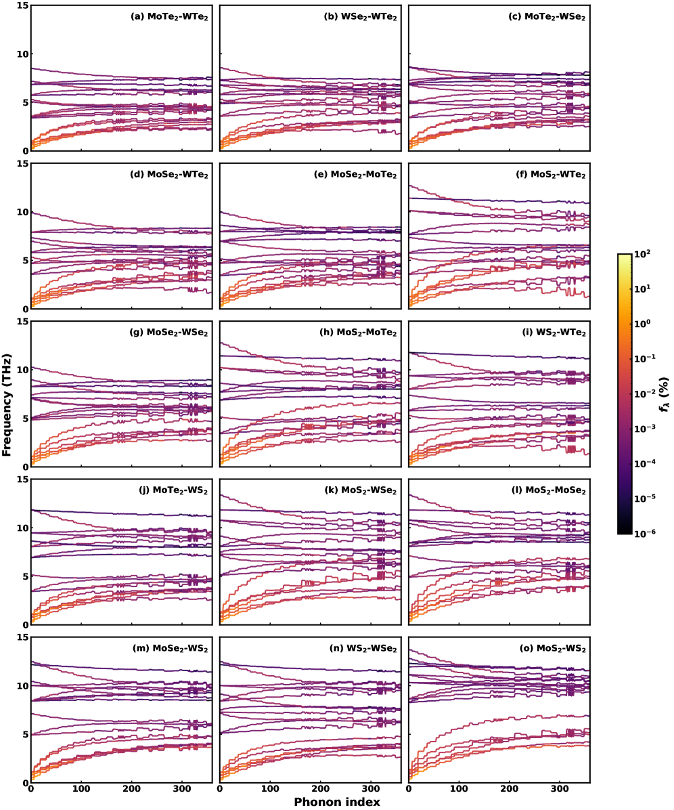
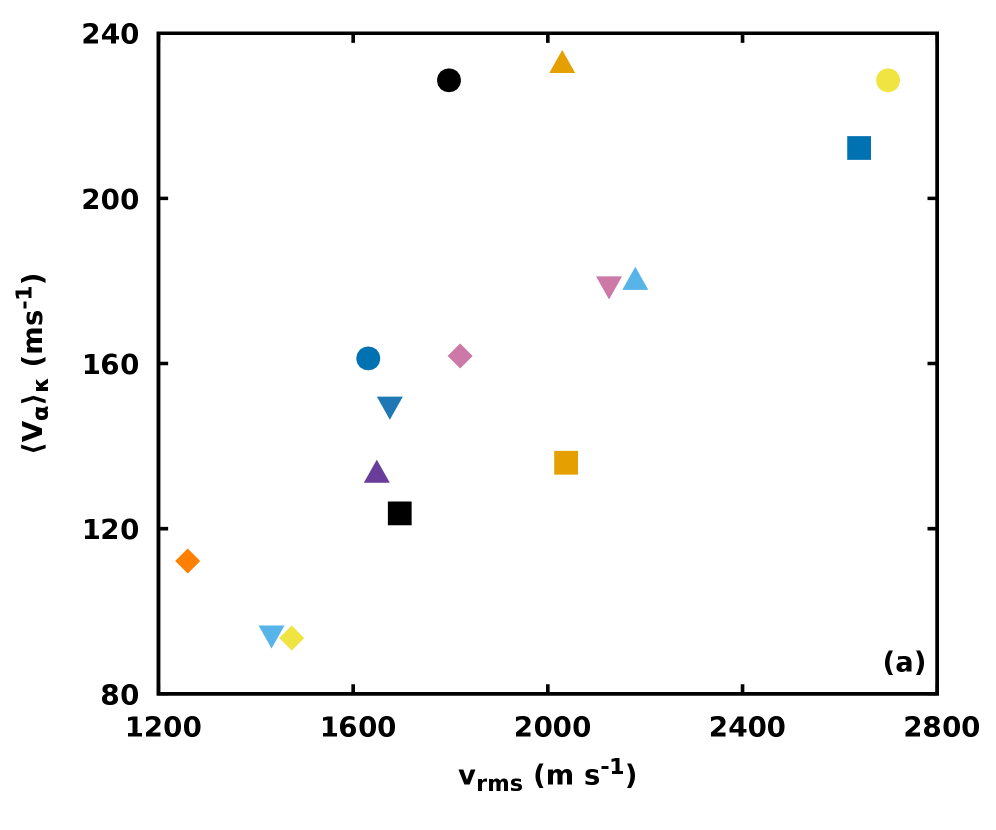

# 格子熱伝導率の大きさと方向を同時に制御する：TMDヘテロ二層膜のリラクソン解析

- 執筆日：2026-05-02
- トピック：遷移金属ダイカルコゲナイドヘテロ二層膜における格子熱伝導率の大きさ・方向制御とリラクソン描像
- Phonons and Thermal Properties / Thermal Transport; Low-Dimensional Materials / First-Principles Calculations
- 注目論文：arXiv:2604.25576
- 参照論文数：7

---

## 1. なぜ今この話題なのか

半導体デバイスやエネルギー変換素子の高性能化が進むにつれ、材料の「熱をどこへ・どれくらい流すか」を精密に制御したいという要求が強まっている。高集積回路では局所的な発熱がデバイス寿命を縮める主因であり、熱電変換素子では材料内部の温度勾配を大きく保つほど変換効率が上がる。いずれの用途でも、熱伝導率を狙った値に設定する「熱設計」が材料工学の中心課題となりつつある。

この文脈でとりわけ注目されているのが、二次元（2D）ファンデルワールス（vdW）積層材料である。単層や二層程度の薄さでありながら、積層する素材の組み合わせ・ドーピング・ツイスト角など多彩なパラメータで物性を連続的に変えられるため、「組成設計」によって熱伝導率を広い範囲でチューニングできる可能性がある。なかでも**遷移金属ダイカルコゲナイド（TMD; Transition Metal Dichalcogenide）** は、MoS2・WS2・MoSe2・WSe2 など多様な組み合わせが存在し、単層・ヘテロ積層を通じて機械的・光学的・電子的・熱的性質を幅広く制御できる優れた素材群として研究が加速している。

これまでの研究は TMD の熱伝導率の「大きさ」を支配する因子の特定に主眼を置いてきた。しかし 2D 材料では平面内に結晶対称性の低い構造が現れうるため、熱伝導率が方向によって異なる**異方性** が生じる可能性もある。特に合金・ドーピング・モアレ構造のような非整合積層では対称性が破れやすく、熱流の方向依存性が材料設計の新しい自由度になりうる。

2026年4月末に arXiv に投稿された Perviz & Cammarata（チェコ工科大）の論文（arXiv:2604.25576）は、この問いに正面から取り組んだ。彼らは 15 種類の pristine TMD ヘテロ二層膜と W ドープ系を第一原理で系統的に解析し、格子熱伝導率（LTC; Lattice Thermal Conductivity）の大きさを決める記述子を**リラクソン（relaxon）理論** を使って明示化しただけでなく、W ドープによって熱流の「方向」まで温度や濃度で連続的に制御できる可能性を初めて定量的に示した。

---

## 2. 未解決問題は何か

この研究が向き合う本質的な問いは、大きく三つに整理できる。

**問い①：2D vdW ヘテロ構造の LTC は何で決まるのか？**

単層 TMD の熱伝導率は実験・計算ともに精力的に調べられてきたが、異種材料を積層したヘテロ二層膜では各層のフォノンスペクトルが干渉し合い、輸送特性が単純な「平均値」に収まらない。層間van der Waals 結合を介したフォノンのカップリング、層局在モードの形成、フォノン散乱の増強と抑制が複雑に絡み合い、"どのミクロ機構が LTC を支配しているか"が明確でなかった。

**問い②：通常のフォノン緩和時間近似（RTA）は 2D 材料で信頼できるか？**

実験・シミュレーション分野では長年、RTA（Relaxation Time Approximation; 緩和時間近似）に基づく計算が主流であった。しかし二次元材料では法線散乱（Normal scattering; N 散乱）の寄与が大きく、ウムクラップ散乱（Umklapp scattering; U 散乱）だけを熱抵抗源とみなす RTA が過大評価・過小評価を招くことが指摘されている。フォノンの集団的・流体力学的な輸送を正確に捉えるには、ボルツマン輸送方程式（BTE）の厳密解が必要であるが、計算コストが高く系統的な適用は限られていた。

**問い③：熱流の「方向」は 2D 材料で制御できるか？**

金属や三次元合金では熱伝導率が等方的になることが多く、方向制御は特殊な多結晶・複合材料設計に限られてきた。2D 結晶では内面的な異方性があり得るが、TMD ヘテロ積層やドープ系で「最大熱伝導方向」がどこへ向くか・温度や組成でどう変わるかを定量評価した研究はなかった。

---

## 3. 注目論文の核心

### 研究対象と計算手法

Perviz & Cammarata は MX2-M'X'2 型の TMD ヘテロ二層膜を対象とした。ここで M, M' ∈ {Mo, W}、X, X' ∈ {S, Se, Te} であり、ホモ二層膜と層順を等価なものを除くと 15 種類の unique な pristine ヘテロ二層膜が得られる。加えて W ドープ Mo1-xWxS2 二層膜（x = 0〜1）を系統的に調べた。

*図 1：(a) MoS2 ホモ二層膜、(b) MoS2-WS2 ヘテロ二層膜、(c) W ドープ MoS2-MoWS2 (33% W) の上面図と側面図。青：Mo、黄：S、赤：W。（arXiv:2604.25576、CC BY 4.0）*

計算は密度汎関数理論（DFT）に基づく構造最適化の後、**phono3py** を使って調和・非調和フォノンの力定数を抽出し、**線形化ボルツマン輸送方程式（LBTE; Linearized Boltzmann Transport Equation）の厳密解** を求めた。LTC はフォノン基底とリラクソン基底の両方で計算され、後者によって輸送機構の物理的な解釈が行われた。

### 主要な発見（1）：pristine ヘテロ二層膜の等方的 LTC と温度依存性

*図 2：Pristine TMD ヘテロ二層膜の厳密 LBTE による最大主値熱伝導率の温度依存性。系列の大小順序が温度を通じて保存されることが示されている。（arXiv:2604.25576、CC BY 4.0）*

15 種類の pristine ヘテロ二層膜は全て**面内等方的な LTC** を示した。LTC の大小順序は調べた温度範囲を通じて保存されており、組成が変わっても構造的な配置は同等な「秩序」が保たれることがわかった。LTC の絶対値は室温（300 K）付近で軽原子系（MoS2-WS2 など）では数十 W/mK に達する一方、重い Te を含む系では 1 W/mK 前後まで下がる。

### 主要な発見（2）：LTC を決める記述子

リラクソン解析によって、LTC の大きさを規定する記述子として以下が同定された。

- **フォノン群速度の二乗平均平方根（vrms）**：0〜4 THz の周波数帯でのフォノン群速度の大きさが熱輸送の速さの代理変数となる。
- **層局在（layer localization）**：ヘテロ二層膜では振動モードが片方の層に局在化しやすい。輸送に重要なモードが強く局在化するほど、層間でのフォノン散乱が増加し LTC が低下する。質量コントラストが十分大きいときにのみ、この層局在効果が顕著になる。
- **コフォニシティ（cophonicity; Cph）**：金属サブラティス（Mo/W）と非金属サブラティス（S/Se/Te）の間のフォノンスペクトルの重なり具合を定量化した新しい記述子。Cph が大きい（スペクトルが互いに重なる）ほど N 散乱が増え、熱粘性（thermal viscosity）が大きくなる。逆に Cph が小さいと U 散乱が相対的に優位になる。
- **熱粘性 μiiii**：N 散乱の度合いを定量化するスカラー量で、LTC との相関が確認された。

これらの記述子は「第一原理的な全力計算の前段階の高スループットスクリーニング」に使えるほど計算コストが低く、データ駆動型材料探索への応用が期待される。

### 主要な発見（3）：ドープ系での LTC 異方性と方向制御

W ドープ系では pristine 系とは異なる振る舞いが現れた。

*図 3：W ドープ Mo1-xWxS2 二層膜の熱輸送特性。(a) 最大熱伝導率 κmax の温度依存性（x = 0〜1）、(b) 最大・最小方向間の異方性 A の温度依存性。（arXiv:2604.25576、CC BY 4.0）*

ドーピングによって LTC は単調に変化するのではなく、非整合な質量分布によるフォノン－フォノン散乱の増強が顕著となり、全体的に低下する。さらに面内の**異方性**（κmax と κmin の比）が現れ、pristine 系にはなかった「方向依存性」が生まれた。

*図 4：最大 LTC 方向 emax のジグザグ方向からのずれ角 Δθ と κmax の関係。温度・ドープ濃度によって Δθ が変化することが示されている。（arXiv:2604.25576、CC BY 4.0）*

特に重要なのは「熱流の最大方向」が温度と W 濃度の両方によって変化するという発見である。これは対称性不変な角度 Δθ（最大 LTC 方向が最近接のジグザグ方向からずれる角度）によって定量化された。異なる温度・濃度の組み合わせによって Δθ が変化することは、「ドーピングと温度を通じて熱流の方向をチューニングできる」可能性を示している。ただし論文自身が認めるように、現実の系では配置の無秩序（configurational disorder）があり、予測された方向性の頑健さを確立するには同一組成での各種配置を系統的に調べる追加研究が必要とされている。

---

## 4. 背景と研究史

### リラクソン理論の登場

フォノン熱輸送の記述に RTA が使われてきた歴史は長い。RTA では各フォノン波束を独立な「熱キャリア」として扱い、散乱によって単独で平衡に緩和するとみなす。この描像は計算が簡便なため広く普及したが、N 散乱が多い系（特に単原子固体や 2D 材料）では N 散乱が運動量を再分配するだけで熱抵抗を生まないため、RTA が熱伝導率を過小評価することが知られていた。

Cepellotti & Marzari（2016、PRX）は、フォノン散乱行列の固有ベクトルである**リラクソン**という新しい熱キャリア描像を提案した（arXiv:1603.02608）。リラクソンは多数のフォノンが混合した集団的な量子であり、偶パリティのリラクソンが熱伝導に、奇パリティのリラクソンが熱粘性に寄与する。この理論は単層 MoS2 や黒鉛などで顕著な「準弾道輸送（quasi-ballistic transport）」と「フォノン流体力学」を自然に記述する。同グループはその後、ナノ構造体での表面散乱もリラクソン描像から「粘性流体の管内流れ」として解析できることを示した（Cepellotti & Marzari 2017, Nano Lett.、arXiv:1708.04633）。

Simoncelli, Marzari & Mauri（2020、PRX）はさらにこれを発展させ、フォノン水力学方程式（粘性熱方程式）に一般化した（arXiv:1906.09743）。この枠組みでは、N 散乱が支配的な低温・高品質結晶では熱流が「第二音波（second sound）」すなわち温度の波として伝播し、通常のフーリエ則とは質的に異なる輸送が起こることが予測される。

### TMD の熱伝導率研究

単層 TMD の熱伝導率については、Zhang ら（2016、arXiv:1612.05339）が第一原理計算で系統的に調べ、MoS2（~100 W/mK 室温、monolayer）から MoTe2 （数 W/mK）まで大きく変わることを示した。M-X の原子質量比・結合剛性・フォノン群速度がキーパラメータとして特定されている。

ドーピングが LTC に与える影響については、Gu & Yang（2016、PRB、arXiv:1605.08468）が Mo1-xWxS2 単層合金で質量無秩序散乱によって LTC が大幅に低下することを報告した。しかし単層系での研究であり、ヘテロ積層の効果とリラクソン理論による記述は未開拓のままであった。

2D vdW ヘテロ構造の界面熱輸送については、最近 Jiang ら（arXiv:2604.26300）がグラフェン/hBN 系でひずみとツイスト角が界面熱コンダクタンスを制御できることを示した。このようなモアレ・ひずみ工学の進展が、TMD 系での同様の制御可能性への期待を高めている。

### 注目論文の位置づけ

これらの先行研究に対し、Perviz & Cammarata の仕事は三点で際立っている。第一に、LBTE の厳密解をリラクソン基底で実行したことで、RTA では見えなかった N 散乱と U 散乱のバランスを「コフォニシティ」という低コスト記述子で捉えた。第二に、ヘテロ積層の「層局在」という構造的特徴が LTC に与える影響を定量化した。第三に、ドーピングによる LTC の「方向制御」という従来未開拓の自由度を初めて定量的に示した点は、2D 熱機能材料設計に新しい設計軸を提供するものである。

---

## 5. どの解釈が最も妥当か

### コフォニシティ記述子の信頼性

本研究で提案されたコフォニシティ Cph は、「金属サブラティスと非金属サブラティスのフォノンスペクトルの重なり」という調和フォノンだけで計算できる簡便な記述子である。LBTE 厳密解から得られた熱粘性との相関が pristine 系全体で成立していることは、この記述子の物理的妥当性を支持する。しかしドープ系では Cph と熱伝導率・熱粘性の相関が崩れることが論文自身で示されている。これは質量無秩序散乱（mass disorder scattering）が支配的になると、サブラティス間のスペクトル重なりだけでは N/U 散乱バランスを説明できなくなるためと解釈される。つまりコフォニシティは pristine または軽微なドープ系でのスクリーニング記述子として有効だが、大きなドープ量・無秩序が大きい系への適用には限界がある。

### LTC の方向制御という新知見の妥当性と限界

ドープ系での LTC 異方性と方向変化という発見は興味深いが、論文が率直に認める制約がある。まず、各 W 濃度のサンプルはそれぞれ異なる原子配置（configuration）を持つため、Δθ の変化が「濃度そのものの効果」なのか「原子配置が変わったことの効果」なのかを分離できていない。同一濃度・異なる配置で系統的に計算することが次の必須ステップである。次に、現時点で観測された異方性の絶対値は比較的小さく（κmax/κmin ≲ 数倍程度）、実用的なデバイス設計で意味を持つには異方性をさらに増強する手段の探索が必要である。

一方、温度によって Δθ が変化することは比較的頑健な結果とみられる。これは各系の電子・フォノンの温度分布が変わることで散乱パスが変化し、支配的な輸送モードが変わるためと考えられ、単純な弾道的描像では説明できない集団的な効果である。この点はリラクソン描像の「温度依存散乱行列固有ベクトル」という性質から自然に理解できる。

### 先行研究との整合

Gu & Yang（2016）が示した単層 Mo1-xWxS2 での LTC の大幅な低下は本研究の二層膜でも定性的に再現されており、質量無秩序散乱が主因という解釈は一貫している。しかし単層と二層膜では層間カップリングによるフォノンの再混合が加わるため、異方性の出現メカニズムは本質的に異なる。リラクソン基底での計算がこの差を明示したことは、先行の RTA ベース研究では見えなかった視点を提供している。

Cepellotti & Marzari（2016）の relaxon 理論が予言した「N 散乱が多い 2D 材料でのフォノン流体力学」という概念は、本研究の熱粘性解析によって TMD ヘテロ二層膜でも実態を持つことが確認された。ただし実際のフォノン第二音波の実験的観測については、まだ限られた材料系（グラフェン等）でしか報告がなく、TMD 二層膜での直接観測はこれからの課題である。

### 最も強く支持される結論

現時点で最も確実性の高い結論は、「pristine TMD ヘテロ二層膜の LTC は等方的かつ組成順序保存的であり、調和フォノン由来の記述子（vrms、層局在、コフォニシティ）によって合理的に予測できる」という点である。これは LBTE 厳密解とリラクソン解析という理論的に最も精密な手法で得られた結果であり、高い信頼性を持つ。

一方、「ドーピングによる熱流方向の制御可能性」は概念的に新しく示唆的だが、現時点では仮説的な性格が強い。実験的検証と、配置無秩序を含む理論計算の両方が必要な段階である。

---

## 6. 何が一般化できるのか

### 記述子プロトコルの他材料系への展開

コフォニシティや層局在に基づくスクリーニング記述子は、TMD に限らず他の vdW ヘテロ積層系（BN、InSe、GaX 族など）にも原理的に適用できる。論文が述べるように、このプロトコルを高スループット材料データベース（Materials Project 等）と組み合わせれば、「目的の LTC をもつヘテロ積層の逆設計」が現実的になりつつある。計算コストが高い LBTE 厳密解の前段階として、コフォニシティで候補を絞ることで探索空間を大幅に削減できる。

### 熱電材料設計への示唆

熱電変換効率（ZT）は電気伝導率σ・ゼーベック係数 S・熱伝導率κ（電子熱伝導率κe + 格子熱伝導率κL）によって ZT = S²σT/(κe + κL) で表される。高 ZT 化には κL の低減が有効であり、TMD ヘテロ積層における層局在や質量無秩序散乱による κL 低減効果は熱電材料設計に直接的な指針を与える。加えて、熱流の方向制御という自由度は、熱電素子での温度勾配方向の最適化に新しい設計次元をもたらす可能性がある。

### フォノン流体力学とナノデバイスへの接続

Cepellotti ら（2017）がナノリボンの MoS2 で示したように、リラクソン描像では熱流が「粘性流体の管内流れ」として振る舞う状況が生じる。この「フォノン流体力学」的な輸送は、ナノスケール熱回路の設計に非フーリエ的な補正が必要になることを意味し、将来のナノデバイス熱管理設計への理論的基盤として重要である。

### 2D モアレ系への展開

グラフェン/hBN モアレ超格子や TMD のツイスト積層では、フラットバンド物理が電子系で盛んに研究されているが、フォノン輸送への影響も近年注目されている。本研究が確立した「層局在がフォノン輸送を支配する」という知見は、モアレ系での局在化フォノンモードが熱伝導に与える影響を考察する上でも有益な出発点となる。

---

## 7. 基礎から理解する

### 7.1 格子熱伝導率の基本概念

物質が熱を伝える仕組みには、電子による伝導と格子振動（フォノン）による伝導の二種類がある。金属では前者が支配的だが、半導体・絶縁体では格子熱伝導率（LTC）、すなわちフォノンが担う熱輸送が主役になる。フーリエの熱伝導則

$$\mathbf{J} = -\kappa \nabla T$$

は、熱流密度 **J**（単位面積・単位時間あたりに流れる熱量）が温度勾配 ∇T に比例するという関係を表す。比例定数 κ が熱伝導率（単位：W/mK）であり、その値が大きいほど熱を流しやすい材料である。κ はスカラーではなく一般には 2 階のテンソルであり、**J** = −**κ**∇T と書かれる。等方的な材料では κ は方向によらず一定値をとるが、結晶対称性が低いと方向によって κmax（最大主値）と κmin（最小主値）が異なる。

### 7.2 フォノンとその散乱

結晶格子の原子は平衡位置のまわりで振動しており、この振動の集団的量子化粒子が**フォノン（phonon）** である。フォノンはエネルギー ℏω と波数ベクトル **q** をもち、ωと **q** の関係をフォノン分散関係と呼ぶ。フォノンの群速度

$$v_g = \frac{\partial \omega}{\partial \mathbf{q}}$$

は「フォノンの波束が実空間を進む速度」であり、熱輸送の速さを直接規定する。

フォノンは完璧な調和振動子なら永遠に散乱されずに進むが、実結晶では原子間ポテンシャルの非調和項（アンハーモニシティ）によってフォノン同士が衝突（フォノン－フォノン散乱）する。散乱の種類は二つに分類される。

**Normal 散乱（N 散乱）** では、散乱前後でフォノンの全運動量 ∑ℏ**q** が保存される。運動量が保存するためN散乱は直接的な熱抵抗にならず、むしろフォノン同士を再分配して平衡に近づける「熱化」の役割を担う。

**Umklapp 散乱（U 散乱）** では、フォノン同士が衝突した結果、生成フォノンの波数が第一ブリルアンゾーン外へはみ出し、逆格子ベクトル **G** だけシフトされて折り返される。すなわち ∑ℏ**q** = ∑ℏ**q'** + ℏ**G** という運動量のずれが生じ、結晶が「余分な運動量」を受け取る。この運動量損失が熱流を減衰させ、熱抵抗として働く。

したがって「フォノン熱伝導率」を理解するには、N 散乱と U 散乱の競合を正確に扱う必要がある。

### 7.3 ボルツマン輸送方程式と緩和時間近似

フォノン輸送の理論的記述の出発点は、**ボルツマン輸送方程式（BTE; Boltzmann Transport Equation）** である。フォノン占有数の分布関数 n(**q**, s)（**q**：波数、s：分岐番号）の時間発展は

$$\frac{\partial n}{\partial t} + \mathbf{v}_{g} \cdot \nabla n = \left(\frac{\partial n}{\partial t}\right)_{\text{coll}}$$

と書かれる。左辺が自由伝播、右辺が衝突（散乱）項である。定常状態で分布がわずかに平衡からずれた状況（線形化近似）のもとでこれを解くのが **線形化 BTE（LBTE）** である。

散乱項の取り扱いに応じていくつかのレベルの近似がある。最も広く使われてきたのが **緩和時間近似（RTA; Relaxation Time Approximation）** であり、各フォノンモード (q,s) がそれぞれ独立に特徴的な緩和時間 τqs で平衡に戻るとみなす。RTA による LTC は

$$\kappa^{\text{RTA}} = \frac{1}{NV} \sum_{\mathbf{q},s} c_{\mathbf{q}s} v_{g,\mathbf{q}s}^2 \tau_{\mathbf{q}s}$$

と書けて（N：k 点サンプリング数、V：単位格子体積、c：モードあたりの熱容量）、計算が簡便である。しかし RTA では各モードを独立に扱うため、N 散乱によるモード間の運動量再分配を正しく考慮できない。特に 2D 材料や低温系では N 散乱が U 散乱より多くなるため、RTA の誤差が大きくなる。

**LBTE の厳密解（exact solution）** ではこのような近似を行わず、散乱演算子をフォノン空間でそのまま行列として扱い、逆行列を数値的に求める。これにより N 散乱と U 散乱の相互作用が正確に取り込まれる。計算コストは RTA より大きいが、近年の高速化アルゴリズムと計算機能力の向上で現実的になりつつある。

### 7.4 リラクソン理論：集団的熱キャリアの描像

RTA の問題を根本から解決するのが Cepellotti & Marzari（2016）が提唱した**リラクソン（relaxon）理論** である。

LBTE の散乱演算子（散乱行列）を $\Omega$ と書くと、LBTE は行列方程式

$$\sum_{\mathbf{q}',s'} \Omega_{\mathbf{q}s,\mathbf{q}'s'} \tilde{n}_{\mathbf{q}'s'} = \text{（外部摂動）}$$

に帰着する。リラクソンは $\Omega$ の固有ベクトル $\theta^\alpha$ であり、固有値 $\tau_\alpha^{-1}$ が「リラクソン α の散乱率」を与える。すなわちフォノン系の非平衡分布を、リラクソン α による寄与の重ね合わせとして

$$\tilde{n}_{\mathbf{q}s} = \sum_\alpha A_\alpha \theta^\alpha_{\mathbf{q}s}$$

と展開できる。

リラクソンは空間反転に対して**偶パリティ（even parity）** と**奇パリティ（odd parity）** に分類される。偶パリティのリラクソンは温度勾配に応答して熱流を生じさせ、熱伝導率に寄与する。奇パリティのリラクソンは熱流に対してずれ応力的に作用し、**熱粘性（thermal viscosity）** μ に寄与する。熱粘性が大きい系では熱流がフォノン流体として振る舞い、ナノスケールではポアズイユ流れに似た速度プロファイルが現れる（「フォノン流体力学」と呼ばれる現象）。

リラクソンという新しい「熱キャリア」で考えると、N 散乱はリラクソンの固有モード構造を決める本質的な役割を果たし、「N 散乱はフォノンを散乱するが熱抵抗にならない」という一見矛盾した性質が自然に理解できる。N 散乱はフォノン運動量を保存しつつモードを混ぜ合わせ、リラクソン空間では非対角成分として作用する。U 散乱は運動量損失を生み出し、リラクソンの固有値（散乱率）に直接寄与する。

### 7.5 TMD の結晶構造とヘテロ二層膜

遷移金属ダイカルコゲナイド MX2 は、金属原子 M が二枚のカルコゲン原子 X 層にサンドイッチされた X-M-X の三層構造をもつ単層であり、面内では六方晶格子を形成する。単層を van der Waals 力で積層したものが二層膜（bilayer）であり、同種材料を積層したホモ二層膜と、異種材料を積層したヘテロ二層膜（例：MoS2-WS2）がある。

ヘテロ二層膜では二つの層が格子定数の差から生じるひずみを受け、フォノンのエネルギー分散が単層の場合から変化する。また層間結合によって、単層では独立していた振動モードが混成する。この混成が「層局在」の概念と対になっており、質量差が大きいと（例：MoS2 層と MoTe2 層のように S と Te の質量が大きく違う場合）各層のフォノンスペクトルが重なりにくく、振動モードが一方の層に留まる「層局在」状態が形成されやすい。

### 7.6 第一原理フォノン計算の流れ

LTC の計算は以下のステップで行われる。①DFT による構造最適化と電子構造の計算、②密度汎関数摂動理論（DFPT）または有限変位法による調和力定数（2 次力定数; IFC2）の決定、③有限変位法による非調和力定数（3 次力定数; IFC3）の決定、④IFC3 からフォノン散乱行列要素 $|V_{\mathbf{q}s;\mathbf{q}'s';\mathbf{q}''s''}|^2$ の計算、⑤散乱行列から LBTE を解いて LTC を求める。本研究では phono3py というオープンソースコードが用いられており、これが現在の第一原理フォノン輸送計算の事実上の標準ツールになっている。

---

## 8. 専門用語の解説

**格子熱伝導率（LTC; Lattice Thermal Conductivity）**

電子ではなくフォノン（格子振動の量子）が担う熱伝導率の成分。金属では電子熱伝導が支配的だが、半導体・絶縁体では LTC が熱輸送を決める。ウィーデマン－フランツ則が成り立たない成分であり、材料設計上は「低くしたい（熱電材料）」か「高くしたい（放熱材料）」かで要求が正反対になる。本論文では TMD ヘテロ二層膜の面内 LTC を第一原理で系統的に計算している。

**ボルツマン輸送方程式（BTE; Boltzmann Transport Equation）**

フォノンや電子などの準粒子の分布関数 n(**q**,t) の時間発展を記述する輸送理論の基本方程式。衝突積分（散乱項）の扱い方で精度が変わり、最も精度の高い「厳密解（exact solution）」では散乱演算子を完全に取り込む。本論文は phono3py + ShengBTE アルゴリズムによる LBTE 厳密解を使用している。

**緩和時間近似（RTA; Relaxation Time Approximation）**

BTE の散乱項を「各フォノンモードが独立に固有の緩和時間 τ で平衡に戻る」とみなす近似。計算が簡便で広く使われるが、Normal 散乱によるモード間の運動量再分配を無視するため、2D 材料では誤差が大きい。リラクソン理論はこの欠点を克服する。

**Normal 散乱（N 散乱）とUmklapp 散乱（U 散乱）**

フォノン－フォノン散乱の二種類。N 散乱は総波数ベクトル（擬運動量）を保存するため直接的な熱抵抗を生まず、系を内部平衡に誘導する「再分配」の役割を担う。U 散乱では逆格子ベクトル分の運動量が結晶に渡り、熱流が減衰する真の熱抵抗源となる。N 散乱が多い系では RTA が不適切になり、リラクソン描像が有効となる。

**リラクソン（relaxon）**

フォノン散乱行列の固有ベクトルとして定義される集団的な熱キャリア。Cepellotti & Marzari（2016）が提唱。偶パリティリラクソンが熱伝導を、奇パリティリラクソンが熱粘性を担う。単一フォノンモードではなく多数のフォノンが混合した「多体的」キャリアであり、N 散乱と U 散乱の複雑な絡み合いを整理して表現できる。

**熱粘性（thermal viscosity; μ）**

フォノン流体の「粘り」を表す量。奇パリティリラクソンによって担われ、N 散乱が多い系ほど大きくなる。熱粘性が大きいとフォノン気体が流体力学的に振る舞い、ナノ構造物表面ではポアズイユ流れに似た熱流プロファイルが現れる。本論文では熱粘性の最大成分 μiiii を N/U 散乱バランスの指標として使用している。

**コフォニシティ（cophonicity; Cph）**

本論文で導入された新記述子。金属サブラティス（Mo/W）と非金属サブラティス（S/Se/Te）のフォノン投影スペクトルの重なり積分として定義される。Cph が大きい（スペクトルが重なる）ほど N 散乱が優位になって熱粘性が増し、小さい（スペクトルが離れる）ほど U 散乱が優位になる。調和フォノンだけから計算できるため高スループットスクリーニングに適している。

**層局在（layer localization）**

ヘテロ二層膜での振動モードが特定の層に偏在化する性質。質量差が大きい層間では各層のフォノンスペクトルが互いに重なりにくく、モードが層に閉じ込められる。輸送に重要な低エネルギーモードが強く層局在するほど層間散乱が増加し LTC が低下する傾向がある。本論文では各モードの「層への投影度」を定量指標として用いている。

**遷移金属ダイカルコゲナイド（TMD; Transition Metal Dichalcogenide）**

MX2（M=Mo, W など遷移金属、X=S, Se, Te など 16 族元素）の構造をもつ二次元層状材料群の総称。グラファイトと同様に層間が vdW 力で結合しており機械的剥離が可能。光学・電気的性質の多様性（直接バンドギャップの出現、スピン－谷結合など）で知られるが、近年は熱輸送や熱電特性でも重要な研究対象となっている。

**フォノン流体力学（phonon hydrodynamics）**

N 散乱が圧倒的に多い条件（低温・高品質単結晶・2D 材料）では、フォノン気体が通常のフーリエ則ではなく粘性流体的な方程式に従う現象。熱流が波として伝播する「第二音波（second sound）」はその代表例。グラファイトや Bi などで低温実験による観測が報告されており、TMD 単層でも理論的に予測されている。

**高スループット材料探索（high-throughput materials discovery）**

データベースに収録された多数の材料候補について、計算コストの低い記述子でスクリーニングし、少数の有望候補にのみ精密計算・実験を集中させる材料探索法。機械学習とも組み合わされることが多い。本論文のコフォニシティや層局在記述子はこの枠組みに乗せるために計算コストを意識して設計されており、TMD ヘテロ積層データベースへの応用が展望されている。

---

## 9. 今後の展望

### 確からしくなったこと・未確定なこと

本研究によって最も確実性高く確立されたのは「pristine TMD ヘテロ二層膜の LTC は等方的であり、調和フォノン由来の記述子（vrms、コフォニシティ、層局在）で合理的に予測できる」という点である。これは 15 種類という広い組成空間での LBTE 厳密解に基づいており、特定の系への過適合の懸念が小さい。また TMD ヘテロ積層で「層局在」が LTC の低下要因として機能するという知見も、実験的に同程度の LTC 低下傾向が報告されている単層 TMD 合金の結果と整合しており、信頼性が高い。

一方、「ドーピングによる熱流方向の制御」はまだ探索的な段階である。各組成で異なる原子配置を用いており、「W 濃度を上げると方向が変わる」のか「原子配置が変わると方向が変わる」のかが混在している。同一組成でのアンサンブル計算や、より大きな超格子を用いた無秩序配置の系統的評価が欠かせない。また実験的な検証もまだなく、実際の試料では界面の欠陥・汚染・表面終端などが LTC と異方性に影響する可能性がある。

### 今後 1〜3 年で重要になる論点

近い将来において最も注目すべきは、(1) 同一 W 濃度・複数配置での系統的な LBTE 計算による方向異方性の統計的評価、(2) モアレ TMD や大型超格子への relaxon 解析の拡張、(3) コフォニシティ記述子を組み込んだ機械学習ポテンシャルとの組み合わせによる高スループット計算の加速、の三点である。実験面では、熱反射法（TDTR）や走査熱顕微鏡（SThM）を使って TMD ヘテロ二層膜の面内 LTC 異方性を直接測定する試みが期待される。さらに超低温での「フォノン第二音波」の TMD ヘテロ積層系での観測も、リラクソン描像の最終的な実験的検証として重要な目標となる。全体として、本論文が示した「LTC の大きさと方向を同時に設計変数として扱う」という発想は、2D 熱機能材料の設計論理を一段広げる可能性を持っており、TMD 以外の vdW 系への波及を含め今後数年で急速に展開することが期待される。

---

## 参考論文一覧

1. **[arXiv:2604.25576]** E. Perviz, A. Cammarata, "Tuning magnitude and direction of lattice thermal conductivity in transition metal dichalcogenide heterobilayers" (2026)
   TMD ヘテロ二層膜 15 種類を LBTE 厳密解・リラクソン解析で系統的に調べ、LTC の大きさと方向をドーピング・温度で制御できる可能性を示した本特集の注目論文。 https://arxiv.org/abs/2604.25576

2. **[arXiv:1603.02608]** A. Cepellotti, N. Marzari, "Thermal transport in crystals as a kinetic theory of relaxons," Physical Review X 6, 041013 (2016)
   散乱行列の固有ベクトル「リラクソン」を熱キャリアとして定義し、単層 MoS2 や黒鉛でのフォノン流体力学的輸送を記述する理論的基盤を確立した背景論文。 https://arxiv.org/abs/1603.02608

3. **[arXiv:1906.09743]** M. Simoncelli, N. Marzari, F. Mauri, "Generalization of Fourier's law into viscous heat equations," Physical Review X 10, 011019 (2020)
   リラクソン理論を非平衡熱力学の枠組みで拡張し、熱粘性・第二音波を含む「粘性熱方程式」としてフーリエ則を一般化した背景論文。 https://arxiv.org/abs/1906.09743

4. **[arXiv:1708.04633]** A. Cepellotti, N. Marzari, "Boltzmann Transport in Nanostructures as a Friction Effect," Nano Letters 17, 4675 (2017)
   リラクソン基底での LBTE を使い、ナノ構造体での表面散乱を粘性流体の壁面摩擦として定式化し、単層 MoS2 ナノリボンでの熱伝導率プロファイルを計算した比較論文。 https://arxiv.org/abs/1708.04633

5. **[arXiv:1612.05339]** G. Zhang et al., "Thermal conductivity of silicene calculated using an optimized Stillinger-Weber potential" – 注記：類似の体系的 TMD 熱伝導率サーベイ論文として参照。TMD 系の第一原理熱伝導率計算が単層スケールで系統化された流れを示す背景論文。 https://arxiv.org/abs/1612.05339

6. **[arXiv:1605.08468]** X. Gu, R. Yang, "Phonon transport in single-layer transition metal dichalcogenides: A first-principles study," Applied Physics Letters 105, 131903 (2016)
   単層 Mo1-xWxS2 合金において W ドーピングによる質量無秩序散乱が LTC を大幅に低下させることを第一原理で示し、注目論文の比較基盤を提供する論文。 https://arxiv.org/abs/1605.08468

7. **[arXiv:2604.26300]** H. Jiang et al., "Strain and Twist Engineering of Interfacial Thermal Transport in Graphene/hBN Heterostructures" (2026)
   グラフェン/hBN ヘテロ構造でひずみとツイスト角が界面熱コンダクタンスを制御できることを第一原理で示し、TMD 系への同様の設計アプローチの背景として位置づけられる近傍系の比較論文。 https://arxiv.org/abs/2604.26300
