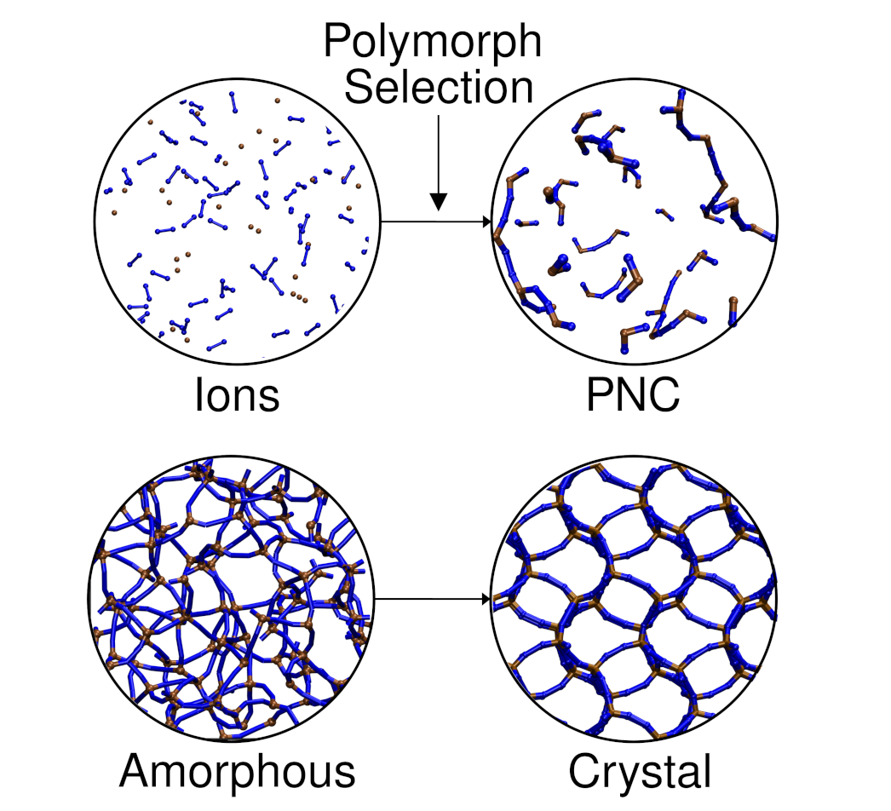
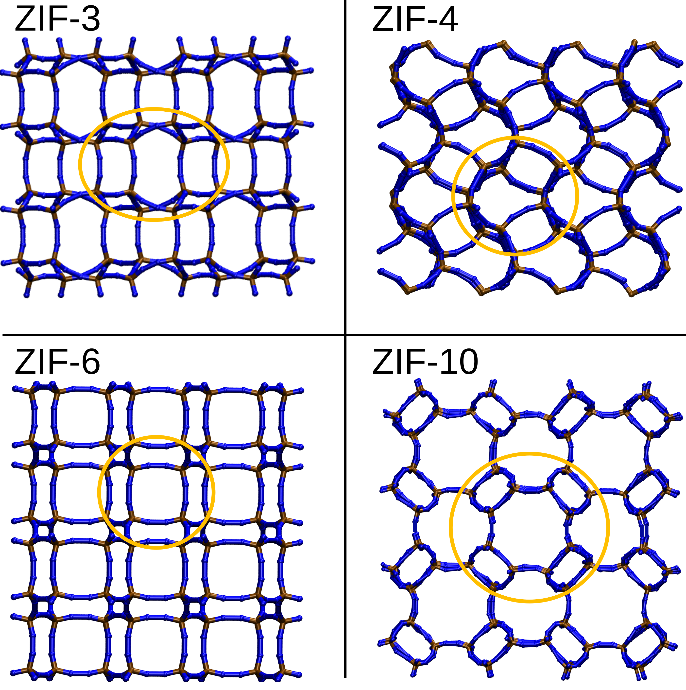
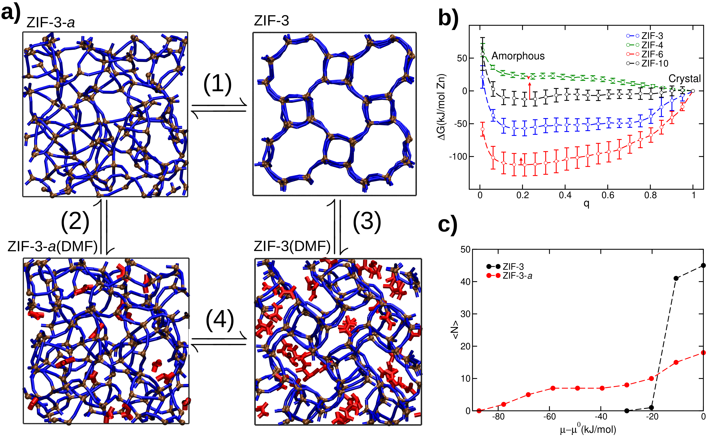
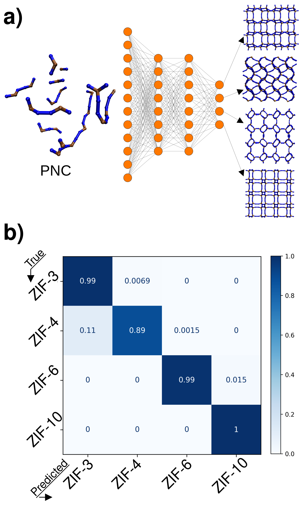
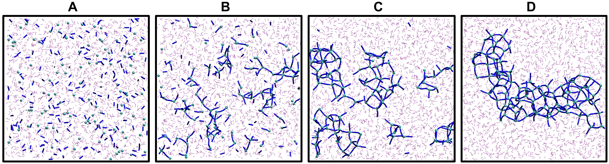
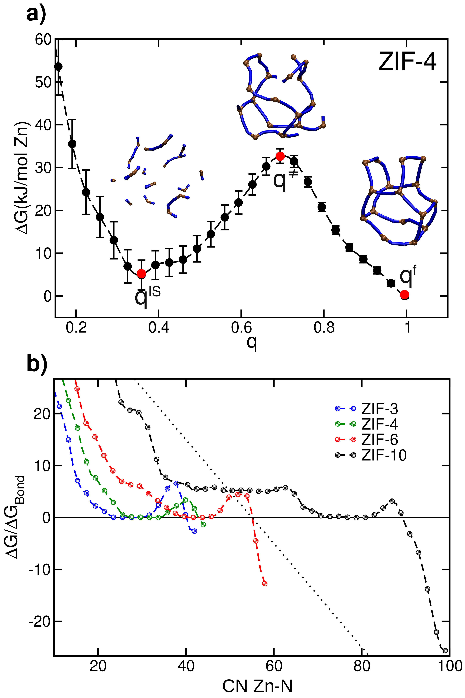

# ZIF多形選択の謎：機械学習と分子シミュレーションが解き明かす結晶化の起源

- **執筆日**: 2026年5月3日
- **トピック**: ゼオライト様イミダゾレート骨格（ZIF）の多形選択メカニズムを、機械学習分類器と反応性分子動力学シミュレーションを組み合わせて解明した研究
- **タグ**: Materials Synthesis and Processing / Phase Transitions; Nanostructures / Machine Learning; Molecular Dynamics
- **注目論文**: arXiv:2604.28106 — Emilio Méndez, Rocio Semino, "Machine Learning and Molecular Simulations Reveal Mechanisms of ZIFs Polymorph Selection" (2026)
- **参照論文数**: 6

---

## 1. なぜ今この話題なのか

金属有機構造体（**MOF; Metal-Organic Framework**）は、金属イオンと有機配位子が規則的に連結してできた多孔質結晶材料であり、その巨大な比表面積と高い細孔の設計自由度から、CO₂回収・水素貯蔵・薬物送達・化学センサーまで幅広い応用が期待されている。とりわけ**ZIF（Zeolitic Imidazolate Framework）** は、亜鉛（Zn）またはコバルト（Co）などの二価金属イオンとイミダゾール系配位子からなるMOFの一種で、ゼオライトと同様のネットワークトポロジーをもちながら、有機配位子の置換基を変えることで細孔サイズや化学的親和性を精密に調整できる点が際立っている。

ZIFが材料科学において特別な位置を占める理由の一つは、その驚くほど豊富な**多形（polymorph）** の存在である。化学式 ZnIm₂（Im = イミダゾレート）だけを取ってみても、少なくとも24種類の異なる結晶構造が実験的に確認されており、それぞれが異なる細孔形状・サイズ・柔軟性・熱安定性を示す。工業的に最もよく使われる ZIF-8 は細孔直径約3.4 Åの SOD（sodalite）型構造をもち、気体分離膜や触媒担体として実用化が進んでいる。一方、ZIF-4（cag 型）は加熱により非晶質化したのちに ZIF-zni（ZIF-zinc 型）へ相転移する特異な挙動を示し、エネルギー貯蔵材料としての可能性も議論されている。

ところが、このような多形の豊富さは同時に重大な問題をはらんでいる。**どの合成条件がどの多形を与えるのか**が、現状では主としてトライアルアンドエラーに依存しているのである。合成研究者たちは反応溶媒・温度・濃度・反応時間・添加物を系統的に変えながら、目的の多形を探索してきた。しかしこの経験則的なアプローチは、新規 ZIF 材料の合成設計には本質的な限界がある。なぜ特定の条件下で特定の多形が優先して生成するのかというメカニズムの理解なしには、理論に基づく合成制御は不可能だからである。

この問題を解決するには、結晶化プロセスそのものを分子レベルで理解する必要がある。ここ10年ほどで計算資源の飛躍的な向上と機械学習ポテンシャルの登場により、これまで計算コスト上困難だったMOFの自己組織化シミュレーションが現実的になってきた。その中で、Sorbonne Université の Rocio Semino グループは、反応性力場と拡張サンプリング法を組み合わせた分子動力学シミュレーションを精力的に開発してきた。2026年4月末に投稿された注目論文 arXiv:2604.28106 は、この系列における最新の成果であり、機械学習分類器をシミュレーションデータ解析に組み込むことで、**多形選択が核形成前クラスター段階で既に決まる**という画期的な知見を示した。

*図1: 注目論文（arXiv:2604.28106）のTOC図。ZIF-4（cag型）とZIF-zni（zni型）の2つの多形がどのような前駆体クラスターから生まれるかを概念的に示す。（CC BY 4.0、Méndez & Semino 2026）*

---

## 2. 未解決問題は何か

ZIF の多形選択メカニズムを理解しようとするとき、大きく分けて3つの本質的な問いが浮かび上がる。

第一の問いは、**結晶化はどこで・いつ「決まる」のか**という問題である。古典的核形成理論（CNT; Classical Nucleation Theory）では、溶液中の分子が集まって臨界核を形成し、そこから結晶が成長すると考える。しかしCNTは単一成分系を念頭に置いており、複数の多形が存在する場合、どの多形の核が優先して形成されるかについては何も語らない。より根本的には、そもそも溶液中の「前駆体クラスター」がどんな構造をもっているのか、それが最終生成物の多形とどう関係するのかが不明だった。実験的には核形成を直接観察することは極めて難しく、計算からのアプローチが必要とされていた。

第二の問いは、**非古典的核形成経路はどのように機能するか**という問題である。近年、多くの無機材料・有機材料・タンパク質において、結晶化が「溶液→結晶」の1段階で進まず、「溶液→非晶質中間体→結晶」という2段階経路をたどることが明らかになっている。ZIF においても、いくつかの実験的証拠が非晶質前駆体相の存在を示唆していた。しかし、その非晶質中間体が最終的な多形選択においてどんな役割を果たしているのかは、ほとんど理解されていなかった。非晶質中間体は単なる「乱雑な塊」なのか、それとも内部に多形の種を宿した構造的な記憶をもつのか、という問いが核心にある。

第三の問いは、**機械学習はこの問題にどう貢献できるか**という方法論的問題である。分子シミュレーションで得られる大量のトラジェクトリデータから、多形を区別する構造的特徴量を人間が手設計することは難しい。特に非晶質的なクラスター段階では、結晶多形の長距離秩序はまだ形成されておらず、局所構造の微妙な差異が多形を決定づけているとすれば、その差異を見つけ出すには教師あり機械学習が有力な手段となる。しかし、シミュレーションデータのどの特徴量を入力とし、どの教師ラベルを用いるかという設計そのものが、科学的な問いと表裏一体になっている。

---

## 3. 注目論文の核心

注目論文（arXiv:2604.28106; Méndez & Semino, 2026）は、ZnIm₂ 系の2つの主要多形である**ZIF-4**（cag トポロジー）と**ZIF-zni**（zni トポロジー）の選択メカニズムを、計算と機械学習の組み合わせで解明することを目的としている。

### 手法の概要

著者らが用いたシミュレーション手法の核心は、**反応性力場（ReaxFF型）** と**パス集合変数を用いたメタダイナミクス（metadynamics with path collective variables）** の組み合わせである。通常の分子動力学（MD）力場は原子間の結合を固定して扱うため、金属—配位子結合の形成・解離を伴うMOFの自己組織化を再現できない。そこで著者らのグループが開発してきた反応性力場を用い、ZnとImの結合が動的に形成・解離できる条件でシミュレーションを行っている。

さらに、核形成のような希少事象（rare event）を計算可能な時間スケールで観察するために、**メタダイナミクス**を利用している。メタダイナミクスとは、時間発展とともに既に訪れた構造空間にペナルティを積み上げていくことで、エネルギー障壁を乗り越えやすくする拡張サンプリング法である。集合変数（CV）としてパスCVを使用しており、これはあらかじめ設定した「経路」（たとえば溶液状態から結晶ZIF-4への経路）に沿った進行度と経路からの乖離を定量化するものである。これにより、2つの多形への核形成経路上の自由エネルギー面（FES; Free Energy Surface）を計算することができる。

機械学習の役割は、シミュレーションで得られた大量の構造スナップショット（ZIF-4、ZIF-zni、非晶質、溶液状態）を分類することにある。著者らは**ニューラルネットワーク（NN）分類器**を訓練し、各スナップショットを「どの多形に近いか」「どの程度秩序化されているか」という観点からスコアリングした。入力特徴量には局所構造記述子（環サイズ分布、Zn—Im—Zn 結合角分布など）が用いられており、NN分類器は人間が直感的には見逃しがちな微細な構造シグネチャを学習する。

### 主要な発見

最も重要な結果は、**「多形選択は核形成前クラスター（pre-nucleation cluster）の段階で既に起きている」** という知見である。具体的には、結晶化の臨界核に達する前の非晶質クラスター段階において、NN 分類器は各クラスターを ZIF-4 的または ZIF-zni 的と高精度で区別できた。つまり、一見「無秩序」に見える前駆体クラスターであっても、内部には特定の多形に対応した局所構造的「偏り」が既に潜在しているのである。

*図2: 注目論文（arXiv:2604.28106）より。ZIF-4（cag型）とZIF-zni（zni型）の結晶構造スナップショット。両者は同じ Zn-Im₂ 組成をもちながら、環サイズ分布（4員環・6員環の比率）において明確に異なる。（CC BY 4.0）*

自由エネルギー面の計算からは、ZIF-4 と ZIF-zni への核形成経路が互いに異なるエネルギー障壁をもつことが示された。特定の溶液条件下では一方の多形への障壁が低く、その条件が実験的な多形選択と定性的に一致する。また、前駆体クラスターの局所構造—特に**環サイズ分布**（4員環・6員環・8員環の相対比）—が多形を識別する最も有力な特徴量であることが NN 分類器の解析から判明した。ZIF-4 的クラスターは4員環を多く含み、ZIF-zni 的クラスターは6員環の比率が高い傾向がある。

*図3: 注目論文（arXiv:2604.28106）より。核形成前クラスターの非晶質構造の代表例。左: ZIF-4 型前駆体クラスター、右: ZIF-zni 型前駆体クラスター。色は環サイズを示す。（CC BY 4.0）*

*図4: 注目論文（arXiv:2604.28106）より。ニューラルネットワーク分類器の混同行列。ZIF-4、ZIF-zni、非晶質、溶液の4クラスに対して高い分類精度が得られている。（CC BY 4.0）*

### 新規性と位置づけ

この研究の前に何が分かっていたかを整理する。同グループの先行研究（arXiv:2411.04884; Méndez & Semino, 2024）では ZIF-4 単体の核形成熱力学がメタダイナミクスで解析され、非古典的核形成の存在が計算から示されていた。また arXiv:2507.23574（Gargari & Semino, 2025）では ZIF-8 の核形成において温度・溶媒条件が核の局所構造に影響することが示されていた。今回の論文はこれらの基盤の上に立ち、**2つの多形を同時に扱い**、かつ**機械学習を分類ツールとして本格的に組み込んだ**点で大きな前進である。多形の「どちらが生成するか」という問いに対して分子レベルの答えを出した最初の計算研究として位置づけられる。

---

## 4. 背景と研究史

### MOF合成の経験則から計算へ

MOF の合成は2000年代初頭から爆発的に発展し、現在では10万種を超える構造がデータベースに登録されている。初期の研究では合成条件（溶媒・温度・pH・金属源・配位子）の組み合わせを試行錯誤しながら新規構造を探索する「セレンディピティ」的なアプローチが主流だったが、近年はより系統的・合理的な合成設計への転換が求められるようになった。

計算からMOFの結晶化を理解しようとする試みは2010年代後半から本格化した。初期の研究ではCNT的な核形成速度の計算が行われたが、ZIF のような金属—配位子系では結合の形成・解離を扱う必要があり、通常の力場では不十分であった。Semino グループが開発してきた反応性力場ベースの MD は、この制約を克服するための重要な技術的進歩であった（arXiv:2507.23574 参照）。

### 多形の豊富さとその整理

ZnIm₂ の多形問題は、実験・計算の両面から継続的に研究されてきた。実験的には、溶媒の種類（DMF、メタノール、水）や微量添加物（アミン類）によって ZIF-4・ZIF-8・ZIF-zni などが選択的に得られることが知られているが、メカニズムは不明のままだった。計算的な多形探索の面では、最近 MLIP（機械学習原子間ポテンシャル）を用いた大規模な結晶構造予測が実施された。arXiv:2601.05097（Xu et al., 2026）は、DFT と MLIP を組み合わせた階層的なアプローチで ZnIm₂ の 1493 種のトポロジーにわたる 9626 個のエネルギー極小構造を探索し、多形の安定性ランキングを計算した。これは「どの多形が熱力学的に安定か」という問いへの回答であり、注目論文が問う「なぜある多形が動力学的に優先して生成するか」という問いとは相補的な関係にある。

*図5: arXiv:2507.23574（Gargari & Semino, 2025）より。ZIF-8の核形成過程における局所構造の変化パターン。核形成前クラスターが非晶質的中間体を経由して結晶化する様子が示されている。（CC BY 4.0）*

### 非古典的核形成の認識の広まり

「非古典的核形成」という概念は、方解石（CaCO₃）・タンパク質・合金など多様な系で蓄積された実験証拠によって2010年代に広く認知されるようになった。MOF 系では、実験的な直接観察（溶液中のin situ X線散乱、クライオ電子顕微鏡など）が技術的に難しいため、非古典的核形成の検証は主に計算に頼らざるを得ない状況が続いている。Semino グループの一連の研究は、ZIF における非古典的核形成の計算的証拠を段階的に積み上げてきた。arXiv:2411.04884 では ZIF-4 の核形成自由エネルギープロファイルが非単調な2段階構造を示すことが示され、非古典的経路の存在を強く示唆した。

### 結晶成長フェーズの研究

注目論文が解明したのは核形成（最初の安定な核の形成）フェーズであるが、実際の結晶化にはその後の**成長**フェーズも重要である。arXiv:2512.03190（Gargari, Méndez & Semino, 2025）は定常化学ポテンシャルシミュレーションを使って ZIF-8 の結晶成長を初めて計算的に研究した。この研究は、成長フェーズでも非古典的なオリゴマー付着機構が働いており、生成する結晶層には非晶質相に特徴的な 3・5・7員環の欠陥が残存することを示した。核形成—成長を通じた構造欠陥の蓄積という視点は、実際に合成されるZIF材料の物性理解にも重要な含意をもつ。

---

## 5. どの解釈が最も妥当か

### 「前核形成クラスターが多形を決める」という主張の強さ

注目論文の中心主張は「多形選択は臨界核以前の前駆体クラスター段階で決まる」というものであり、これはNN分類器が前駆体クラスターを高精度で ZIF-4 的・ZIF-zni 的に区別できるという計算的証拠によって支持される。この解釈が正しいとすれば、「なぜある条件では ZIF-4 が生成し、別の条件では ZIF-zni が生成するか」は「なぜある条件では ZIF-4 的クラスターが優先して形成されるか」という問いに帰着する。これは物理化学的に意味のある還元であり、溶液中の Zn²⁺—Im⁻ 相互作用・溶媒効果・濃度依存性というより直接的な変数で説明できる可能性がある。

環サイズ分布が最も有力な多形識別特徴量であるという発見も、物理的に理解できる。ZIF-4（cag 型）と ZIF-zni（zni 型）の結晶格子では、Zn イオンが形成する環の大きさの分布が構造的に定義された違いをもつ（ZIF-4 は4員環と6員環、ZIF-zni は6員環が主体）。前駆体クラスターがすでにこの環サイズの「記憶」をもつという事実は、結晶化が単なる局所的なランダム集合ではなく、一定の構造テンプレートに基づく自己組織化を経ることを示唆する。

*図6: 注目論文（arXiv:2604.28106）より。ZIF-4とZIF-zniへの核形成経路上の自由エネルギー面（FES）。2つの多形への経路が異なるエネルギー障壁をもつ様子が示されている。（CC BY 4.0）*

### 競合的な解釈と不確定な点

もっとも、この解釈には留意すべき限界もある。第一に、シミュレーションで用いた反応性力場の精度の問題がある。今回用いられた力場は同グループが以前の研究で開発・検証したものだが、金属—配位子系の量子化学的な精度（DFT レベル）を完全に再現できているとは言いきれない。特に、イミダゾレートの異なる結合様式（1-H/2-H イミダゾール等）や溶媒との相互作用エネルギーが力場で正確に記述されているかどうかは、実験との比較を通じた検証が必要である。

第二に、この研究はガス相的な単純な設定（溶媒を陰的に扱う）で行われており、実際の合成ではジメチルホルムアミド（DMF）やメタノールなどの溶媒分子が明示的に存在する。溶媒分子の明示的な取り扱いが多形選択に大きな影響を与える可能性は排除できない。arXiv:2507.23574 では溶媒条件が ZIF-8 の核形成に影響することが示されており、この効果が ZIF-4 / ZIF-zni 系でどう働くかは今後の課題である。

第三に、計算と実験の定量的対応がまだ弱い点がある。FES から計算された核形成障壁の高さが実際の合成温度・濃度条件における多形選択比率と定量的に一致するかどうかについて、本論文では定性的な議論にとどまっている。多形選択の実験的収率を予測する「合成マップ」への接続は、今後の重要な方向性である。

### 熱力学的安定性との関係

arXiv:2601.05097 の CSP 研究は、ZnIm₂ 多形の安定性ランキングを計算している。ZIF-zni は熱力学的には ZIF-4 より安定であることが知られており（エネルギー的に低い）、一方 ZIF-8 はさらに安定な ZIF-zni の準安定相である。これは、ZIF-8 が実験的に最もよく生成するという事実が熱力学ではなく動力学によって支配されていることを意味する。注目論文の結果はこの見方と整合する：前駆体クラスター段階での構造的偏りが動力学的経路を決め、熱力学的安定性とは独立に多形選択が起きる。

この「動力学支配の多形選択」という解釈は、分子認識や有機結晶多形の分野では既によく知られた概念（Ostwald の段階則）に対応する。ZIF 系でこれが前駆体クラスターレベルで起きていることを計算から直接示したことが、この論文の本質的な貢献である。

---

## 6. 何が一般化できるのか

### 他のZIF多形・他のMOF系への拡張

注目論文の方法論—反応性MDとメタダイナミクスとNN分類器の組み合わせ—は、ZIF-4/ZIF-zni ペア以外にも原理的に適用できる。特に工業的に重要な ZIF-8 との多形競合（ZIF-8 vs ZIF-zni、ZIF-8 vs ZIF-67 など）への拡張は自然な次のステップである。ただし、異なる ZIF 間で力場の精度が担保できるかどうかが実用上の障壁になる。また、Co ベースや Fe ベースの ZIF、あるいはイミダゾール以外の有機配位子を使う MOF 系（HKUST-1、MIL-53 等）への一般化には、それぞれ適切な反応性力場の開発が必要である。

結晶成長フェーズ（arXiv:2512.03190 が扱った領域）との統合も重要な課題である。核形成フェーズで多形の「種」が決まったとしても、その後の成長過程で欠陥の蓄積によって構造が変化したり、別の多形への変換が起きたりする可能性がある。核形成—成長を一貫して追跡することで、最終生成物の多形純度や結晶サイズに関する設計原理が得られるだろう。

### 合成制御への応用

理論的に最も重要な含意は「前駆体クラスターの構造が多形を決める」という知見が、**合成の設計変数を前核形成段階にフォーカスすべき**ことを示唆している点である。具体的には、溶液中の初期 Zn²⁺—Im⁻ 比、混合速度、溶媒の誘電率といった変数が前駆体クラスターの環サイズ分布に影響し、それが多形選択を決定するという仮説が立てられる。この仮説を実験的に検証するためには、時間分解 X 線散乱や中性子散乱を用いたin situ 観察が有力な手段となる。

arXiv:2306.02091（Ying et al., 2023）が示したように、ZIF-8 の格子動力学は MLIP を使った計算で正確に記述でき、その熱伝導率の異方性が明らかにされている。このような物性計算と合成メカニズム研究が接続されることで、「目的の物性をもつ多形を選択的に合成するための合成条件」を計算から提案するという逆設計アプローチが現実に近づきつつある。

### 機械学習の方法論的意義

本研究における NN 分類器の使い方は、単なる分類ツールとしてではなく、**物理的な問いに対する解釈可能な答えを引き出す道具**として機能している。どの入力特徴量が分類に寄与しているかを解析することで、多形を識別する構造的指標（環サイズ分布）が同定された。このアプローチは、大量のシミュレーションデータから人間が設計した記述子では見えにくいパターンを見つけるという、材料シミュレーションにおけるMLの有望な応用形態である。将来的には、より高次元の特徴量（グラフニューラルネットワークで扱う原子接続性など）を使ったより精緻な多形分類器の開発も考えられる。

---

## 7. 基礎から理解する

この節では、今回のトピックを理解するために必要な基礎概念を、「知らない前提」から段階的に積み上げて説明する。

### 7.1 金属有機構造体（MOF）とは何か

MOFは、**金属イオン（または金属クラスター）** と**有機配位子（リンカー）** が自己組織化してできる多孔性結晶材料である。金属イオンは「ノード」として機能し、配位子は「橋渡し」としてノード同士をつないでネットワークを構築する。このネットワークは3次元的に周期的な構造をとり、内部に均一なサイズの空隙（細孔）をもつ。

MOFの特徴は、その細孔の設計自由度の高さにある。金属の種類・配位子の長さ・官能基・接続幾何の組み合わせを変えることで、細孔サイズ（数Åから数nm）・化学的親和性・柔軟性・熱安定性などを連続的に調整できる。比表面積は最大で数千 m²/g に達し、ゼオライトや活性炭を大きく上回る例もある。

ZIF（Zeolitic Imidazolate Framework）はMOFの一種で、金属（Zn、Co等）とイミダゾレート配位子が四面体配位でつながったネットワークをもつ。Zn—Im—Zn の結合角（145°程度）がゼオライトの Si—O—Si 結合角に近いため、ゼオライトと同じトポロジー（sodalite型、cag型等）の構造を形成できる。この「ゼオライトアナログ」としての性質が、ZIF をガス分離膜や触媒に適した候補材料にしている。

### 7.2 多形（ポリモルフ）とは何か

**多形（polymorph）** とは、同じ化学組成をもちながら、異なる結晶構造をとる現象（およびそれぞれの結晶相）を指す。有名な例はダイヤモンドとグラファイト（ともに炭素の多形）であり、構造の違いが物性の劇的な差異（硬度・電気伝導性・光学特性）をもたらす。

MOFにおける多形は特に豊富で、ZnIm₂ だけで24種以上が報告されている。これは、Zn²⁺ が4配位・5配位・6配位など異なる配位環境をとれること、イミダゾレートの結合様式が複数あること、そして格子を形成するトポロジーの自由度が高いことに起因する。

熱力学的には、異なる多形は同じ組成に対して異なるギブス自由エネルギーをもち、最安定相は最もギブス自由エネルギーの低い多形である。ただし、準安定相が動力学的な理由から実際の合成で優先して生成することはよくある（これを Ostwald の段階則という）。実際、工業利用される ZIF-8 は ZIF-zni より熱力学的に不安定であるが、合成条件によって ZIF-8 が優先して得られる。

### 7.3 古典的核形成理論（CNT）

結晶が溶液や融液から生成するプロセスを「核形成（nucleation）」という。古典的核形成理論（CNT）は、均一な液体中に半径 $r$ の球形核が形成されるときの自由エネルギー変化を次のように書く：

$$\Delta G(r) = -\frac{4}{3}\pi r^3 \Delta g_{\rm v} + 4\pi r^2 \gamma$$

ここで $\Delta g_{\rm v}$ は単位体積あたりの結晶—液体間の自由エネルギー差（過飽和時は正）、$\gamma$ は核—液体界面エネルギーである。第1項は体積項（安定化）、第2項は界面項（不安定化）で、これらの競合によって $\Delta G(r)$ は臨界半径 $r^*$ で極大をとる：

$$r^* = \frac{2\gamma}{\Delta g_{\rm v}}, \quad \Delta G^* = \frac{16\pi \gamma^3}{3(\Delta g_{\rm v})^2}$$

この $\Delta G^*$ が**核形成障壁**であり、これを超えた核（臨界核）だけが安定に成長できる。CNTはシンプルで広く使われるが、以下の限界がある：球形核という仮定・界面エネルギーの一定性仮定・「溶液→結晶」の1段階経路の仮定、などである。

### 7.4 非古典的核形成とは

実験では、CNTが予測するよりも低い障壁で核形成が起きたり、溶液中に非晶質的な前駆体相が観察されたりすることが多い。これが「非古典的核形成」の証拠と解釈される。非古典的経路としてよく議論されるのは**2段階核形成**であり、「溶液→密な液体/非晶質クラスター→結晶」という2段階を経る。第1段階は濃度ゆらぎ（スピノーダル分解に近い）で駆動され、エネルギー障壁が小さい。第2段階で非晶質クラスター内部に結晶秩序が形成される。

ZIF 系でも、この2段階核形成が計算から示されている（arXiv:2411.04884）。非晶質前駆体の内部構造が最終的な多形に対応した局所秩序を宿している、という今回の注目論文の知見は、この2段階機構を一歩踏み込んで「前駆体クラスターが多形の記憶をもつ」という形に精緻化したものである。

### 7.5 メタダイナミクスとは

核形成のような「希少事象」は、通常の MD シミュレーションでは観察できない。たとえば ZIF の核形成には $10^{-6}$ 秒以上かかる可能性があり、1ナノ秒のシミュレーションでは到底起きない。**メタダイナミクス（metadynamics）** はこの問題を解決する手法の一つである。

アイデアは単純で、シミュレーション中にある「集合変数（CV）」空間を探索しながら、既に訪れた場所にガウス形のペナルティ（バイアスポテンシャル）を積み上げていく。その結果、系は一度訪れた状態には戻りにくくなり、エネルギー障壁を乗り越えやすくなる。十分な時間が経つと、積み上げられたバイアスポテンシャルの負が自由エネルギー面（FES）の近似を与える：

$$F(s) \approx -\lim_{t\to\infty} V_{\rm bias}(s, t)$$

ここで $s$ は集合変数、$V_{\rm bias}$ は時刻 $t$ までに積み上げたバイアスポテンシャルである。ZIF の核形成研究では、CV として「どの多形に近いか」「どれだけ核形成が進んだか」を定量化する**パス集合変数（path CV）** が用いられる。パスCVは、あらかじめ定義した参照経路（例：溶液状態→ZIF-4 結晶）に沿った進行度 $s$ と経路からの逸脱 $z$ で記述される。

### 7.6 反応性力場とは

通常の分子動力学力場（CHARMM、AMBER、UFF等）は、原子間の結合トポロジーをシミュレーション開始前に固定して扱う。このため、化学反応（結合の形成・解離）を伴うプロセスの計算には使えない。ZIF の自己組織化では Zn²⁺ と Im⁻ の間に配位結合が動的に形成・解離する必要があるため、通常の力場は不適切である。

**反応性力場（reactive force field）** は、結合の形成・解離を原子間距離に応じて動的に記述する力場であり、代表例としてReaxFFがある。Semino グループはZIF系に特化した反応性力場を開発・改良してきており、これが今回の研究の技術的基盤となっている。反応性力場は第一原理計算よりも数百倍から数千倍高速であり、数千〜数万原子の系を数百ナノ秒にわたってシミュレーションすることを可能にする。

### 7.7 機械学習分類器の役割

シミュレーションで得られる膨大な構造スナップショット（数百万フレーム）を人間が一つひとつ目視で分類することは不可能である。NN 分類器は、あらかじめラベル付きのデータセット（「これは ZIF-4 型」「これは ZIF-zni 型」「これは非晶質」等）で訓練され、新しいスナップショットがどのクラスに属するかを自動的に予測する。

重要なのは、NN が学習する「特徴量」の選択である。今回は局所構造記述子（各 Zn を中心とした第1・第2近傍の結合角・環サイズ分布）が用いられた。NN 分類器の解析から、どの特徴量が分類に最も寄与するかを逆算することで、物理的に意味のある多形識別子（環サイズ分布）が同定された。これは単なる分類ではなく、「機械学習を使って物理を発見する」というアプローチの好例である。

---

## 8. 専門用語の解説

**ゼオライト様イミダゾレート骨格（ZIF; Zeolitic Imidazolate Framework）**　Zn²⁺（またはCo²⁺）とイミダゾレート配位子が四面体配位でつながる金属有機構造体。Zn—Im—Zn 結合角（約145°）がゼオライトの Si—O—Si 角（約145°）に近いため、同様のトポロジーをとる。少なくとも24種の ZnIm₂ 多形が知られ、ZIF-8、ZIF-4、ZIF-zni などが代表例。気体分離・薬物送達・触媒など幅広い応用が期待される。

**多形（polymorph）**　同じ化学組成をもちながら異なる結晶構造をとる相のこと。ダイヤモンドとグラファイト（炭素の多形）が典型例。MOF では同じ金属—配位子の組み合わせから多数の多形が得られることがあり、各多形は異なる細孔サイズ・安定性・物性をもつ。合成条件の違いがどの多形を生成するかを左右するが、そのメカニズムは今回の論文まで不明な点が多かった。

**核形成前クラスター（pre-nucleation cluster）**　溶液中で臨界核（安定に成長できる最小の核）に達する前の段階で形成される、小さな分子集合体。古典的核形成理論では注目されなかったが、非古典的核形成の文脈では結晶化の行く末を決める重要な段階として注目されている。今回の研究の核心的発見は、このクラスター段階で既に多形の構造的「偏り」が生じているという点にある。

**反応性力場（reactive force field）**　化学結合の形成・解離を動的に記述できる分子動力学力場。ReaxFFが代表例。原子間距離に応じて結合次数が連続的に変化するように設計されており、金属—配位子結合の動的な形成・解離を伴うMOF自己組織化シミュレーションに不可欠。第一原理計算より大幅に高速で、より大きな系・長い時間スケールのシミュレーションを可能にする。

**メタダイナミクス（metadynamics）**　希少事象（エネルギー障壁を超えるプロセス）を効率よくサンプリングする拡張MD法。シミュレーション中に既に訪れた集合変数空間にガウス形のバイアスポテンシャルを積み上げ、系を新しい状態へと誘導する。十分な時間後、バイアスポテンシャルの負が自由エネルギー面（FES）の近似を与える。核形成シミュレーションでは、溶液→核→結晶という経路上の障壁を計算するために使われる。

**パス集合変数（path collective variable; path CV）**　メタダイナミクスで使う集合変数の一種。あらかじめ設定した参照経路（例：溶液状態から特定の多形の結晶構造まで）に沿った進行度 $s$ と経路からの逸脱 $z$ で反応座標を記述する。ZIF の多形選択研究では ZIF-4 への経路と ZIF-zni への経路をそれぞれ設定し、各経路上の自由エネルギープロファイルを計算する。

**自由エネルギー面（FES; Free Energy Surface）**　集合変数の空間における自由エネルギーの景観。山（障壁）と谷（安定状態）で構成され、反応経路・反応速度・安定性を視覚的に把握できる。核形成の FES では、溶液状態・非晶質クラスター・臨界核・結晶相がそれぞれ谷または障壁として現れる。FES の形状から、どちらの多形への核形成が動力学的に優先するかを推定できる。

**機械学習原子間ポテンシャル（MLIP; Machine-Learned Interatomic Potential）**　第一原理計算（DFT）データを教師信号として訓練したニューラルネットワーク原子間ポテンシャル。DFT 並みの精度を保ちながら計算コストは数桁小さく、大規模・長時間シミュレーションを可能にする。arXiv:2601.05097 では MLIP を用いた ZIF の結晶構造予測が行われ、9000 以上の多形候補が探索された。arXiv:2306.02091 では ZIF-8 の熱伝導率計算に MLIP が使われた。

**環サイズ分布（ring size distribution）**　ZIF ネットワーク中で Zn—Im—Zn 結合が形成する環の員数（3員環・4員環・6員環・8員環など）の分布。ZIF-4 は4員環と6員環を主に含み、ZIF-zni は6員環が主体であり、この分布が構造的な多形識別子となる。今回の研究では、NN 分類器が前駆体クラスターを分類する際に最も重要な特徴量として環サイズ分布が同定された。

**Ostwald の段階則（Ostwald's step rule）**　相転移において、最終的に最安定な相に直接転移するのではなく、準安定相を経由した段階的な転移が起きる傾向があるという経験則（1897年）。ZIF系では、熱力学的に最安定な ZIF-zni よりも準安定な ZIF-8 が合成で優先して得られることが多く、Ostwald 的な動力学的支配の証拠として解釈される。今回の研究は、この動力学的支配が前駆体クラスターの段階から既に始まっていることを計算で示した。

---

## 9. 今後の展望

今回の研究によって確度が高まったことは、ZIF の多形選択が（少なくとも計算モデルの範囲で）前核形成クラスターの段階で決まるという動力学的描像である。環サイズ分布という具体的な識別子が同定されたことで、溶液条件と多形選択を橋渡しする分子レベルの仮説が生まれた。また、非古典的核形成—2段階経路—を ZIF 系で詳細に計算した研究として、この分野のベンチマークになりうる。arXiv:2512.03190 が示した結晶成長フェーズとの整合性も、「核形成と成長の両フェーズで非古典的メカニズムが働く」という統一的な描像を支持している。

一方、まだ不確定な点は多い。最も重要なのは、計算と実験の定量的な対応関係がまだ弱い点である。今後1〜3年で注目すべき方向性としては、（1）時間分解X線散乱・中性子散乱・クライオ電子顕微鏡などによる溶液中ZIFクラスターの実験的観察と計算結果の照合、（2）明示的溶媒（DMF・メタノール等）を取り込んだシミュレーションによる溶媒効果の定量評価、（3）arXiv:2601.05097 的な網羅的多形安定性データと今回の動力学データの統合による「多形選択マップ」の構築、（4）グラフニューラルネットワーク等のより表現力の高いML手法による多形識別器の開発と、逆設計への応用が挙げられる。ZIF多形選択の計算的理解が進むことで、目的の多形を選択的に得るための「合成レシピの計算設計」という夢の実現に向けた道が着実に開かれつつある。

---

## 参考論文一覧

1. **arXiv:2604.28106** — Emilio Méndez, Rocio Semino, "Machine Learning and Molecular Simulations Reveal Mechanisms of ZIFs Polymorph Selection," *cond-mat.mtrl-sci + physics.chem-ph* (2026). [https://arxiv.org/abs/2604.28106](https://arxiv.org/abs/2604.28106)　反応性力場によるメタダイナミクスとNN分類器を組み合わせ、ZIF-4とZIF-zniの多形選択が前核形成クラスター段階で起きることを計算から初めて示した主論文。

2. **arXiv:2601.05097** — Xu et al., "Hierarchical Crystal Structure Prediction of ZIFs Using DFT and MLIPs," *cond-mat.mtrl-sci* (2026). [https://arxiv.org/abs/2601.05097](https://arxiv.org/abs/2601.05097)　MLIP を用いた大規模結晶構造予測で ZnIm₂ の9626個の多形候補を探索し、熱力学的安定性ランキングを計算した。

3. **arXiv:2507.23574** — Sahar Andarzi Gargari, Rocio Semino, "Unveiling ZIF-8 nucleation mechanisms through molecular simulation," *cond-mat.mtrl-sci* (2025). [https://arxiv.org/abs/2507.23574](https://arxiv.org/abs/2507.23574)　ZIF-8 の核形成を反応性力場と拡張サンプリング法で解析し、温度・溶媒条件が局所構造に与える影響を示した比較対象研究。

4. **arXiv:2411.04884** — Emilio Méndez, Rocio Semino, "Thermodynamic Insights into Self-assembly of ZIFs," *cond-mat.mtrl-sci* (2024). [https://arxiv.org/abs/2411.04884](https://arxiv.org/abs/2411.04884)　ZIF-4 の核形成に関するメタダイナミクス解析で、非古典的2段階核形成の自由エネルギー的証拠を示した先行研究。

5. **arXiv:2512.03190** — Sahar Andarzi Gargari, Emilio Méndez, Rocio Semino, "Computer Simulation of the Growth of a Metal-Organic Framework Proto-crystal at Constant Chemical Potential," *cond-mat.mtrl-sci* (2025). [https://arxiv.org/abs/2512.03190](https://arxiv.org/abs/2512.03190)　ZIF-8 の結晶成長フェーズをシミュレーションで初めて研究し、オリゴマー付着による非古典的成長メカニズムを明らかにした研究。

6. **arXiv:2306.02091** — Ying et al., "Sub-micrometer phonon mean free paths in MOFs revealed by machine learning molecular dynamics," *cond-mat.mtrl-sci* (2023). [https://arxiv.org/abs/2306.02091](https://arxiv.org/abs/2306.02091)　ZIF-8 の熱伝導率を MLIP による大規模 MD で計算し、フォノン平均自由行程が 1μm 以下であることを示した波及研究。
