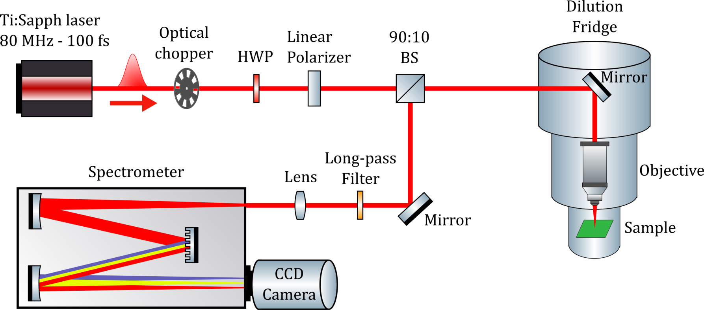
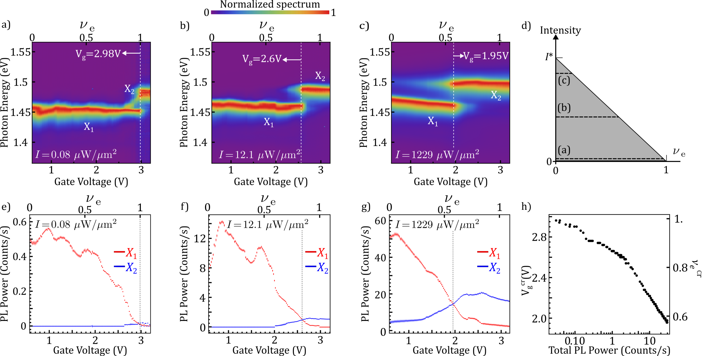

# モアレ超格子における弾道的エキシトン輸送——電子ウィグナー結晶とボゾン流

- **執筆日**: 2026-05-02
- **トピック**: モアレ超格子における弾道的エキシトン輸送と電子–エキシトン秩序の相互絡み合い
- **タグ**: Semiconductors and Electronic Materials / Low-Dimensional Materials; Excitons and Photoinduced Response / Charge, Orbital, and Spin Order / Spin Liquids and Quantum Many-Body Systems / Nonequilibrium Phase Transitions / Pump-Probe Measurements
- **注目論文**: arXiv:2604.26871「Ballistic Exciton Flow Driven by Intertwined Exciton-Electron Orders in a Moiré Superlattice」
- **参照論文数**: 6本

---

## 1. なぜ今この話題なのか

遷移金属ダイカルコゲナイド（TMD）のヘテロバイレイヤーを微小な角度でずらして積層すると、「モアレ超格子」と呼ばれる数ナノメートルから数十ナノメートルの周期的な電位変調が現れる。この人工格子は、ツイスト角という単一のパラメータで格子定数・バンド幅・サイト間ホッピングを連続的に制御できるため、2010年代後半から強相関電子系の量子シミュレーターとして爆発的に注目されてきた。特に WSe₂/WS₂ モアレ系では、電子のフラクショナル充填（ν = 1/3、2/3、1 など）に対応して**モット絶縁体**や**一般化ウィグナー結晶（Generalized Wigner Crystal, GWC）** が光学的に観測され（Regan et al. 2020、arXiv:1910.09047）、二次元での強相関物性を実験室で"設計"できる時代が到来した。

こうした研究の主役はこれまで「フェルミオン」——つまり電子——であった。しかし近年、この同じプラットフォームで「ボゾン」であるエキシトン（励起子）がどのような多体秩序を形成し、どのように輸送されるかという問いが急速に重要性を増している。エキシトンは電子と正孔が静電引力で束縛された中性粒子であり、整数スピンのボゾンとして振る舞う。モアレ格子のサイトに捕捉されたエキシトンは、相互作用によってボーズ–ハバード模型的な振る舞いを示すことが理論・実験の両面から示されており（Tancredi et al. 2022、arXiv:2201.10877；Xiong et al. 2023、arXiv:2207.10764）、ボゾンの多体物理をこれまでにない制御性で研究できる舞台として注目されている。

このような背景の中で、2025年4月に投稿された Deng らの論文（arXiv:2604.26871）は、WSe₂/WS₂ モアレ超格子において、特定の電子充填率においてエキシトンが**弾道的（ballistic）輸送**——平均二乗変位（MSD）が時間の二乗に比例する $\langle r^2 \rangle \propto t^2$ の伝播——を示すという驚くべき発見を報告した。通常の拡散（MSD ∝ t）ではなく弾道的輸送が実現するということは、エキシトンが散乱なく（あるいは極めて少ない散乱で）コヒーレントに伝播していることを意味する。しかもこの弾道輸送は、電子がウィグナー結晶を形成するフラクショナル充填（ν = 1/3、2/3）においてとりわけ顕著に現れる。これは、電子の長距離秩序とエキシトンの輸送が深く絡み合っていることを示唆し、強相関ボゾン–フェルミオン系の物理として全く新しい論点を提起する。

---

## 2. 未解決問題は何か

この分野が抱える本質的な問いは大きく三つに整理できる。

**問い①：モアレポテンシャルの中でエキシトンは「閉じ込められる」のか「流れる」のか？**

モアレ格子はエキシトンを各サイトに局在化させようとするポテンシャルを形成する。ボーズ–ハバード模型の枠組みでは、サイト間ホッピング $t$ とオンサイト相互作用 $U$ の比によってモット絶縁体相（$U \gg t$）と超流動相（$t \gg U$）が分岐する。先行実験 (Xiong et al. 2023；Regan et al. 2020) はエキシトンや電子が絶縁体的な秩序を形成することを示してきたが、どのような条件下で流動性が回復するかは明確でなかった。

**問い②：ボゾン（エキシトン）とフェルミオン（電子）の相互作用は輸送を促進するか抑制するか？**

モアレ系では、光学的に生成したエキシトン（ボゾン）と、ゲート電圧で導入した電子（フェルミオン）が同じ格子上に共存する。これは「ボーズ–フェルミ混合（Bose-Fermi mixture）」そのものであり、両者の相互作用がエキシトン輸送を促進するか妨げるかは自明でない。実験的には Wu et al. (2024、arXiv:2304.09731) がボーズ–フェルミ–ハバード系で励起子モット絶縁体を報告しており、電子の存在がエキシトンを局在化させる側面があることが示唆されていた。しかし今回の anchor 論文は逆に、特定の電子充填でエキシトンが弾道的に流れることを示しており、ボーズ–フェルミ相互作用の「二面性」が浮き彫りになっている。

**問い③：弾道輸送はどの程度「コヒーレント」であり、どのような機構に由来するのか？**

弾道輸送が観測されたとしても、それが真の量子コヒーレンスに起因するものなのか、それとも弾道的フォノンや準弾道的な輸送機構によるものなのかを区別することは実験的に難しい。また、1次元のボーズ–フェルミ–ハバード模型（密度行列繰り込み群で数値解析）が定性的再現を与えるというが、実験系は2次元であり、次元性の違いが結論にどう影響するかも未解決である。

---

## 3. 注目論文の核心

Deng らの論文（arXiv:2604.26871）の実験系は、hBN（六方晶窒化ホウ素）で封止した WSe₂/WS₂ モアレヘテロバイレイヤーであり、ツイスト角は約 2–4° 程度（小角度域）と推定される。上下のゲート電極によって電子充填率 ν（1モアレサイトあたりの電子数）を連続的に変化させながら、パルスレーザーでエキシトンを局所的に生成し、時間分解光学顕微鏡（時間分解 PL またはポンプ–プローブ分光と考えられる）でエキシトンの空間拡がりを追跡することで MSD の時間依存性を測定している。

従来の研究では、TMD ヘテロバイレイヤー中のエキシトン輸送は拡散的（$\langle r^2(t) \rangle \propto t$）であることが多く、モアレポテンシャルによる局在化がエキシトン拡散係数を著しく低下させることが知られていた（Knorr et al. 2022、arXiv:2209.03778）。これに対して Deng らは、ν = 1/3 および ν = 2/3 という「フラクショナル」な電子充填において MSD が $t^2$ に従う弾道的輸送を明確に観測した。特に注目すべきは、この弾道的輸送が電子のウィグナー結晶形成と強く相関している点である。ν = 1/3 と 2/3 は、WSe₂/WS₂ モアレ系において一般化ウィグナー結晶が安定化することが Regan et al. (2020) によって確認されている充填率であり、長距離周期秩序を持つ電子背景の中でエキシトンが弾道的に流れるという構図が浮かび上がる。

理論的解釈として、Deng らは**1次元ボーズ–フェルミ–ハバード模型**を用い、密度行列繰り込み群（DMRG）で数値解析した。このモデルでは、電子（フェルミオン）がウィグナー結晶的な周期秩序を形成した背景の上を、エキシトン（ボゾン）がホッピングする状況が記述される。DMRG 計算は実験で観測された弾道的な MSD の時間依存性を定性的に再現し、「エキシトン-電子の絡み合った秩序（intertwined exciton-electron orders）」が弾道輸送の起源であることを支持する。

この研究の新規性は三点に集約される。第一に、エキシトンという中性ボゾンの弾道輸送が強相関モアレ系で実証されたことである。第二に、その弾道性がフラクショナル電子充填——すなわち電子のウィグナー結晶形成——と直接関連していることであり、ボゾン輸送とフェルミオン秩序の相互絡み合いという新たな物性概念を提起した。第三に、DMRG による理論解析が実験との定性的対応を示したことで、ボーズ–フェルミ–ハバード模型が実際の TMD モアレ系の動的挙動を捉える有効な枠組みであることが裏付けられた点である。

---

## 4. 背景と研究史

モアレ超格子が強相関物性の舞台として認識されるようになったのは、2018 年の魔法角ツイスト二層グラフェンにおける超伝導発見（Cao et al., Science 2018）を一つの起点とする。しかし TMD ヘテロバイレイヤーのモアレ系は、スピン–軌道相互作用の強さ・光–物質相互作用の大きさ・エキシトンの安定性という点でグラフェン系とは本質的に異なる優位性を持つ。

WSe₂/WS₂ モアレ超格子における電子の強相関物性を実験的に確立した先駆的研究が Regan et al. (2020、arXiv:1910.09047) である。彼らは反射差分分光（reflectance contrast spectroscopy）を用いて、ν = 1 でモット絶縁体が、ν = 1/3 および 2/3 で一般化ウィグナー結晶（GWC）が形成されることを光学的に検出した。特に GWC は、電子がモアレサイトの三角格子上に 1/3 または 2/3 の割合で周期的に並ぶ電荷秩序であり、従来の半導体量子井戸系では桁違いに高い温度（数ケルビン）まで安定に観測される。この研究は今回の anchor 論文が「ν = 1/3、2/3 で弾道輸送が増強される」という主張に対して、その充填率が電子秩序の特異点であることの直接的な証拠を提供する背景論文として機能する。

エキシトン側の多体物性に関しては、Xiong et al. (2023、arXiv:2207.10764) が WSe₂/WS₂ モアレ系でポンプ–プローブ分光を開発し、エキシトン充填 ν_ex = 1 かつ電荷中性条件においてエキシトンが非圧縮性の状態（incompressible state）を形成することを報告した。これはボゾンのモット絶縁体——エキシトンが 1サイト 1個の状態で局在し、流動できない相——に対応する。この発見は TMD モアレ系がボゾンの多体物理を実現する「量子シミュレーター」として機能することを初めて実験的に示したものであり、anchor 論文が示す「エキシトンが流れる」という結果との対比において極めて重要な位置を占める。

ボーズ–フェルミ相互作用の観点では、Wu et al. (2024、arXiv:2304.09731) が WS₂/WSe₂ モアレ系にてエキシトンと電子を独立に制御し、励起子モット絶縁体（excitonic Mott insulator）が形成されるとともに、ボーズ–フェルミ混合の中間状態として電子–エキシトン混合相が現れることを示した（図1、2参照）。この実験は、電子との共存がエキシトンの多体状態に質的な変化をもたらすことを示し、anchor 論文の「電子のウィグナー結晶がエキシトン輸送を変える」という主張に物理的基盤を与える。

*図1. WS₂/WSe₂ モアレ系でのボーズ–フェルミ混合とエキシトンモット絶縁体の概念図。ゲートによって電子（フェルミオン）とエキシトン（ボゾン）の密度を独立に制御する。[CC BY 4.0, arXiv:2304.09731 より]*

理論面では、Tancredi et al. (2022、arXiv:2201.10877) が Wannier 関数とRytova-Keldysh モデルを組み合わせてモアレ–ボーズ–ハバード模型のパラメータを第一原理的に決定し、エキシトンのモット絶縁体相と拡張相（extended phase）の間の転移を理論的に予言した。この理論は今回の anchor 論文が採用したボーズ–フェルミ–ハバード模型の直接的な先行理論として位置づけられる。

エキシトン輸送の理論的枠組みとしては、Knorr et al. (2022、arXiv:2209.03778) が TMD モアレ系の twist 角依存エキシトン輸送を微視的理論で解析し、小角度（≲ 2°）では Hubbard 模型が記述する「ホッピング的」輸送が、大角度では自由粒子的な「分散的」輸送が支配的となることを示した。anchor 論文の実験は小角度域（モット–ウィグナー結晶的相関が強い領域）に対応するため、通常は Hubbard 模型的なホッピング輸送——それ自体は弾道的ではなく拡散的になりやすい——が期待されるはずである。そこで電子のウィグナー結晶秩序が形成されたときに限って弾道輸送が現れるという anchor 論文の発見は、この理論的予想を大きく覆す。

また、最近発表された Qi et al. (2025、arXiv:2601.19603) は、MoSe₂/WS₂/WSe₂ という異なる系で「ボゾンの結晶化」——エキシトン同士が Coulomb 相互作用で三角格子状に並ぶエキシトン結晶——を観測した。彼らは拡張ボーズ–ハバード模型による解析と光学分光で、1/3 充填においてエキシトンが結晶秩序を形成することを実証した。この発見は anchor 論文と対照的な状況を提示する：同じ「1/3 充填」で、一方はエキシトンが結晶化して動けなくなり（Qi et al.）、他方では電子ウィグナー結晶との絡み合いによってエキシトンが弾道的に動く（Deng et al.）。この対比は、エキシトン充填率・電子充填率・材料系の三者がエキシトンの輸送/局在を決定する相図において非自明な競合を生んでいることを示唆する。

---

## 5. どの解釈が最も妥当か

本節では、anchor 論文の中心的主張「弾道輸送は電子ウィグナー結晶との絡み合いによって生じる」について、関連論文を横断しながら証拠の強さと解釈の可否を批判的に検討する。

**弾道輸送の実験的確証について**

MSD ∝ t² は弾道輸送の最も直接的な指標であり、この関係が ν = 1/3 と 2/3 において明確に観測されたという報告は、実験的に見て強力な証拠である。ただし、「弾道的」輸送とは必ずしも「完全にコヒーレントな量子輸送」を意味するわけではなく、例えば初期には弾道的であった後、長時間では拡散的に移行する「準弾道」輸送でも MSD の短時間挙動が ∝ t² を示すことがある。anchor 論文が提示している測定の時間窓がどの程度に及んでいるか、また長時間での挙動が調べられているかは、現時点の情報からは確認が限られる。今後、より広い時間窓での測定や温度依存性の系統的測定が弾道性の起源を確定するうえで重要である。

**電子ウィグナー結晶との相関：一致する証拠**

弾道輸送が ν = 1/3 および 2/3 で顕著化するという実験的観測は、Regan et al. (1910.09047) が同じ充填率で GWC を報告しているという事実と直接対応する。もし弾道輸送が他の充填率（例えば ν = 0.5 や ν = 0.4 など非特異的な値）でも同様に観測されるなら、GWC との因果関係は弱まる。逆に、GWC の安定する充填率にのみ弾道輸送が現れるという選択性は、電子秩序との直接的な因果関係を強く支持する証拠である。

**DMRG との対応：定性的合意の射程と限界**

1次元ボーズ–フェルミ–ハバード模型 + DMRG が実験の MSD 時間依存性を定性的に再現するという点は、電子–エキシトン相互作用がエキシトン輸送に本質的であることを理論的に支持する。しかし重要な留意点がある：実際の系は**2次元**であり、1次元模型は本来的に次元性の効果を捉えられない。1次元量子系では輸送がより「弾道的」になりやすい（例えば可積分系のスピン輸送など）ことが知られており、1次元での弾道性が2次元系の実験を説明できるかどうかは自明でない。anchor 論文が「定性的に再現」と表現しているのはこの限界を認識してのことと思われるが、2次元 DMRG または量子モンテカルロなどによる2次元模型での検証が不可欠である。

**競合する解釈：エキシトン結晶との関係**

Qi et al. (2601.19603) が観測したエキシトン結晶は、エキシトン間 Coulomb 斥力によってエキシトン自身が三角格子上に固まるという現象である。この結晶化は anchor 論文での弾道輸送とは逆の（局在化する）挙動であるが、どちらも「1/3 充填」で現れるという点は注目に値する。Qi et al. の系では電子は中性（ν_e ≈ 0）であるのに対し、anchor 論文では電子が ν_e = 1/3 または 2/3 で入っており、電子の GWC が存在する。この差異が輸送/結晶化という対照的な挙動の分岐点である可能性が高く、電子フィリングとエキシトンフィリングの二次元相図上での競合相図の決定が今後の重要課題となる。

**Wu et al. (2304.09731) との対比：絶縁化から輸送への転換**

*図2. WS₂/WSe₂ モアレ系において観測されたエキシトン充填率依存のPLスペクトルギャップ。エキシトン充填 ν_ex ≈ 1 での非圧縮性（モット絶縁体的）状態が明確に見られる。[CC BY 4.0, arXiv:2304.09731 より]*

Wu et al. は電子充填率を変えながらエキシトン輸送ではなく「エキシトンの非圧縮性（incompressibility）」を調べ、局在化（Mott 絶縁体）を見出した。一方 Deng et al. は全く同種の材料系でエキシトン輸送を直接測定し弾道的流れを観測した。この違いは「何を測るか」という測定量の違い（圧縮率 vs. MSD）に加え、「どの充填率・どのエキシトン密度で」という条件の違いを反映している可能性が高い。Wu et al. の実験はエキシトン充填 ν_ex = 1 付近に着目しているのに対し、anchor 論文は電子充填 ν_e = 1/3、2/3 を条件とし、低エキシトン密度（単一エキシトンに近い探索プローブ的な条件？）での MSD を追跡していると考えられる。この条件の差が「局在」vs.「弾道」の差を生んでいるなら、ボーズ–フェルミ–ハバード系の相図上で局在相と弾道輸送相が共存または近接していることを示唆する。

**比較的強く支持される結論**

現時点でのエビデンスを総合すると、「電子のウィグナー結晶秩序が、エキシトンに対して規則的なポテンシャルランドスケープを提供し、散乱を抑制することで弾道的ホッピングを可能にする」という機構が最も説得力のある解釈である。具体的には、電子が GWC を形成した状態では周期ポテンシャルが完全に整列し（「弾道レール」として機能し）、エキシトンがこの周期ポテンシャルの中で Bloch 的に伝播できるというシナリオが考えられる。この描像は Hubbard 模型的なホッピング輸送とは異なる：後者はサイト間確率的ホッピングによって拡散的になりやすいのに対し、前者は長距離秩序が波束の散乱を抑えることで弾道性を維持する。

**まだ弱い結論と今後必要な検証**

弾道輸送の正確な機構——エキシトンが GWC の周期ポテンシャルをバンド的に伝播するのか、それともフォノン的な集団励起（フォノリック機構）なのか——は現段階では未確定である。また、DMRG の1次元結果が2次元実験を定量的に説明できるかの検証、温度依存性（コヒーレンス長と温度の関係）の系統測定、そして実際に「エキシトンのバンド構造」が GWC 背景の中で形成されているかを確かめる k 空間分光（モメンタム分解 ARPES の光学版など）が次のステップとして求められる。

---

## 6. 何が一般化できるのか

今回の発見が示す「電子の長距離秩序がボゾン輸送を弾道化する」というメカニズムは、TMD モアレ系を超えた一般化の可能性を持つ。

**他の物質系への接続**

まず、同種の「ボーズ–フェルミ混合」は、光学格子中の超冷却原子実験でも実現されている。超冷却原子では Bose-Fermi Hubbard 模型の相図が詳細に調べられており、フェルミオンの充填率がボゾンの移動度に与える影響についての理論・実験的知見が蓄積されている。TMD モアレ系との比較は、固体系と冷却原子系の橋渡しとして概念的に興味深い。

次に、角度・ゲート電圧で制御可能なモアレ Bose-Fermi 系は、Wu et al. (2304.09731) が WS₂/WSe₂ でボーズ–フェルミ混合の平衡状態を詳しく調べているように、モアレ自由度を持たない WSe₂ 単層との組み合わせなど材料バリエーションも広がっている。異なる TMD 系（MoTe₂/WSe₂、MoSe₂/MoS₂ など）での類似現象の探索は、弾道輸送が WSe₂/WS₂ 特有の現象なのか、より普遍的な「ボーズ–フェルミ絡み合い輸送」の一例なのかを判定する上で不可欠である。

**デバイス・応用への接続**

弾道的エキシトン輸送が実現するということは、情報を中性粒子（エキシトン）のコヒーレント輸送で伝達する「エキシトニクス（Excitonic）」デバイスへの道を開く可能性を秘める。特に、電子ゲート電圧による充填率制御でエキシトン輸送を ON/OFF できるとすれば（ν = 1/3 で弾道的、それ以外で拡散的）、エキシトン輸送を制御する新しいスイッチング機構として注目される。ただし現状では極低温（数ケルビン）でのみ実現しており、室温での実現には材料設計の大幅な改善が必要である。

**測定手法の一般化**

時間分解 MSD 測定（MSD ∝ t² の確認）は、他のボゾン系——例えばフォノン、マグノン、エキシトン–ポラリトンなど——の弾道輸送探索にも直接適用できる汎用的な手法である。特にモアレ系でのマグノン輸送（スピン波）に類似のアプローチを適用すれば、スピン情報の弾道輸送の実現が期待されるかもしれない。

**局所原理から設計指針へ**

今回の最も重要な知見は「強相関フェルミオン秩序がボゾン輸送を促進しうる」という設計指針の提示である。これは直感に反する：通常、強相関効果は輸送を抑制すると理解されがちだが、秩序化した背景の上では逆に散乱を減らすことが可能だという視点は、強相関ボゾン系の材料設計に新しい次元を開く。ただし、この「ウィグナー結晶がレールになる」というシナリオが普遍的かどうか、どのパラメータ窓で成立するかは今後の研究の余地が大きい。

---

## 7. 基礎から理解する

### エキシトン：電子と正孔の束縛対

半導体にフォトンが入射すると、価電子帯の電子が伝導帯へ励起される（光学遷移）。価電子帯に残った「空の状態」を**正孔（hole）** と呼び、これは正の電荷を持つ準粒子として振る舞う。伝導帯の電子と価電子帯の正孔は電磁気的な Coulomb 引力で束縛されることで、電気的に中性な複合粒子「**エキシトン（exciton）**」を形成する。エキシトンの束縛エネルギーは水素原子と類似の式で与えられる：

$$E_b = -\frac{\mu e^4}{2\hbar^2 \varepsilon^2} \cdot \frac{1}{n^2}$$

ここで $\mu = m_e^* m_h^* / (m_e^* + m_h^*)$ は換算有効質量、$\varepsilon$ は誘電率、$n$ は主量子数である。三次元バルク半導体では $E_b$ は数 meV 程度と小さく室温で消滅してしまうが、二次元 TMD（単層 MoS₂、WSe₂ など）では誘電遮蔽が弱く $E_b$ が数百 meV に達するため、室温でも安定なエキシトンが存在する。

エキシトンはスピン 1 の光子を吸収して生成されるが、電子と正孔のスピンが互いに打ち消し合う場合（スピン一重項 exciton など）には全体として整数スピン（$S = 0$ または $S = 1$）を持つ**ボゾン**として振る舞う。複数のエキシトンが同一量子状態に凝縮する現象（エキシトン–ポラリトン BEC など）が追いかけられているのは、このボゾン的性質ゆえである。

### 遷移金属ダイカルコゲナイド（TMD）とその特徴

TMD は MX₂（M = Mo、W など遷移金属、X = S、Se、Te）という化学式を持つ層状物質で、ファンデルワールス力で積層した各層をテープで剥離することで単層が得られる。単層 TMD は直接バンドギャップ（可視光域）を持ち、強烈な光–物質相互作用と安定なエキシトンを特徴とする。さらにバレー自由度（K 点と K' 点）とスピン–軌道相互作用が強く結合しており、バレートロニクスと呼ばれる新機能性が期待されている。

WSe₂ と WS₂ を重ねたヘテロバイレイヤーでは、両層のバンドギャップがずれることで電子を WS₂ 層に、正孔を WSe₂ 層に分離した**層間エキシトン（interlayer exciton）** が安定に形成される。層間エキシトンは固有双極子モーメントを持ち、電界で制御が容易であるため、モアレ系でのエキシトン物理研究の主役となっている。

### モアレ超格子：周期的ポテンシャルの人工設計

二枚の結晶を微小角度 θ だけずらして積層すると、二層の原子格子の干渉によって長周期の超構造「**モアレパターン（moiré pattern）**」が生じる。格子定数 $a$ の TMD ホモ構造の場合、モアレ周期は

$$\lambda_{\rm M} \approx \frac{a}{\theta} \quad (\theta \ll 1)$$

で与えられ、θ ≈ 2° なら $\lambda_{\rm M}$ ≈ 8–10 nm 程度の超格子が形成される。この長周期の周期構造により、ブリルアンゾーンが縮小（折り畳み）され、**モアレミニバンド（moiré mini-band）** が形成される。ホッピング積分がバンド幅を決め、バンド幅がサイト間ホッピング $t$ として Hubbard 模型に入る。

モアレポテンシャルの振幅 $\Delta$ と Hubbard 模型のオンサイト相互作用 $U$ の比較によって、系の振る舞いが決まる。$U/t \gg 1$ の領域では電子は各サイトに1個ずつ局在した**モット絶縁体**が実現し、フラクショナル充填では**ウィグナー結晶**が現れる。WSe₂/WS₂ の実際の物質パラメータはこの強相関領域に入りやすい。

### 拡散輸送と弾道輸送：平均二乗変位による区別

輸送現象の最も基礎的な区別は**平均二乗変位（MSD）** の時間依存性によって行われる。

- **拡散（Brownian/diffusive）輸送**: $\langle r^2(t) \rangle = 2Dt$（フィックの法則に従う）。散乱が頻繁に起こり、粒子は酔歩（random walk）的に広がる。拡散係数 $D$ が特性量。

- **弾道（ballistic）輸送**: $\langle r^2(t) \rangle = v_0^2 t^2$（初速度 $v_0$ で直進）。散乱がなく、粒子は直線的に伝播する。速度（またはエネルギー）が特性量。

- **異常拡散（anomalous diffusion）**: $\langle r^2(t) \rangle \propto t^\alpha$（$\alpha \neq 1$）。$\alpha > 1$ は超拡散（弾道的傾向）、$\alpha < 1$ は亜拡散（局在傾向）。

通常の半導体中のエキシトンは、フォノン・欠陥・不純物との散乱によって拡散的（$\alpha = 1$）に輸送される。モアレポテンシャルが加わると、エキシトンはサイトに捕捉されやすくなり亜拡散的（$\alpha < 1$）になることも多い（Knorr et al. 2022）。弾道輸送（$\alpha = 2$）が観測されるということは、エキシトンを散乱させる要因が系統的に抑制されているか、エキシトンが何らかのコヒーレント機構で伝播していることを意味する。

### ハバード模型と強相関系の基礎

**ハバード模型（Hubbard model）** は、格子系の強相関電子（またはボゾン）を記述する最も基礎的な模型の一つである：

$$H = -t \sum_{\langle i,j \rangle, \sigma} (c^\dagger_{i\sigma} c_{j\sigma} + \mathrm{h.c.}) + U \sum_i n_{i\uparrow} n_{i\downarrow}$$

ここで $t$ はサイト間ホッピング積分、$U$ はオンサイト Coulomb 反発、$c^\dagger_{i\sigma}$（$c_{i\sigma}$）は生成（消滅）演算子、$n_{i\sigma}$ は数演算子である。$t/U \gg 1$ では系は金属的であり、$U/t \gg 1$ では1サイト1電子の場合にモット絶縁体が実現する。

ボゾンに対するボーズ–ハバード模型では、フェルミオン版の「スピン」の代わりにボゾン数が制限され（ソフトコア /ハードコア）、超流動–Mott 絶縁体転移（BH 相転移）が生じる。特に平均充填 $\bar{n} = 1$ でのモット相から超流動相への量子相転移が理論・実験の両面で精力的に研究されてきた（光格子での超冷却 Bose 原子系による実験が典型例）。

今回の anchor 論文が用いる**ボーズ–フェルミ–ハバード模型**は、ボゾン（エキシトン）とフェルミオン（電子）が同じ格子上に共存する模型である：

$$H = H_{\rm boson} + H_{\rm fermion} + H_{\rm BF}$$

ここで $H_{\rm BF} = U_{\rm BF} \sum_i n^b_i n^f_i$ がボーズ–フェルミ間のオンサイト相互作用（$n^b$ はボゾン数、$n^f$ はフェルミオン数）を表す。フェルミオンが特定の秩序（GWC）を形成した場合、$H_{\rm BF}$ 項が効果的に空間周期的な「仮想格子」をボゾンに対して作り出すことになり、ボゾンのバンド構造が変化する。これが弾道輸送を生む機構として理論上想定されている。

### 密度行列繰り込み群（DMRG）

1次元（または擬1次元）の強相関量子系を高精度で解く方法として**密度行列繰り込み群（Density Matrix Renormalization Group, DMRG）** がある。この手法はスーパーブロック（格子全体）の基底状態を、最も重要な自由度を逐次的に繰り込みながら数値的に求める。行列積状態（Matrix Product State, MPS）表現を活用することで、エンタングルメントエントロピーが小さい（1次元系など）場合に非常に高精度・高効率に機能する。anchor 論文では、1次元のボーズ–フェルミ–ハバード模型に DMRG を適用し、特定の電子充填（ウィグナー結晶的充填）においてボゾン（エキシトン）の MSD が弾道的時間依存性を示すことを数値的に実証している。ただし2次元系への DMRG の直接適用はエンタングルメントの増大によって困難であり、これが「定性的な」対応にとどまる一因でもある。

---

## 8. 専門用語の解説

**1. モアレ超格子（Moiré Superlattice）**
二枚の結晶を微小角度ずらして積層したとき、両層の原子格子の干渉によって現れる長周期の超構造。TMD ヘテロバイレイヤーの場合、周期は数 nm から数十 nm に及び、電子やエキシトンに対して有効格子ポテンシャルとして作用する。ツイスト角を変えることでバンド幅・ホッピング積分・格子定数を人工的に制御できる量子シミュレーターとして機能する。今回の anchor 論文では WSe₂/WS₂ モアレ系が実験舞台となっている。

**2. 一般化ウィグナー結晶（Generalized Wigner Crystal, GWC）**
Wigner（1934年）が電子間 Coulomb 斥力によって電子が格子状に固まる「ウィグナー結晶」を予言して以来の概念を、フラクショナル充填のモアレ系に拡張したもの。WSe₂/WS₂ モアレでは ν = 1/3（三角格子の1/3のサイトに電子が1個ずつ並ぶ）や ν = 2/3 での GWC が光学的に観測されている（Regan et al. 2020）。anchor 論文ではこの GWC 充填率においてエキシトンの弾道輸送が増強されることが報告されており、GWC の長距離周期秩序がエキシトン伝播のレールとして機能する可能性が議論されている。

**3. モット絶縁体（Mott Insulator）**
バンド理論では金属と予言されるにもかかわらず、電子間 Coulomb 反発（Hubbard $U$）によって各サイトに1電子が「詰まって」動けなくなる絶縁体相。充填率 ν = 1（1サイト1電子）でモット絶縁体が最も典型的に現れる。WSe₂/WS₂ モアレ系でも ν = 1 でモット絶縁体が観測されており（Regan et al. 2020）、エキシトンに対してもボーズ–ハバード模型の Mott 相として類似の現象（エキシトンモット絶縁体）が観測されている（Xiong et al. 2023；Wu et al. 2024）。

**4. ボーズ–フェルミ–ハバード模型（Bose-Fermi Hubbard Model）**
ボゾン（エキシトンなど）とフェルミオン（電子など）が同一格子上に共存し、それぞれのホッピングとオンサイト相互作用、さらにボーズ–フェルミ間の相互作用を含む格子量子系のモデル。超冷却原子系での Bose-Fermi 混合で理論・実験的に探求されてきたが、今回の TMD モアレ系がその固体物理的実現となっている。フェルミオン（電子）が GWC を形成した背景において、ボゾン（エキシトン）の動力学（輸送・局在・結晶化）がどうなるかを記述する枠組みとして anchor 論文の理論解析に用いられた。

**5. 弾道輸送（Ballistic Transport）**
粒子が散乱なしに直進的に伝播する輸送モード。平均自由行程が系のサイズ（または関心の空間スケール）よりも長い場合に実現する。典型的には $\langle r^2(t) \rangle \propto t^2$ という MSD の時間依存性で特徴付けられる。通常の拡散的輸送（MSD ∝ t）とは対照的であり、コヒーレントな量子輸送や格子粒子の長距離伝播と関連する。強相関モアレ系での中性粒子（エキシトン）の弾道輸送は anchor 論文が初めて実証した現象である。

**6. 平均二乗変位（Mean Squared Displacement, MSD）**
時刻 $t$ における粒子の原点からの変位の二乗の平均値 $\langle r^2(t) \rangle$。拡散係数・輸送指数の決定に広く使われる。$\langle r^2 \rangle \propto t^\alpha$ の指数 $\alpha$ が輸送モードを区別する：$\alpha = 1$（拡散）、$\alpha = 2$（弾道）、$0 < \alpha < 1$（亜拡散/局在傾向）、$1 < \alpha < 2$（超拡散）。時間分解イメージング（空間分解ポンプ–プローブ分光など）でエキシトンの実空間拡がりを時系列追跡することで MSD が実験的に測定される。

**7. 密度行列繰り込み群（DMRG）**
1990年代初頭に White が開発した数値的な変分法で、1次元（または擬1次元）量子系の基底状態・低励起状態を精密に求める。系を二つのブロックに分割し、密度行列の最大固有値に対応する状態を保持しながら繰り込んでいく。行列積状態（MPS）と等価であり、エンタングルメントエントロピーが「面積則」に従う1次元系で非常に高精度。anchor 論文での1次元ボーズ–フェルミ–ハバード模型のリアルタイム時間発展（MSD の計算）に使用された。

**8. 層間エキシトン（Interlayer Exciton）**
TMD ヘテロバイレイヤーにおいて、電子と正孔が異なる層に分かれて束縛したエキシトン。WSe₂/WS₂ の場合、正孔は WSe₂ 層の価電子帯、電子は WS₂ 層の伝導帯に局在する。各層間の距離（典型的に 6–7 Å）が双極子モーメントの大きさを決め、電界で制御が容易。モアレ電位に強く応答してサイトに捕捉されやすく、モアレエキシトン多体物理の主役を担う。

**9. 拡張ボーズ–ハバード模型（Extended Bose-Hubbard Model）**
標準的なボーズ–ハバード模型に最近接サイト間相互作用（$V$）を追加した模型：$H = -t\sum_{\langle ij \rangle}(b^\dagger_i b_j + \text{h.c.}) + \frac{U}{2}\sum_i n_i(n_i-1) + V\sum_{\langle ij \rangle} n_i n_j$。$V$ が大きい極限で、ボゾンが超固体（supersolid）や結晶（Wigner 結晶的秩序）を形成しうる。Qi et al. (2025、arXiv:2601.19603) はこの模型でエキシトン結晶を記述し、anchor 論文の弾道輸送と対比される局在化側の物理を描像する。

**10. ポンプ–プローブ分光（Pump-Probe Spectroscopy）**
強いレーザーパルス（ポンプ）で系を励起し、時間的に遅れた別のパルス（プローブ）で系の応答を測定する時間分解分光手法。ポンプ–プローブ遅延時間 Δt を変えることで、励起後の時間発展（キャリア冷却、エキシトン形成・消滅・輸送、相転移ダイナミクスなど）をピコ秒から nanosecond スケールで追跡できる。TMD モアレ系の研究（Wu et al. 2024；Xiong et al. 2023；anchor 論文）でエキシトン充填依存の状態変化や空間輸送の追跡に広く活用されている。

---

## 9. 今後の展望

anchor 論文（Deng et al., arXiv:2604.26871）が示した「電子ウィグナー結晶背景下での弾道的エキシトン輸送」は、TMD モアレ超格子の物性物理において複数の意味で転換点となりうる発見である。今後 1–2 年以内に確からしくなりつつあることとして、まず「TMD モアレ系はボーズ–フェルミ混合の固体量子シミュレーターとして確立された」という認識の定着が挙げられる。Wu et al. (2024)、Xiong et al. (2023)、Qi et al. (2025) と本 anchor 論文が連続して報告されており、電子（フェルミオン）とエキシトン（ボゾン）の多体状態を独立にゲート制御できる実験技術も急速に洗練されている。弾道輸送の存在自体は再現性の検証が進めば確定的事実となるであろう。また、今回の発見がトリガーとなって、モアレ系の「ボーズ–フェルミ相図」——電子充填率×エキシトン充填率×温度の三次元空間での相図——を体系的に決定しようとする実験・理論の競争が加速すると予想される。

一方、未確定の問題も多く残されている。最も重要なのは、弾道輸送の**微視的機構**の解明である。「GWC が弾道レールになる」というシナリオは定性的に説得力があるが、エキシトンが実際に GWC 周期ポテンシャル中の Bloch 状態として伝播しているのか、それとも何らかの集団モードや非自明なフラクショナル量子化機構によるものかは確定していない。この問いに答えるためには、k 空間分解測定（運動量分解ポンプ–プローブ、または角度分解 ARPES の光学対応版）がエキシトンのバンド分散を実空間・運動量空間の両面で決定する次世代実験として期待される。さらに、2次元系での DMRG（テンソルネットワーク法の拡張）や量子モンテカルロによる理論検証、そして磁場下での実験（ランダウ準位形成・磁場依存 GWC 安定性との相関）も次の重要な検証手段となるであろう。最終的には、弾道エキシトン輸送が「超流動的な輸送」（位相コヒーレントな集団流）と連続的につながっているかどうかという問い——これはモアレ系でのエキシトン BEC/超流動への道とも関わる——が、今後 2–3 年の最重要論点となると考えられる。

---

## 参考論文一覧

1. **[arXiv:2604.26871](https://arxiv.org/abs/2604.26871)** *(anchor)*  
   Deng et al., "Ballistic Exciton Flow Driven by Intertwined Exciton-Electron Orders in a Moiré Superlattice" (2025).  
   WSe₂/WS₂ モアレ超格子で弾道的エキシトン輸送（MSD ∝ t²）を初めて観測し、電子ウィグナー結晶との絡み合いが弾道性の起源であることを 1D ボーズ–フェルミ–ハバード + DMRG で理論的に解析した本研究の注目論文。

2. **[arXiv:1910.09047](https://arxiv.org/abs/1910.09047)**  
   Regan et al., "Optical detection of Mott and generalized Wigner crystal states in WSe₂/WS₂ moiré superlattices", *Nature* 579, 359 (2020).  
   WSe₂/WS₂ モアレ系において ν = 1 でモット絶縁体、ν = 1/3・2/3 で一般化ウィグナー結晶を光反射差分分光で初観測した先駆的論文であり、anchor 論文が弾道輸送を報告する同じ充填率での電子秩序を確立した背景研究。

3. **[arXiv:2207.10764](https://arxiv.org/abs/2207.10764)**  
   Xiong et al., "Correlated insulator of excitons in WSe₂/WS₂ moiré superlattices", *Science* 380, 860 (2023).  
   WSe₂/WS₂ モアレ系においてエキシトン充填 ν_ex = 1 での非圧縮性（ボゾン的モット絶縁体）をポンプ–プローブ分光で実証し、TMD モアレ系が強相関ボゾン物理の舞台となることを初めて実験的に示した。

4. **[arXiv:2304.09731](https://arxiv.org/abs/2304.09731)**  
   Wu et al., "Excitonic Mott insulator in a Bose-Fermi-Hubbard system of moiré WS₂/WSe₂ heterobilayer", *Nature Communications* 15, 2259 (2024).  
   WS₂/WSe₂ モアレ系でエキシトン（ボゾン）と電子（フェルミオン）を独立に制御し、ボーズ–フェルミ–ハバード系として励起子モット絶縁体および混合相を実証した、anchor 論文の直接的な前提となる実験研究。

5. **[arXiv:2601.19603](https://arxiv.org/abs/2601.19603)**  
   Qi et al., "Observation of a thermodynamically stable exciton crystal in an excitonic insulator coupled to a moiré potential" (2025).  
   MoSe₂/WS₂/WSe₂ モアレ系でエキシトン間 Coulomb 斥力によるボゾン結晶（エキシトン Wigner 結晶）を 1/3 充填で観測し、anchor 論文の弾道輸送と対照的な「エキシトン局在化」の側面を描出した比較論文。

6. **[arXiv:2201.10877](https://arxiv.org/abs/2201.10877)**  
   Tancredi et al., "Moiré-Bose-Hubbard model for interlayer excitons in twisted transition metal dichalcogenide heterostructures" (2022).  
   Wannier 関数と Rytova-Keldysh 誘電モデルからモアレ–ボーズ–ハバード模型のパラメータを第一原理的に導出し、エキシトンのモット絶縁体–拡張相転移を理論予言した、anchor 論文の理論的基盤を成す研究。

7. **[arXiv:2209.03778](https://arxiv.org/abs/2209.03778)**  
   Knorr et al., "Exciton transport in a moiré potential: from hopping to dispersive regime" (2022).  
   TMD モアレ系のエキシトン輸送を微視的理論で解析し、小角度（≲ 2°）ではハバード的ホッピング輸送、大角度では自由粒子的分散輸送が優勢になることを示した理論研究で、anchor 論文が報告する弾道輸送との対比において重要な理論的参照点となる。
