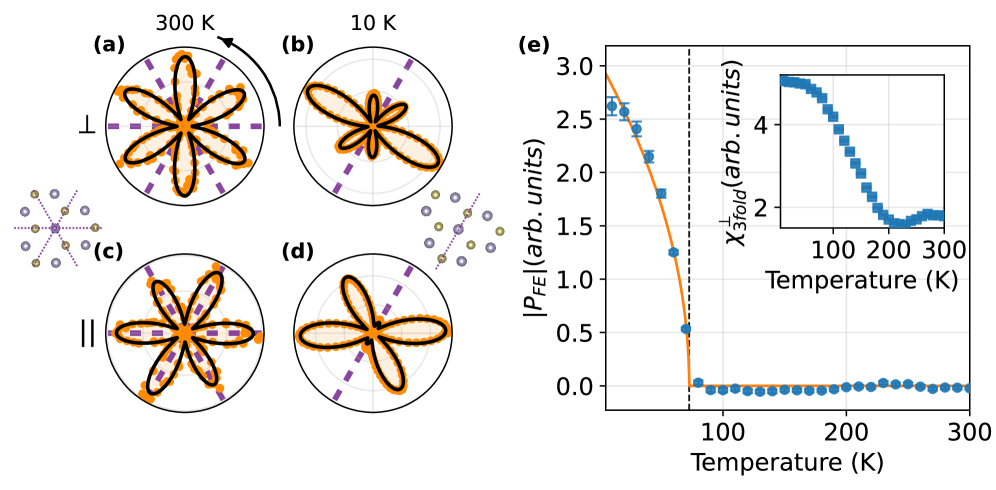
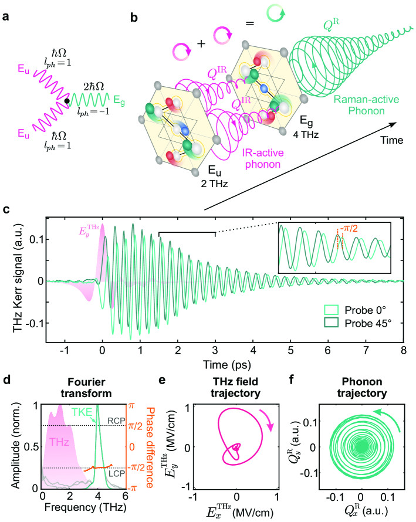
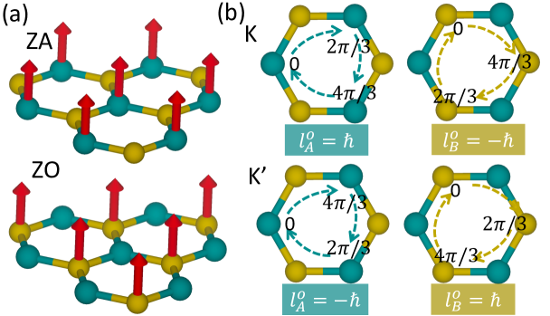

# 光フォノン電気効果：フォノン整流が開く超高速圧電の新地平

- 執筆日：2026-05-02
- トピック：光学フォノンの非線形整流による超高速電気分極誘起（光フォノン電気効果）
- Phonons and Thermal Properties / Nonequilibrium and Dynamic Response / Coupled-Field Response / Pump-Probe Measurements
- 注目論文：arXiv:2604.27524「The optical phonoelectric effect」(Choi, Först, Fechner, Buzzi, Cavalleri et al., 2026)
- 参照論文数：7

---

## 1. なぜ今この話題なのか

物質の秩序変数を光で超高速に制御する試みは、凝縮系物理の最前線として急速に発展している。その先駆けは、超高強度テラヘルツ（THz）パルスや中赤外（mid-IR）パルスを材料に照射することで、電子系でなく**格子振動（フォノン）** を選択的に励起し、物質の対称性や電子状態を過渡的に書き換えるという手法だ。2011年以降のCavalleri グループらによる一連の先駆的研究が示したように、強相関酸化物では特定のIR活性フォノンを共鳴励起することで、常温超伝導的光学応答や一過性の強誘電相が誘起され、「光による物質相の一時的な変換」という概念が実証されてきた。

しかしこれらの現象は主に「相転移的」な非平衡現象として解釈されており、光励起が直接的に秩序変数（分極・磁化など）を生成するメカニズムとしての定式化は未完成だった。最新の注目論文 arXiv:2604.27524（Choi, Cavalleri らによる）は、この状況を刷新する概念を提示する。それが **「光フォノン電気効果（optical phonoelectric effect）」** である。この現象は、IR活性フォノンをフェムト秒パルスで共鳴駆動すると、非線形フォノン結合を通じてラマン活性フォノンに準静的変位が誘起され、それが巨視的な電気分極を生み出すという、ひとことで言えば「歪みなしの圧電効果」だ。

なぜ今この問いが重要なのか。第一に、従来の圧電効果は音速で伝播する機械的応力を基盤とするため、その応答速度の上限は音速 ($\sim 10^3$ m/s) に律速される。光フォノン電気効果では、励起は光速（$\sim 10^8$ m/s）で伝播し、電気分極の応答はフォノン振動周期（$\sim 10^{-13}$ s）スケールで生じる。論文の試算では、従来の圧電応答より**4桁速い**時定数での分極誘起が可能と示されている。第二に、機械的な歪みが不要であるため、材料の破壊強度という物理限界を超えた分極振幅が実現できる可能性がある。これは超高速アクチュエーター・記憶素子・超高速電場源の設計に直結する工学的可能性だ。

こうした背景のもと、本記事では非線形フォノニクスの全体像から出発し、注目論文の提示する光フォノン電気効果の物理的核心を丁寧に解説した上で、関連する最新研究との比較を通じてこのトピックの位置づけと今後の可能性を掘り下げる。

---

## 2. 未解決問題は何か

この分野には少なくとも三つの本質的な未解決問題がある。

**問い①：フォノン整流はどの材料でも普遍的に成立するか？**

光フォノン電気効果の核心は「フォノン整流」であり、IR活性モードの振動エネルギーがラマンモードの準静的変位（時間平均変位）に転換される過程だ。この変換を支える自由エネルギー中の三次結合項 $g \cdot Q_{\rm IR}^2 Q_{\rm R}$ の大きさは物質ごとに大きく異なり、どの対称性クラスの材料で大きくなるのかは系統的には未解明だ。また非中心対称であることは必要条件だが、圧電係数が高い材料群と光フォノン電気効果が強い材料群は必ずしも一致するのかは不明である。BPO₄という特定の材料での実証から、一般的設計指針へ移行するための理論・実験両面の整備が求められている。

**問い②：誘起分極の大きさと持続時間はどこまで制御できるか？**

注目論文は、フォノン励起によって誘起される準静的変位は机上の試算では破壊限界を超えた分極に相当すると主張する。しかし実際の誘起分極の大きさは、励起フォノン振幅（つまり入力光強度）と非線形結合係数 $g$ に依存する。また熱的なフォノン集団（格子熱化）が生じると準静的変位の寿命が短縮される。ポンプ光パルス幅・強度と分極の間の定量的関係、および熱的な緩和過程との競合をどう制御するかが実用上の鍵となる。

**問い③：光誘起電気分極と他の自由度（磁化・超伝導・角運動量）の結合をどう統一的に理解するか？**

Cavalleriグループが最近示した光誘起超伝導（2405.00848）では、フォノン駆動によって高温超伝導体のマイスナー的磁場排除が誘起されることが実証された。同じグループが本論文で圧電的分極誘起を示したことは、「フォノン駆動による秩序変数エンジニアリング」という統一的な枠組みの成熟を示唆する。一方、Juraschekらが精力的に展開している円偏光フォノンによる磁気モーメント生成や、フォノン角運動量ホール効果（2604.01899, 2504.19121）は、同じ非線形フォノニクスの枠組みから「電気的」でなく「磁気的・角運動量的」な応答を引き出す。この二つの方向性を結ぶ統一理論はまだ存在しない。

---

## 3. 注目論文の核心

**論文概要**：arXiv:2604.27524「The optical phonoelectric effect」(Jiwon Choi, Michael Först, Michael Fechner, Michele Buzzi, Andrea Cavalleri ら, Max-Planck Institute for the Structure and Dynamics of Matter, Hamburg, 2026年4月30日投稿)

非中心対称絶縁体 **BPO₄（ホウリン酸）** を舞台とし、IR活性フォノンへの共鳴mid-IRポンプ励起が巨視的な電気分極を誘起することを実験的・理論的に示した論文である。この現象を著者らは「光フォノン電気効果」と命名した。

**何が前進したか**：従来の非線形フォノニクス研究は、IR励起によって誘起される格子変位を主として「過渡的な結晶構造変化」として捉え、その電磁応答（光学伝導率など）の変化を追跡してきた。一方、本論文は光励起フォノンが直接的に **電気分極** を生成するメカニズムを中心に据え、それを「フォノン整流（phonon rectification）」として定式化した点で新しい。

**物理的メカニズム**：格子の自由エネルギーを IR モード座標 $Q_{\rm IR}$ とラマンモード座標 $Q_{\rm R}$ で展開すると、非中心対称性を持つ結晶では以下の結合項が現れる。

$$F_{\rm coupl} = g \, Q_{\rm IR}^2 \, Q_{\rm R}$$

IR モードを強制振動させると $Q_{\rm IR}(t) = A \cos(\omega_{\rm IR} t)$ となり、この結合項は $Q_{\rm R}$ に対して「有効力」$F_{\rm eff} = -g A^2 \cos^2(\omega_{\rm IR} t) / 2$ を与える。$\cos^2$ の時間平均はゼロでなく $1/2$ であるから、ラマンモードに**有限の時間平均変位**

$$\langle Q_{\rm R} \rangle = -\frac{g A^2}{2\omega_{\rm R}^2}$$

が誘起される。これが「整流」である。非中心対称絶縁体では電気分極はラマンモード変位に線形に結合（ボルン有効電荷 $Z^*$ を介して）しているため、この $\langle Q_{\rm R} \rangle$ が直接巨視的分極 $P$ を生む。

**BPO₄ での実証**：BPO₄はS4対称性（非中心対称）を持つ圧電体で、圧電係数は適度に大きく、IR/ラマンモード間の非線形結合係数 $g$ も第一原理計算で評価可能な物質として選ばれた。ポンプ実験では、IR活性フォノンを共鳴励起したのち、ポンプ遅延時間の関数として電場誘起第二高調波発生（SHG）または電気光学応答をプローブすることで分極の誘起を確認した（論文ではより詳細な電気光学系プローブ手法が使われている）。

**新規性の定量的スケール**：論文中の試算では、フォノン振動振幅が典型的な光学実験で達成できる値（格子定数の~1%）であれば、誘起分極は $10^{-3}$ C/m² 程度と評価される。これは BaTiO₃ などの典型的な強誘電体の自発分極（~0.1–0.3 C/m²）に比べれば小さいが、機械的歪みで同等の分極を得ようとすると破壊限界を超えてしまう変形量が必要になることが示されている。さらに応答時定数は光速で決まり、従来の圧電セラミクス（MHz帯での応用限界）より4桁速い。

**何が仮説段階か**：現段階では、誘起分極の絶対振幅を直接電気的に定量した実験は論文中に含まれていないようだ（電気光学プローブによる相対的検出）。また、高い繰り返し率での動作安定性（連続パルス照射での熱効果）は未検証であり、実用デバイスへの接続には追加実験が必要だ。

---

## 4. 背景と研究史

非線形フォノニクスという分野は2010年代前半に Cavalleri グループを中心に体系化された。その出発点は、強相関 Mott 絶縁体 $(R)_{1/3}$Sr$_{2/3}$MnO₃系でのIR励起によって、金属-絶縁体転移が過渡的に引き起こせるという観測（Rini et al., Nature 2007年）にある。その後、Subedi らが第一原理的な微視的理論を整備し、IR活性フォノンとラマン活性フォノンの非線形結合（ $Q_{\rm IR}^2 Q_{\rm R}$ 型）が、時間平均的な格子変位を引き起こすという「非線形フォノニクス」の枠組みを確立した。この理論枠組みを包括的にまとめたレビューが arXiv:2111.13779（Subedi, 2021）「Light-control of materials via nonlinear phononics」であり、絶縁体-金属転移、スピン・軌道秩序の融解、さらには強誘電体予測・反強磁性体での強磁性誘起など、第一原理計算で予測された豊富な現象群が整理されている。

Cavalleri グループはこの理論基盤の上で、最も注目される現象として「光誘起超伝導」に取り組んできた。YBa₂Cu₃O₆.₅₀ のIR活性 Apical 酸素フォノンを励起すると、転移温度をはるかに超える温度でも超伝導的光学応答が現れることが2011年に報告された。この現象が真に超伝導の特徴（マイスナー効果）を示すかどうかは長く未解決だったが、2024年の arXiv:2405.00848（Fava, Buzzi, Cavalleri ら）がついにその証拠を示した。YBa₂Cu₃O₆.₄₈ をフォノン励起した際の近傍 GaP 層でのファラデー回転を測定し、磁場の排除（マイスナー的誘起反磁性）を動的に検出することに成功した。体積磁化率 $\chi_v \approx -0.3$ という推定値は、類似形状の平衡型 II型超伝導体で期待される値と整合しており、これは単なる移動度上昇では説明できないと著者らは主張する。

同じ非線形フォノニクスの枠組みから「電気分極の制御」を目指す研究として、強誘電体の軟モードダイナミクスが注目されてきた。arXiv:2602.21284（Ron, Rotem ら, 2026年2月）「Non-adiabatic dynamics of the ferroelectric soft mode in SnTe」は、フェムト秒近赤外パルスで励起された SnTe（強誘電半金属）において、強誘電秩序変数（軟モード変位）の非断熱的な応答を時間分解SHGで直接観測した研究だ。

*図1. arXiv:2602.21284 より（CC BY 4.0）。SnTe (111) 面での表面SHGの回転異方性パターン。室温（a,c）と10K（b,d）での比較により、低温で強誘電秩序に伴う対称性変化が顕在化している。*

この研究では、ポンプ後の数ピコ秒間の時間分解SHGを追跡することで、ポテンシャルエネルギー面の修正（自由エネルギー上のバリア変化）がナノ秒以下の時間スケールで起きていることを示した。注目論文（2604.27524）との相違は明確で、SnTe は強誘電体であり既存の自発分極を持つのに対し、BPO₄ は圧電体（非中心対称だが常誘電）であって、分極はゼロ点から光によって「生成」される。これは根本的に異なる物理だ。

一方、非線形フォノニクスが扱う自由度が「スカラー変位」だけでないことを示した重要な研究として arXiv:2503.11626（2025年3月）「Direct observation of angular momentum transfer among crystal lattice modes」がある。Bi₂Se₃ では、円偏光した THz パルスによって Eu フォノンが励起されると、その角運動量がラマン活性 Eg フォノンに移送されることを直接観測した。この「ヘリカル非線形フォノニクス」では、$Q_{\rm IR}^2 Q_{\rm R}$ 型結合のベクトル類似体が角運動量の移送を担う。

*図2. arXiv:2503.11626 より（CC BY-NC-ND 4.0）。Bi₂Se₃でのフォノン-フォノン角運動量移動の3フォノン散乱プロセス概念図。Eu（IR活性）2個とEg（ラマン活性）1個のプロセスにおける角運動量保存則が示されている。*

この研究は、非線形フォノニクスが電気分極だけでなく磁気的自由度（角運動量 = 磁気モーメント）の制御にも拡張できることを示す。

---

## 5. どの解釈が最も妥当か

注目論文の提示する光フォノン電気効果の核心的主張——「$Q_{\rm IR}^2 Q_{\rm R}$ 型の非線形結合がフォノン整流を通じて電気分極を生む」——はどの程度強く支持されているのか、また代替解釈はあるのか。

**整流機構への支持**：非線形フォノニクスの自由エネルギー展開は、Subedi の第一原理計算（2111.13779）によって LiNbO₃ などの強誘電体で厳密に裏付けられており、IR励起による準静的変位は実験的にも確認されている。BPO₄ での $g$ 係数を第一原理で計算し、それが有限であることを示している点は、光フォノン電気効果の存在を直接的に支持する計算的根拠となる。

しかし実験面での直接証拠はなお限定的だ。電気光学プローブは分極の変化に感度があるが、熱膨張起源の変位（格子加熱）と真の光フォノン電気信号の区別が重要な課題として残る。フォノン整流による分極は、「ポンプ光強度の二乗に比例する」「ラマンモードの固有振動数で周期的に振動した後に準静的平均へ収束する」という独特のダイナミクスを示すはずであり、こうした特徴を時間分解測定で確認することが実験的証明の核心となる。

**2602.21284 との比較から見えること**：Ron らの SnTe 研究では、フェムト秒パルス励起後に強誘電分極が非断熱的に変化し（図には明示的なポンプ後の分極時間発展が示されている）、その変化がポテンシャル面の修正として理解できることが示された。これは「分極の操作」という目標は共有するが、機構は全く異なる。SnTe では既存の自発分極（強誘電秩序）を操作するのに対し、BPO₄ では分極ゼロの常誘電状態から光によって分極を「書き込む」。後者が成功していれば、強誘電体でない材料でも「光圧電効果」が実現できることになり、材料の自由度が大幅に広がる。

**熱的な擾乱の問題**：非線形フォノニクスの実験的困難の一つは、高強度 IR パルスが電子系や格子系を加熱し、熱的な擾乱が「非平衡効果」と混在することだ。光フォノン電気効果において、準静的な格子変位（信号）は照射後のフォノン緩和とともに減衰するが、その時定数はラマンモードの寿命（典型的に数ピコ秒から数十ピコ秒）で決まる。一方、格子加熱効果は通常 100 ps 以上の時定数を持つ。したがって、ポンプ直後（数 ps 以内）の信号に注目することで熱的効果と分離できるはずであり、論文がこの時間窓を重点的に測定しているかどうかが解釈の信頼性の鍵だ。

**角運動量チャンネルとの対比**：2503.11626 の Bi₂Se₃ 研究は、円偏光 THz 励起下での非線形フォノニクスが「電気的」でなく「磁気的（角運動量的）」な自由度を生成することを示した。この結果は注目論文と競合するものでなく、「フォノン非線形結合という共通のメカニズムが、どの内部自由度を駆動するかは結合の対称性に依存する」という統一的理解を支持する。直線偏光 IR 励起 → 電気分極生成（光フォノン電気効果）、円偏光 THz 励起 → 角運動量（擬的磁場）生成（ヘリカル非線形フォノニクス）という対応関係が成立する可能性がある。

**現時点での最有力解釈**：注目論文の主張は、(1) 自由エネルギーの理論的枠組みとして整合性があり、(2) BPO₄ での第一原理計算が有限の $g$ を予測しており、(3) 概念的には Subedi らが予測していた「光誘起分極スイッチング」の実験的実現として位置づけられる。しかし現時点では、実験的な直接証拠の強度は「概念実証」レベルであり、定量的な分極振幅の測定、熱的効果の完全な排除、そして複数の材料系での再現が強固な確立に必要だろう。

---

## 6. 何が一般化できるのか

光フォノン電気効果が「フォノン整流 → 電気分極」というメカニズムに基づく限り、その原理は非中心対称絶縁体の広いクラスに適用可能なはずだ。ただし実際に観測可能な信号強度は、$g Q_{\rm IR}^2 / \omega_{\rm R}^2$ によって定まるから、大きな非線形結合係数 $g$、低いラマンモード周波数 $\omega_{\rm R}$（ソフトモードを持つ材料）、および高い励起振幅 $A$ の組み合わせが重要になる。

この観点から最も有望な材料クラスの一つは、**強誘電転移点近傍の常誘電体**（転移温度直上の物質）だ。強誘電ソフトモード（ $\omega_{\rm R} \to 0$）を持つ状態では $\omega_{\rm R}^2$ が小さくなり、誘起変位が増大する。Ron らの SnTe 研究（2602.21284）が示す強誘電体での軟モード動力学はこの文脈でも重要であり、ソフトモードを持つ「潜在強誘電体（incipient ferroelectric）」では特に大きな光フォノン電気信号が期待される。SrTiO₃ や KTaO₃ といった量子常誘電体での実験は次のステップとして自然な候補だ。

また、フォノン自由度に関する最近の理論的進展は、電気分極以外の応答への一般化を示唆する。arXiv:2604.01899（Lopez, Juraschek ら, 2026年4月）は、熱流に伴ってフォノン角運動量が横方向に蓄積する「フォノン角運動量ホール効果」の第一原理原子論的理論を展開し、これが全結晶系に普遍的な応答であることを示した。フォノン角運動量の生成と輸送は、電子系での「スピンホール効果」「軌道ホール効果」の格子振動版として位置づけられる。

*図3. arXiv:2504.19121 より（CC BY 4.0）。h-BN 単層における ZA（音響）モードと ZO（光学）モードの面外変位パターン。k = K/K'点でのフォノンが擬角運動量（pseudo angular momentum）を担う。これは円偏光フォノンとは異なる「擬磁気的」自由度の例として、フォノン磁気モーメントの起源多様性を示す。*

arXiv:2504.19121（Chaudhary, Juraschek ら, 2025年4月）はさらに踏み込み、フォノン磁気モーメントには「異常」な三つのクラスが存在することを示した。(1) 面外変位のみを持つ「回転なし軸フォノン（rotationless axial phonon）」が擬角運動量を持ちながら磁気応答を示すケース、(2) 角運動量がゼロなのに有限の磁気モーメントを持つ「発散するジャイロ磁気比」のケース、(3) フォノン角運動量と磁気モーメントが非共線となる異方的ジャイロ磁気比のケースである。これらは標準的な「円運動する原子が磁気モーメントを持つ」という描像では理解できない異常性であり、フォノン系に「隠れた秩序」が存在しうることを示唆する。

電気的（光フォノン電気効果）と磁気的（フォノン角運動量・磁気モーメント）の二つの路線は、現段階では並行して進展しているが、その統一的理解は今後最も重要な理論的課題の一つとなるだろう。例えば、強磁性体の圧電性に類比した「圧磁性（piezomagnetic）フォノン効果」や、電場と磁場を同時に生成する「マルチフェロイック光フォノン効果」の理論的可能性も検討に値する。

デバイス応用の観点では、光フォノン電気効果は超高速電場パルス生成器（テラヘルツ帯よりも高周波での電場パルス）の新たな原理として注目される。また、圧電 MEMS（微小電気機械システム）への適用よりも、単結晶薄膜でのフェムト秒光駆動メモリ、あるいは光周波数で動作する電場スイッチとしての応用が現実的な視野に入ってくるかもしれない。

---

## 7. 基礎から理解する

### 7.1 結晶の格子振動：音響フォノンと光学フォノン

固体の中で原子は格子点の周りで振動している。単純な一次元モデルから始めよう。N 個の原子が質量 m でバネ定数 κ で繋がれた鎖を考えると、各原子 n の変位 $u_n$ は次の方程式に従う。

$$m\ddot{u}_n = \kappa(u_{n+1} - 2u_n + u_{n-1})$$

これを解くと、分散関係 $\omega(k) = 2\sqrt{\kappa/m} |\sin(ka/2)|$ が得られる。この「音響モード」では、長波長（$k \to 0$）で $\omega \to 0$ となり、すべての原子が同位相で運動（実質的に媒体の弾性波）する。

一方、単位胞に2種類の原子（質量 $M$ と $m$、$M > m$）があると、分散関係は「音響枝」と「光学枝」に分かれる。光学モード（optical mode）は長波長極限でも有限の振動数を持ち（$\omega_{\rm opt}(k=0) = \sqrt{2\kappa(1/m + 1/M)}$）、重い原子と軽い原子が逆位相で振動する。この名称の由来は、イオン結晶では異符号のイオンが逆位相で動くため**双極子モーメントが振動し、赤外光（IR）と直接結合**するからだ。

三次元結晶では光学フォノンは複数の枝に分かれ、対称性によって赤外活性かラマン活性かが決まる。

**赤外（IR）活性モード**：振動によって電気双極子モーメントが変化するモードで、IR 光と直接結合する。非中心対称結晶では全ての光学モードが原理的に IR 活性だが、中心対称結晶では「反転対称によって禁止される」モード群が存在する。

**ラマン活性モード**：振動によって分極率テンソルが変化するモード。ラマン散乱（入射光から光学フォノン1つ分のエネルギーが移動する非弾性散乱）で観測される。中心対称結晶では IR 活性とラマン活性は相互に排他（alternation rule）だが、非中心対称結晶では両方同時に活性なモードも存在する。

### 7.2 フォノンと電気分極：ボルン有効電荷と圧電効果

なぜフォノンが電気分極と関係するのか。格子のイオンが変位すると、電子雲の再分布を含めた実効的な電荷変化が生じ、電気分極が変わる。この実効電荷を**ボルン有効電荷（Born effective charge）** $Z^*$ と呼ぶ。ラマンモード座標 $Q_{\rm R}$ でのイオン変位に対応する分極変化は

$$\Delta P = \frac{Z^* e}{a^3} Q_{\rm R}$$

と書ける（$a$ は格子定数、$e$ は素電荷）。この $\Delta P$ が光フォノン電気効果で生成される分極の源泉だ。

一般の圧電体では、外部から応力（歪み $\epsilon$）を加えると電気分極が生じる：$P = d\epsilon$（$d$: 圧電定数）。これは歪みが格子変位 $Q$ を誘起し、$Q$ が $\Delta P$ を生むという連鎖反応だ。光フォノン電気効果はこの「歪み→格子変位→分極」の経路をバイパスし、「フォノン励起→準静的格子変位→分極」で直接実現する点が本質的に異なる。

### 7.3 非線形フォノニクスの自由エネルギー展開

非線形フォノニクスの核心は、自由エネルギーのフォノン座標による展開に潜む高次項にある。調和近似では各モードは独立で $F = \sum_i \frac{\omega_i^2}{2} Q_i^2$。しかし実際には、格子の非調和性（原子間ポテンシャルの三次以上の項）を反映した結合項が存在する。

最も重要な結合項は

$$F_{\rm int} = g \cdot Q_{\rm IR}^2 \cdot Q_{\rm R}$$

の形を持つ。$Q_{\rm IR}^2$ は **偶数次**なので、IR モードの振動を "整流" して $Q_{\rm R}$ に一定方向の「有効力」を与える。このメカニズムが「イオニックラマン散乱（Ionic Raman Scattering）」として1970年代から議論されてきた。

強度 $I$ の IR パルスで $Q_{\rm IR}$ を振動させると、$Q_{\rm R}$ のダイナミクスは強制振動方程式

$$\ddot{Q}_{\rm R} + \gamma \dot{Q}_{\rm R} + \omega_{\rm R}^2 Q_{\rm R} = -g Q_{\rm IR}^2(t)$$

に従う（$\gamma$: 減衰定数）。入力が $Q_{\rm IR}(t) = A\sin(\omega_{\rm IR} t)$ であれば $Q_{\rm IR}^2(t) = \frac{A^2}{2}(1 - \cos 2\omega_{\rm IR} t)$ となり、定数項 $\frac{A^2}{2}$ が準静的変位を引き起こす。定常解は $\langle Q_{\rm R} \rangle = -g A^2 / (2\omega_{\rm R}^2)$ であり、これが **フォノン整流** の結果だ。

### 7.4 対称性の役割：なぜ非中心対称が必要か

$Q_{\rm IR}^2 Q_{\rm R}$ 型の結合が結晶中に現れるためには、結晶の点群対称性によって許容されなければならない。中心対称（反転中心を持つ）結晶では、反転操作 $\hat{I}$ の下で $Q_{\rm IR} \to -Q_{\rm IR}$、$Q_{\rm R} \to -Q_{\rm R}$ だが、$Q_{\rm IR}^2 Q_{\rm R}$ は $(-Q_{\rm IR})^2(-Q_{\rm R}) = -Q_{\rm IR}^2 Q_{\rm R}$ と変換され、結合定数 $g = 0$ が要請される。したがって反転対称性のない（非中心対称な）結晶でのみこの結合が有限となり、圧電効果と光フォノン電気効果はともに非中心対称性を必要とするという対応が生まれる。

### 7.5 ポンプ-プローブ分光：超高速格子ダイナミクスの観測

光フォノン電気効果の実証には、フェムト秒（$10^{-15}$ s）～ピコ秒（$10^{-12}$ s）スケールの格子動力学をリアルタイムで追跡する**ポンプ-プローブ分光**が不可欠だ。代表的な手法は：

**電気光学サンプリング（EOS）**：プローブとなる可視フェムト秒パルスの偏光が、サンプル中の電場（= 誘起分極に比例）によって回転する（ポッケルス効果）。この回転角を遅延時間の関数として測定すると、フォノン整流後の時間発展分極がダイレクトに読める。

**時間分解第二高調波発生（tr-SHG）**：非中心対称結晶でのみ許容される SHG の強度は分極の大きさの二乗に比例するため、分極の変化を間接的に追跡できる。Ron らの SnTe 研究（2602.21284）でも、時間分解 SHG が強誘電ソフトモード変位の時間発展の主要なプローブとして用いられた。

これらの手法の時間分解能はポンプとプローブのパルス幅で決まり、最先端では 10〜50 fs の分解能が達成されている。フォノン周期（THz帯 IR モードで $\omega_{\rm IR}/(2\pi) \sim 10$ THz なら周期 = 100 fs）と同程度の時間分解能が必要であり、フェムト秒レーザーシステムの発達がこの研究分野を支えている。

---

## 8. 専門用語の解説

**フォノン整流（phonon rectification）** ：振動する（交流的な）フォノン座標から直流的（時間平均）変位を取り出す過程。電気回路のダイオード整流と類比的で、$Q_{\rm IR}^2$ の時間平均が有限であることを利用する。非線形フォノニクスの核心概念であり、光フォノン電気効果の主役となるメカニズム。今論文ではこれが BPO₄ でのマクロ分極を生む主因として提示されている。

**イオニックラマン散乱（Ionic Raman Scattering, IRS）** ：外部電場（IR光）がIR活性フォノンを駆動し、非線形結合 $g Q_{\rm IR}^2 Q_{\rm R}$ を通じてラマン活性フォノンを励起する過程。ラマン散乱の「格子版」として1970年代に提案され、21世紀の強フィールド中赤外レーザーの登場によって実験的に実現可能になった。光フォノン電気効果はこの IRS の定常的（時間平均的）側面にあたる。

**ボルン有効電荷（Born effective charge）** ：格子変位に対する電気分極の変化を定量化するテンソル量。単純なイオン電荷（+2, -2 など）と異なり、変位によって電子雲も再配置されることを含んだ「実効的電荷」。大きなボルン有効電荷を持つ材料（強誘電体など）では、格子変位から生じる分極変化が特に大きい。光フォノン電気効果の分極振幅は $Z^* e \langle Q_{\rm R} \rangle$ で評価される。

**光フォノン電気効果（optical phonoelectric effect）** ：注目論文が提唱する新概念。中赤外光でIR活性フォノンを共鳴励起することで、フォノン整流を通じてラマンモードの準静的変位を生じさせ、それが電気分極となる現象。機械的歪みを必要としないため「歪みなし圧電効果」とも呼べる。応答速度は音速でなく光速によって律速され、従来の圧電セラミクスより 4 桁高速な分極応答が原理的に可能。

**非線形フォノニクス（nonlinear phononics）** ：IR活性フォノンを強制励起し、それが非線形結合を通じて他のフォノンモードを駆動することで材料の物性（対称性・電子状態・磁気秩序など）を一時的に変化させる分野。Cavalleri グループを中心に 2010 年代に体系化され、光誘起絶縁体-金属転移、光誘起超伝導、強誘電相の誘起などが報告されてきた。光フォノン電気効果はこの枠組みの「電気分極生成」への応用。

**フォノン角運動量（phonon angular momentum）** ：円偏光した格子振動（キラルフォノン）が持つ角運動量。電子のスピンと類比的で、原子が円軌道を描く振動では $\ell = \pm 1$ の擬スピンを持つ。この角運動量は隣接モードへの非線形結合で移動できる（2503.11626 が実証）。光フォノン電気効果が「直線偏光 IR で分極を生む」効果なら、フォノン角運動量効果は「円偏光 THz で磁化的応答を生む」効果として並行する概念を形成する。

**圧電効果（piezoelectric effect）** ：非中心対称結晶に機械的応力（歪み）を加えると電気分極が生じる（正圧電効果）、あるいは電場を印加すると歪みが生じる（逆圧電効果）現象。石英・BaTiO₃・PZT などが代表材料。光フォノン電気効果との対比では、歪みが格子変位の「巨視的な」発現形態であるのに対し、フォノン励起は局所的・選択的な格子変位を「量子論的精度で」制御する点が本質的な違い。

**強誘電体ソフトモード（ferroelectric soft mode）** ：強誘電転移点（キュリー温度 $T_C$）に近づくにつれて固有振動数 $\omega_{\rm soft} \to 0$ に近づく光学フォノンモード。Cochran の関係 $\omega_{\rm soft}^2 \propto T - T_C$ に従う。ソフトモード変位が自発分極の起源。転移点近傍では光フォノン電気効果の誘起変位が増大（$\langle Q_R \rangle \propto 1/\omega_R^2$）するため、強誘電転移点近傍の常誘電体が光フォノン電気効果の最有望材料として期待される。

**フォノン角運動量ホール効果（phonon angular momentum Hall effect）** ：熱流（縦方向の熱電流）が横方向のフォノン角運動量流を生む現象。電子系のスピンホール効果の格子振動版。arXiv:2604.01899（Juraschek ら）が原子論的理論を展開し、第一原理計算で多様な材料での角運動量蓄積を予測した。普遍的に全結晶に存在する応答であることが示されており、フォノン「スピントロニクス」という新分野の基礎となりうる。

**ポンプ-プローブ分光（pump-probe spectroscopy）** ：強い「ポンプ」パルスで系を励起し、時間遅延させた弱い「プローブ」パルスでその応答を測定する超高速分光法。時間分解能は両パルス幅の畳み込みで決まり、最先端では 10 fs 以下。フォノン動力学の直接観測（TR-SHG, 電気光学サンプリング, 過渡反射率など）に不可欠な手法。光フォノン電気効果の実証実験でもポンプ-プローブ配置が採用されており、中赤外ポンプ（~10-15 μm 帯）＋可視近赤外プローブという組み合わせが典型的構成。

---

## 9. 今後の展望

光フォノン電気効果の実証は、「非線形フォノニクス」が物性制御の汎用ツールへと成熟しつつあることを象徴する。かなり確からしくなった点としては、以下が挙げられる。IR活性フォノンの共鳴励起によってラマン活性モードへの準静的変位（フォノン整流）が生じること自体は、第一原理計算と複数の物質系での実験でよく確立されている。Cavalleri グループによる光誘起超伝導（2405.00848）と今回の光フォノン電気効果の両立は、同じグループが「フォノン駆動で複数の秩序変数を選択的に操作できる」ことを示しており、非線形フォノニクスが特定の現象に限定されない普遍的な物性制御手法であることを強く示唆する。また、フォノン角運動量の実験的直接観測（2503.11626）は、フォノンが「エネルギー」だけでなく「ベクトル的な自由度」を持つことを実証し、今後の理論的統一に向けた基盤を与えた。

一方でまだ未確定な重要問題も多い。光フォノン電気効果の誘起分極の絶対振幅の定量測定、材料依存性（BPO₄ 以外への一般化）、熱的効果の排除、そして繰り返し励起への安定性は今後の実験課題だ。また、フォノン整流による「電気的」応答とヘリカル非線形フォノニクスによる「磁気的」応答をどう統一理論で記述するかは、今後 1〜3 年で最重要の理論的課題となるだろう。実験面では、強誘電転移点近傍の常誘電体（SrTiO₃, KTaO₃, SnTe 近傍）での光フォノン電気効果の探索と、フォノン整流信号のより直接的な電気的検出法（例えば光導電スイッチ型の電気的読み出し）の開発が鍵になる。もし定量的な分極制御が実証されれば、フェムト秒光パルスで書き込まれるメモリ素子や、光信号-電気信号変換デバイスとしての応用が視野に入り、従来の圧電 MEMS 技術とは全く異なる超高速ナノデバイスの設計原理が生まれる可能性がある。

---

## 参考論文一覧

1. **[arXiv:2604.27524]** Choi, J., Först, M., Fechner, M., Buzzi, M., Cavalleri, A. et al. (2026) "The optical phonoelectric effect." — 本記事の注目論文。BPO₄でのフォノン整流による超高速電気分極誘起を実証し、「光フォノン電気効果」を提唱した。
   https://arxiv.org/abs/2604.27524

2. **[arXiv:2111.13779]** Subedi, A. (2021) "Light-control of materials via nonlinear phononics." *Comptes Rendus Physique* — 非線形フォノニクスの包括的レビュー。IR励起フォノンによる格子変位制御の実験・理論をまとめ、光フォノン電気効果の理論的土台を与えている。
   https://arxiv.org/abs/2111.13779

3. **[arXiv:2405.00848]** Fava, S., De Vecchi, G., Jotzu, G., Buzzi, M., Gebert, T., Liu, Y., Keimer, B., Cavalleri, A. (2024) "Magnetic field expulsion in optically driven YBa₂Cu₃O₆.₄₈." — フォノン励起によるカップレート超伝導体での動的マイスナー効果を実証。同グループのフォノン駆動秩序変数制御の文脈を示す。
   https://arxiv.org/abs/2405.00848

4. **[arXiv:2602.21284]** Ron, A. et al. (2026) "Non-adiabatic dynamics of the ferroelectric soft mode in SnTe." — 強誘電体 SnTe での軟モードの非断熱的ダイナミクスを時間分解SHGで観測。光フォノン電気効果との重要な比較対象として、既存分極の操作（対 BPO₄での分極の生成）の相違を浮き彫りにする。
   https://arxiv.org/abs/2602.21284

5. **[arXiv:2503.11626]** (2025) "Direct observation of angular momentum transfer among crystal lattice modes." — Bi₂Se₃でのフォノン-フォノン角運動量移動をTHzポンプで直接観測。ヘリカル非線形フォノニクスを確立し、フォノン整流が電荷のみならずベクトル自由度を運ぶことを示す。
   https://arxiv.org/abs/2503.11626

6. **[arXiv:2604.01899]** Lopez, D. A. B., Brehm, V., Juraschek, D. M. (2026) "Atomistic theory of the phonon angular momentum Hall effect." — フォノン角運動量ホール効果の原子論的理論を展開。全結晶に普遍的な応答として確立し、フォノン内部自由度の輸送理論の基礎を与える。
   https://arxiv.org/abs/2604.01899

7. **[arXiv:2504.19121]** Chaudhary, S., Romao, C. P., Juraschek, D. M. (2025) "Anomalous phonon magnetic moments." — フォノン磁気モーメントの異常な三つのクラス（回転なし軸フォノン、発散ジャイロ磁気比、非共線ジャイロ磁気テンソル）を理論的に同定。フォノン磁性の起源多様性と「フォノン磁気隠れ秩序」の可能性を示唆。
   https://arxiv.org/abs/2504.19121
