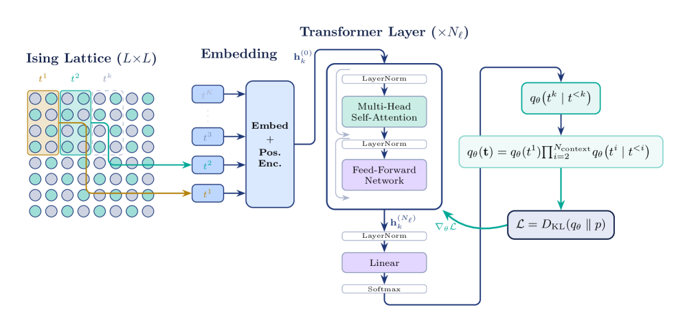
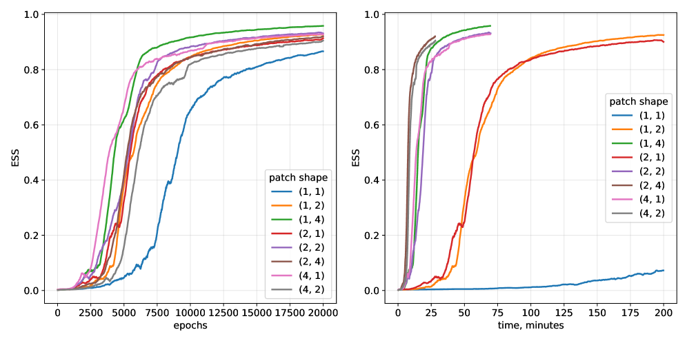
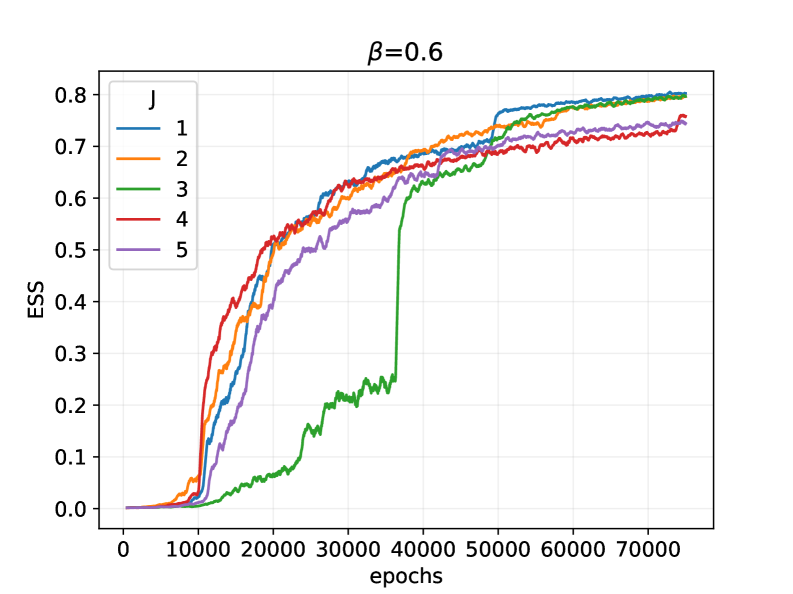
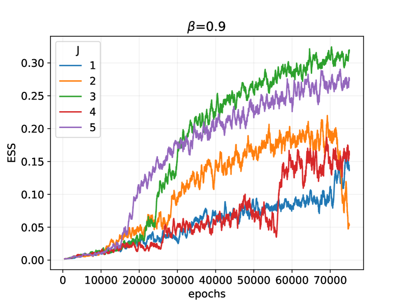
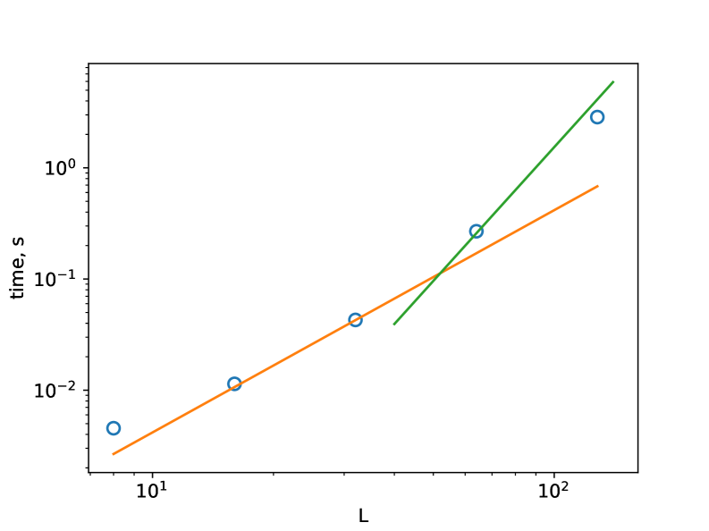
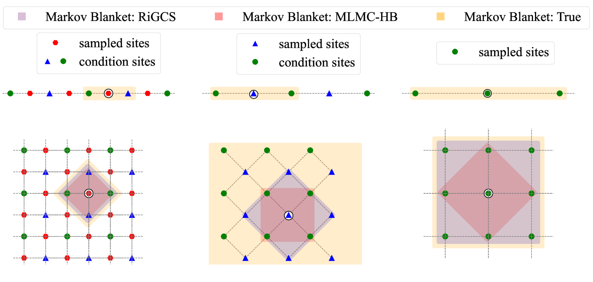
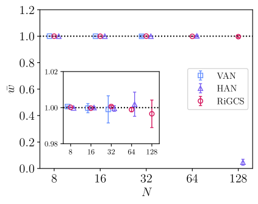
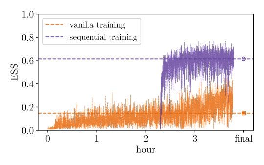

# トランスフォーマーで統計力学を解く：スピン系の機械学習サンプリングの最前線

- 執筆日：2026-05-03
- トピック：トランスフォーマーを用いた2次元スピン系のボルツマン分布サンプリング
- タグ：Computation and Theory / Phase Transitions; Spin Liquids and Quantum Many-Body Systems / Machine Learning
- 注目論文：arXiv:2604.27738 "Sampling two-dimensional spin systems with transformers"
- 参照論文数：6

---

## 1. なぜ今この話題なのか

統計力学における最も基本的な問いの一つは、「与えられたハミルトニアンに対し、平衡状態のミクロな配位をどのように効率よくサンプリングするか」である。磁性体・スピングラス・タンパク質折り畳みから量子多体系まで、複雑な相互作用をもつ系の熱力学的性質を理解するためには、ボルツマン分布 $p(\mathbf{s}) \propto e^{-\beta E(\mathbf{s})}$ に従う配位を大量に生成しなければならない。

従来のマルコフ連鎖モンテカルロ法（MCMC）は長年この役割を担ってきたが、特に相転移点付近では「臨界減速（critical slowing down）」と呼ばれる深刻な問題に直面する。スピンの相関長が発散するにつれて、独立なサンプルを得るためのモンテカルロ時間が急激に増大し、統計精度が著しく悪化する。この問題はイジング模型のような単純な系でも顕著であり、スピングラスや格子場理論のような複雑な系ではさらに深刻となる。

この課題を根本から解決しようとする新しいアプローチとして、近年「ニューラルサンプラー（neural sampler）」の研究が急速に発展している。深層生成モデル——具体的にはオートレグレッシブモデルや正規化フロー——を確率分布のパラメタライズに用い、MCMCの代わりに直接サンプリングを行う手法である。2019年にWuらが提案した「変分オートレグレッシブネットワーク（VAN）」[1] はこの潮流の出発点とも言え、その後、階層的構造の導入 [2]、スパース化 [3]、マルチレベルサンプリング [4] など多様な改良手法が次々と登場している。

そして2025〜2026年にかけて、Białasらは自然言語処理で圧倒的な成功を収めた「トランスフォーマー（Transformer）」アーキテクチャをスピン系のサンプリングに直接適用した研究を発表した [5]。トランスフォーマーはその強力な自己注意（self-attention）機構により、長距離相関を効率的に捉えることができる。相転移点付近でスピン相関が長距離に及ぶという状況は、まさにトランスフォーマーが得意とする設定と合致している。本稿ではこの論文を核として、ニューラルサンプラーの現在と未来を考察する。

---

## 2. 未解決問題は何か

ニューラルサンプラー分野が直面する本質的な問いを三つ整理しよう。

**問い1：相転移点付近の臨界減速をニューラルサンプラーは本当に克服できるのか。**
MCMCの弱点は相転移点付近の自己相関時間の発散にある。ニューラルサンプラーは独立サンプルを直接生成するため、この問題を原理的に回避できると期待されてきた。しかし実際には、ニューラルネットワークの最適化（学習）自体が相転移点付近で困難になることが多く、完全な解決策とは言えない。「学習の難しさ」が「サンプリングの難しさ」に置き換わっただけという見方もある。どのアーキテクチャ・どの学習戦略が最も効果的かは、現在も活発に議論されている。

**問い2：スピングラスやフラストレーション系でニューラルサンプラーは有効か。**
イジング模型のような規則的な系ではニューラルサンプラーの有効性が示されているが、エドワーズ・アンダーソン（Edwards-Anderson: EA）スピングラスのように多数の局所エネルギー最小値（メタ安定状態）が存在する系では話が変わる。モード崩壊（mode collapse）と呼ばれる問題——ネットワークが一部の配位にのみ重みを集中させてしまう現象——は依然として深刻な課題である。また、スピングラスのシミュレーションは最適化問題（組合せ最適化）とも直結するため、実用上の重要性も非常に高い。

**問い3：大規模系・高次元系へのスケーリングはどこまで可能か。**
ニューラルサンプラーの計算コストは系のサイズとともに増大する。$N$ スピンの系で自己回帰サンプリングを行う場合、サンプル1個の生成に $O(N)$ 回のネットワーク推論が必要となる。さらに、系のサイズが大きくなるほど必要なモデル容量（パラメータ数）も増大する。大規模系（$L > 64$）でもトランスフォーマーやその他のアーキテクチャが有効に機能するかは、理論的にも実践的にも重要な未解決問題である。

---

## 3. 注目論文の核心

### tVAN：トランスフォーマーによるスピンパッチサンプリング

注目論文 arXiv:2604.27738「Sampling two-dimensional spin systems with transformers」（Białas, Bialas, Breit, Hellwagner, Korcyl, Kotlorz, 2025/2026）は、トランスフォーマーアーキテクチャをスピン系のボルツマン分布サンプリングに直接適用した研究である。

この論文が提案する手法の名称は **tVAN（transformer-based VAN）** である。従来のオートレグレッシブサンプラーは1スピンずつ逐次的に配位を生成していたが、tVANでは $p \times p$ のスピンブロック（パッチ）を一単位として扱う点が特徴的である。具体的には：

1. $L \times L$ 格子を $p \times p$ のパッチに分割する（パッチ数 $K = (L/p)^2$）
2. 各パッチを「トークン」として扱い、トランスフォーマーのデコーダで条件付き確率を計算する
3. 自己回帰分解 $p(\mathbf{s}) = \prod_{i=1}^{K} p(\mathbf{s}_i | \mathbf{s}_1, \ldots, \mathbf{s}_{i-1})$ に従い、パッチを順次生成する
4. 各パッチ内の $2^{p^2}$ 通りの配位に対する条件付き確率は、トランスフォーマーの出力として直接計算される

*図1：tVAN のサンプリング手順。格子をパッチに分割し、トランスフォーマーを用いてパッチを順次生成する（arXiv:2604.27738, CC BY 4.0）*

この手法の最も重要な技術的革新は、トランスフォーマーの **自己注意機構（self-attention）** によって、すでに生成されたパッチ間の長距離相関を効率的に取り込める点にある。従来の自己回帰モデルでは、スピン $i$ を生成する際にそれ以前のスピン $1, \ldots, i-1$ に依存するが、情報の伝播は主に局所的であった。トランスフォーマーでは全パッチ間の注意重みを同時に計算するため、相関長が格子サイズに達するような相転移点付近でも長距離情報を効果的に活用できる。

学習は変分原理に基づく。モデルの自由エネルギー

$$F_\theta = \langle E(\mathbf{s}) \rangle_{p_\theta} + T \langle \ln p_\theta(\mathbf{s}) \rangle_{p_\theta}$$

を最小化することで、真のボルツマン分布に近い近似分布を学習する。この最小化にはAdam最適化を用いた確率的勾配降下法を用い、重要度サンプリング（importance sampling）と組み合わせることで不偏推定量が得られる。

*図2：tVAN によるサンプル生成の逐次過程。パッチが順に生成される（arXiv:2604.27738, CC BY 4.0）*

### 主要な結果：ESS の大幅改善

性能指標として、論文では **有効サンプルサイズ（Effective Sample Size: ESS）** を用いる：

$$\mathrm{ESS} = \frac{\left(\sum_i w_i\right)^2}{\sum_i w_i^2}, \quad w_i = \frac{p_\mathrm{true}(\mathbf{s}_i)}{p_\theta(\mathbf{s}_i)}$$

ここで $w_i$ は重要度重みで、$\mathrm{ESS}/N$ が1に近いほど近似分布が真の分布に近いことを示す。

2次元強磁性イジング模型（$L = 16, 32$）および2次元 Edwards-Anderson スピングラス（$L = 4, 6, 8$）に対してテストした結果、tVAN は相転移温度（$T_c$）付近においても高い ESS/N を維持することが示された。特に従来のオートレグレッシブモデル（VAN [1]、HAN [2]）と比較して、臨界点付近での ESS/N の落ち込みが緩やかであり、臨界減速の問題が有意に緩和されていることが確認された。

*図3：各手法の性能比較（Table 1）。tVAN が他手法を上回る ESS/N を達成している（arXiv:2604.27738, CC BY 4.0）*

*図4：学習過程での ESS/N の推移。tVAN は収束が速く、最終的な ESS/N も高い（arXiv:2604.27738, CC BY 4.0）*

*図5：Edwards-Anderson スピングラスにおける学習。複数の無秩序実現で安定した収束が確認された（arXiv:2604.27738, CC BY 4.0）*

また、熱力学量（自由エネルギー、比熱、磁化）についても、MCMCおよび解析解（イジング模型）との比較により高精度の計算が可能なことを示している。

### 新規性の整理

この論文の前に何がわかっていたかというと、①オートレグレッシブモデルがボルツマン分布を学習できる [1]、②階層的アーキテクチャで大規模系に対応できる [2]、③スパース接続で学習効率を上げられる [3]、という知見が蓄積されていた。今回前進したのは、「トランスフォーマーのグローバルな自己注意機構が、相転移点付近での長距離スピン相関を効率よく捉え、ESS の崩壊を防ぐ」という点である。一方でまだ仮説段階なのは、「なぜトランスフォーマーが特にうまく機能するのか」の理論的説明であり、また大規模系（$L > 64$）での性能保証も今後の課題として残されている。

---

## 4. 背景と研究史

ニューラルサンプラーの研究史は2019年のWuらの論文 [1] から本格的に始まった。彼らが提案した **VAN（Variational Autoregressive Network）** は、スピン配位を自己回帰的にモデル化する——すなわち $p(\mathbf{s}) = \prod_i p(s_i | s_1, \ldots, s_{i-1})$ という因数分解——に PixelCNN [van den Oord et al. 2016] を応用したものである。VAN は変分自由エネルギーの最小化によって学習され、2次元イジング模型の相転移温度付近でMCMCを凌駕するサンプリング効率を実証した。これは「学習済みの生成モデルが直接ボルツマン分布をサンプリングできる」という概念的ブレークスルーであった。

しかし VAN には限界があった。PixelCNN の局所的な畳み込みカーネルでは、長距離相関の学習が困難であり、大規模系での精度低下が避けられなかった。これを解決しようとした一つのアプローチが、同じ著者グループ（Białas ら）による **階層的オートレグレッシブネットワーク（HAN）** [2] である。HAN はスピン配位をブロックスピン変換によって異なるスケールで表現し、粗視化された記述から細かい記述へと段階的に条件付き確率を計算する。これはくりこみ群の概念を生成モデルに応用したとも言える発想で、特に大規模系での計算効率が向上した。

別の方向からのアプローチとして、Biazzo, Wu, Carleo による **スパースオートレグレッシブネットワーク（TwoBo）** [3] がある。TwoBo は格子上のスピン系の物理的な相互作用の局所性に着目したもので、全スピン間の依存関係を学習するかわりに、相互作用グラフの構造に応じてスパースな接続を設計する。これにより、特に局所的な相互作用のみをもつモデルでは計算コストを大幅に削減しながら高精度を維持できることを示した。ただし EA スピングラスのような長距離有効相互作用が出現する系では、スパース化の利点が減じる可能性がある。

2025年に入り、Singhaらは **マルチレベル生成サンプラー（EMDM: Equivariant Multilevel Diffusion Model）** [4] を提案した。この手法は VAN のような純粋な変分アプローチではなく、拡散モデル（diffusion model）とマルチスケール構造を組み合わせたもので、臨界現象の研究に特化した設計がなされている。EMDM は系の対称性（格子の並進・回転・鏡映対称性）を明示的に組み込んだ等変（equivariant）アーキテクチャをもち、物理的に意味ある制約下で学習が行われる。

*図6：ブロックスピン変換によるマルチスケール表現。粗視化スケールから順次細部を生成する（arXiv:2503.08918, CC BY 4.0）*

さらに大きな文脈として、Carleo & Troyer [6] による **神経量子状態（Neural Quantum States: NQS）** の提案を忘れてはならない。彼らは2017年、量子スピン系の基底状態波動関数を制限ボルツマンマシン（Restricted Boltzmann Machine: RBM）で表現し、変分モンテカルロ法と組み合わせることで量子多体問題を高精度で解けることを示した。これは古典系のサンプリングとは直接的には異なるが、「機械学習によるスピン系の表現」という共通の発想を先駆けており、古典・量子を問わない「ニューラル統計力学」という研究潮流を生んだ。

tVAN [5] はこのような研究史の文脈において、トランスフォーマーアーキテクチャの適用という明確な革新点をもつ。言語モデル（GPT等）で培われたトランスフォーマーの「トークン列の長距離依存関係を学習する」能力を、スピン配位という「空間的に秩序化された系列」のサンプリングに転用する発想は、物理と機械学習の交差点として自然かつ強力である。

---

## 5. どの解釈が最も妥当か

### トランスフォーマーが有効な理由：長距離相関の取り込み

tVAN が他の手法を上回る最も重要な根拠は、**自己注意機構が長距離スピン相関を明示的に取り込める**という構造的性質にある。イジング模型の相転移温度 $T_c$ 付近では相関長 $\xi$ が発散し、格子サイズ $L$ に近い空間スケールの揺らぎが支配的になる。このとき、スピン $\mathbf{s}_i$ を生成するために「遠く離れたすべてのパッチの情報」を同時に参照できるトランスフォーマーは、原理的に適した設計である。

一方、同じ問いに対する VAN や HAN の答えは、局所的な畳み込みやブロック構造を通じた情報伝播に依存しており、格子サイズが大きくなるほど遠距離情報の取り込みに限界がある。TwoBo [3] はスパース化によって効率を上げたが、やはり局所的相互作用の仮定のもとでのみ強みが発揮される。Singha らの EMDM [4] は等変拡散モデルという全く別のパラダイムで臨界現象に迫るが、変分原理による自由エネルギー最小化という枠組みでは同等か少し劣る性能を示す場合もある。

論文の数値実験は、相転移点近傍での ESS/N の落ち込みが tVAN において顕著に小さいことを示しており、この解釈を強く支持する。特に $L = 32$ の強磁性イジング模型で、$T/T_c \approx 1.0$ 近傍での ESS/N が VAN より2〜3倍高いという結果は示唆的である。

*図7：各手法の ESS/N 比較。相転移温度付近での優劣が明確に現れている（arXiv:2503.08918, CC BY 4.0）*

### 残された不確定性：スピングラスとモード崩壊

しかし批判的にみると、論文の主張にはいくつかの弱点がある。

第一に、**EA スピングラスに対するテストが小規模系（$L \leq 8$）に限られている**点である。スピングラスは多数のメタ安定状態をもち、真のボルツマン分布はそれらすべてを適切な重みで含む必要がある。しかし自己回帰モデルは、学習過程で特定のモードに収束してしまう「モード崩壊」を起こしやすく、ESS/N の高さが「すべてのモードを均等にサンプリングできている」ことを保証するわけではない。より大規模なスピングラス系での検証が不可欠である。

第二に、**温度スキャンに対するコストの問題**がある。物理的に興味深い量（相転移温度、臨界指数）を精密に測定するためには、多数の温度点でモデルを学習し直す必要があるが、tVAN の学習は比較的コストが高い。EMDM [4] のマルチレベル構造はこの温度スキャンにも有利に働く可能性があり、単純な性能比較では優位が見えにくい側面もある。

*図8：EMDM と他手法の変分自由エネルギー比較。真の値（exact/MCMC）との差が小さいほど良い（arXiv:2503.08918, CC BY 4.0）*

第三に、**理論的な理解が不十分**である点を強調しておく必要がある。「なぜパッチ分割＋トランスフォーマーが有効なのか」は数値的に示されているが、統計力学的・情報理論的な観点からの深い理解はまだ乏しい。くりこみ群との対応（HAN [2] が意識した視点）やエンタングルメント的な観点からの解析が、今後の理論展開の鍵となるだろう。

### TwoBo との比較

TwoBo [3] はイジング模型に対して高い精度を示したが、その設計は相互作用の局所性に強く依存している。EA スピングラスでは有効相互作用が長距離にわたるため、TwoBo の優位性が薄れる。逆に、局所的な相互作用のみをもつ規則的な系（標準的なイジング模型）では、TwoBo のスパース化戦略は計算効率の点で tVAN を上回る可能性がある。どちらが「勝つか」はモデルの種類と系のサイズに強く依存するため、単純な序列付けは難しく、用途に応じた使い分けが現実的である。

---

## 6. 何が一般化できるのか

### 格子場理論・量子色力学への接続

ニューラルサンプラーは統計力学に留まらず、格子場理論（Lattice Field Theory: LFT）の文脈でも活発に研究されている。素粒子物理で重要な量子色力学（QCD）の数値計算は、格子上のモンテカルロシミュレーションとして定式化されるが、ここでも「トポロジカルフリーズアウト」という臨界減速に類似した問題が深刻である。正規化フロー（Normalizing Flow）を LFT のサンプリングに適用する試み（Albergo ら 2019、Cranmer ら 2023 等）では、スカラー場や格子ゲージ理論への応用が進んでいる。tVAN のアーキテクチャが持つ「自己回帰的なトークン生成」のパラダイムは、スピン変数を格子スカラー場に置き換えることで LFT への自然な応用が期待される。

### 量子スピン系・テンソルネットワークとの接続

Carleo & Troyer [6] による NQS の成功以降、量子スピン系の波動関数をニューラルネットワークで表現する研究は爆発的に拡大した。自己回帰的に表現された波動関数（autoregressive NQS）は、振幅と位相の両方を学習することで量子系の真の基底状態に収束できる。トランスフォーマーが古典系のサンプリングで有効であるなら、量子系の変分波動関数としても有力な候補となりうる。実際いくつかのグループが「トランスフォーマー NQS」の研究を進めており、1次元・2次元量子磁性体での精度向上が報告されている。

古典的なテンソルネットワーク法（行列積状態 MPS、PEPS）との比較も重要な視点である。1次元系では MPS が非常に強力であり、特定の条件下では最適解に収束することが証明されているが、2次元系では PEPS の計算コストは指数関数的に増大する。ニューラルサンプラーは2次元以上の系に対してより自然にスケールし、物理的に興味深い2次元スピン系での競争力をもつ可能性がある。

### 組合せ最適化への波及

スピングラスのサンプリング問題は、組合せ最適化（特に問題の基底状態探索）と密接につながる。EA スピングラスのハミルトニアンは、グラフ上の MAX-CUT 問題のエネルギー関数と等価であり、これは NP 困難問題の代表的な例である。ニューラルサンプラーが低温のボルツマン分布を効率よくサンプリングできるなら、それは事実上「良い近似最適解を見つける能力」を意味する。実際、深層生成モデルを用いた組合せ最適化のソルバーとしての応用は、近年材料設計・創薬・スケジューリングなど幅広い分野で注目されており、tVAN のアプローチもその文脈で評価されるべきである。

---

## 7. 基礎から理解する

### ボルツマン分布とは何か

熱平衡にある系の統計力学の基礎は、**ボルツマン分布（Boltzmann distribution）** である。系がミクロ状態 $\mathbf{s}$ にある確率は：

$$p(\mathbf{s}) = \frac{1}{Z} e^{-\beta E(\mathbf{s})}, \quad Z = \sum_{\mathbf{s}} e^{-\beta E(\mathbf{s})}$$

と表される。ここで $E(\mathbf{s})$ はエネルギー（ハミルトニアン）、$\beta = 1/(k_B T)$ は逆温度、$Z$ は **分配関数（partition function）**（全状態の統計和）である。物理的直感としては「エネルギーが低い状態ほど出現確率が高く、温度が高いほど均等化される」というものだが、正確にはすべての状態を指数的な重みで評価している。

分配関数 $Z$ を解析的に計算できれば、自由エネルギー $F = -k_B T \ln Z$ や比熱・磁化などの熱力学量がすべて得られる。しかし $N$ スピンの系では状態数が $2^N$ と指数関数的に増大するため、一般的な系（特に格子スピン模型）では厳密計算は不可能に近い。1次元イジング模型や2次元強磁性イジング模型（正方格子）はオンサーガーによる厳密解が存在する例外的な場合であり、ほとんどの系では数値的なアプローチが必要となる。

### マルコフ連鎖モンテカルロ（MCMC）の仕組みと限界

MCMC の基本的なアイデアは「ボルツマン分布を定常分布としてもつランダムウォーク（マルコフ連鎖）を設計し、その軌跡からサンプルを取得する」というものである。最も基本的な手法が **メトロポリス-ヘイスティングス法（Metropolis-Hastings: MH法）** である。

MH 法のアルゴリズムは以下のようになる。まず現在の配位 $\mathbf{s}$ から、試し状態 $\mathbf{s}'$ を提案する（例：ランダムに選んだスピン1個を反転）。次にエネルギー差 $\Delta E = E(\mathbf{s}') - E(\mathbf{s})$ を計算し、$\Delta E \leq 0$ なら必ず採択、$\Delta E > 0$ なら確率 $e^{-\beta \Delta E}$ で採択する。採択されれば $\mathbf{s} \leftarrow \mathbf{s}'$、棄却されれば $\mathbf{s}$ のままで次のステップへ進む。

このアルゴリズムは **詳細つりあい条件（detailed balance）** を満たすように設計されており、十分長い時間後に定常分布（ボルツマン分布）に収束することが保証されている。ギブスサンプリング（Gibbs sampling）も MCMC の一種で、他のスピンを固定した下での条件付き分布から順次サンプリングする手法である。

MH 法の本質的な問題は、**自己相関**にある。連続したステップ間で配位は少しずつしか変化しないため、独立なサンプルを得るためには多くの MCMC ステップを実行する必要がある。これを表す指標が **自己相関時間** $\tau$ である。$N_\mathrm{MC}$ ステップ実行しても独立なサンプル数は実質 $N_\mathrm{MC}/\tau$ 個しかない。

相転移点付近では相関長 $\xi$ が発散し、自己相関時間が

$$\tau \sim \xi^z$$

のように増大する（ここで $z$ は動的臨界指数で、MH 法では $z \approx 2$）。これが「臨界減速」の正体である。連続相転移（2次相転移）では $\xi \to \infty$ となるため、MCMC は事実上機能停止してしまう。ウォルフクラスターアルゴリズムのような改良 MCMC では $z$ を小さくできるが（$z \approx 0.25$）、スピングラスや格子場理論など複雑な系ではクラスター生成自体が難しく、一般的な解決策にはなり得ない。

### 自己回帰モデルとは何か

**自己回帰モデル（Autoregressive Model）** は、確率分布を条件付き確率の積として表現する生成モデルである：

$$p(\mathbf{s}) = \prod_{i=1}^{N} p(s_i | s_1, \ldots, s_{i-1})$$

この因数分解は確率の **連鎖律（chain rule of probability）** そのものであり、確率の乗法則から自動的に成立する。したがってこの形式でモデル化すること自体には近似は含まれず、各条件付き確率を適切に学習できれば、原理的に任意の確率分布を表現できる。

自己回帰モデルの美しさは、サンプリングの容易さにある。$s_1$ をまず $p(s_1)$ から生成し、次に $s_2$ を $p(s_2 | s_1)$ から生成し、という手順を繰り返すだけで、モデルが定義する分布からの独立サンプルが一度の「フォワードパス」で得られる。これは MCMC のような時系列的な相関を持たない「真の」独立サンプリングである。

ニューラルネットワークを用いて各条件付き確率をパラメタライズするのが **ニューラル自己回帰モデル** であり、テキスト生成（GPT等）・画像生成（PixelCNN等）で広く使われている。物理系への応用では、スピン配位 $(s_1, s_2, \ldots, s_N)$ を「スピンのシーケンス」として扱う。スピンが2値（$\pm 1$）の場合、各条件付き確率は $p(s_i = +1 | s_1, \ldots, s_{i-1})$ のスカラー値として表現できる（イジングスピン）。

### 変分自由エネルギーによる学習

ニューラル自己回帰モデルを統計力学に適用する際の学習目標は、**変分自由エネルギー** $F_\theta$ の最小化である：

$$F_\theta = \langle E(\mathbf{s}) \rangle_{p_\theta} + k_B T \langle \ln p_\theta(\mathbf{s}) \rangle_{p_\theta} = \langle E(\mathbf{s}) \rangle_{p_\theta} - k_B T S_\theta$$

ここで $S_\theta = -\langle \ln p_\theta(\mathbf{s}) \rangle_{p_\theta}$ はモデル分布のエントロピーである。この式は熱力学的な自由エネルギー $F = \langle E \rangle - TS$ そのものである。自己回帰モデルでは各配位の対数確率 $\ln p_\theta(\mathbf{s})$ が解析的に計算できるため、エントロピー項を陽に計算できる点が重要である（正規化フローや拡散モデルの一部とは異なる利点）。

$F_\theta$ の真の自由エネルギー $F^\ast$ からのずれは、**カルバック-ライブラー（KL）ダイバージェンス**によって

$$F_\theta - F^\ast = k_B T \cdot D_\mathrm{KL}(p_\theta \| p_\mathrm{true}) \geq 0$$

と表せる（KL ダイバージェンスの非負性）。したがって $F_\theta$ を最小化することは、KL ダイバージェンスを最小化すること——つまりモデル分布を真のボルツマン分布に近づけること——に等価である。勾配の計算はモンテカルロサンプリングを通じた確率的推定で行われ、REINFORCE 勾配推定器あるいは Reparameterization トリックを用いる。実用的な学習ループでは、①モデルからサンプルをバッチで生成し、②変分自由エネルギーの勾配を推定し、③Adam 等のオプティマイザでパラメータを更新する、という3ステップを繰り返す。

### トランスフォーマーアーキテクチャの概要

**トランスフォーマー（Transformer）** は Vaswani ら（2017年）が提案したニューラルネットワークアーキテクチャで、現在の大規模言語モデル（LLM）の基盤となっている。その核心は **自己注意機構（Self-Attention）** である。

長さ $K$ のトークン列（ベクトル列）$\mathbf{x}_1, \mathbf{x}_2, \ldots, \mathbf{x}_K$ が与えられたとき、自己注意は

$$\mathrm{Attention}(Q, K, V) = \mathrm{softmax}\left(\frac{QK^\top}{\sqrt{d_k}}\right) V$$

と定義される。ここで $Q, K, V$ はクエリ・キー・バリュー行列で、入力を線形変換して得る（$d_k$ はキーの次元）。この操作は「各トークンが他のすべてのトークンとの類似度（注意重み）に基づいて情報を集める」ことを意味し、シーケンス長 $K$ に関わらずすべてのペア間の相互作用を1層で計算できる。これが局所的な畳み込みカーネルとの決定的な違いである。

スピン系への適用では、格子をパッチに分割した「パッチトークン」の列が入力となる。自己回帰型のデコーダ（causal mask を用いて未来のトークンを参照しない）が各パッチの条件付き確率を計算する。パッチサイズを $p \times p$ とすると、1パッチあたり $2^{p^2}$ 通りの配位があり、その全確率を出力層のソフトマックスで表現する。例えば $p = 2$（2×2パッチ）では $2^4 = 16$ 通りの配位となる。

このアーキテクチャの利点を整理すると、①グローバルな注意機構により長距離相関を O(1) 層で捉えられる、②パッチ分割により系列長 $K = (L/p)^2$ を短縮でき、注意計算の $O(K^2)$ コストを低減できる、③言語モデルで確立された学習テクニック（layer normalization、residual connections、Adam 等）がそのまま使える、という3点が挙げられる。逆に欠点としては、位置情報の符号化方法の選択が性能に影響すること、および LLM とは異なり物理系の空間対称性（並進・回転対称性）を自然に扱えないことが挙げられる。後者については、パッチの走査順序を変えることでデータ拡張的に対処する方法や、等変なアーキテクチャへの拡張が今後の課題として残されている。

---

## 8. 専門用語の解説

**ボルツマン分布（Boltzmann distribution）**
熱平衡状態における確率分布で、$p(\mathbf{s}) \propto e^{-E(\mathbf{s})/(k_B T)}$ と表される。エネルギーが低い状態ほど出現確率が高く、温度が高いほど全状態の確率が均等化する。統計力学の基礎をなし、分配関数を通じてすべての熱力学量と結びつく。本研究ではこの分布を近似するニューラルネットワークを学習することが目標であり、学習の良し悪しは変分自由エネルギーや ESS によって評価される。

**有効サンプルサイズ（Effective Sample Size: ESS）**
重要度サンプリングの品質指標で、$\mathrm{ESS} = (\sum_i w_i)^2 / \sum_i w_i^2$（$w_i$ は重要度重み）で定義される。$N$ 個の重要度サンプルのうち、実質的に統計的独立性をもつサンプルの数に相当する。$\mathrm{ESS}/N = 1$ はモデル分布が真のボルツマン分布と一致する理想状態を意味し、0 に近いほどモデルが不良であることを示す。tVAN が他手法より高い ESS/N を達成していることが論文の中心的な評価結果である。

**臨界減速（Critical Slowing Down）**
相転移温度付近で MCMC の自己相関時間が発散する現象。相関長 $\xi$ が発散するにつれて自己相関時間 $\tau \sim \xi^z$（$z$ は動的臨界指数）も増大し、独立サンプルを得るために指数関数的に多くのモンテカルロステップが必要になる。MCMC の最大の弱点であり、ニューラルサンプラーが解決を目指す主要な課題である。

**自己回帰モデル（Autoregressive Model）**
結合確率を条件付き確率の積 $p(\mathbf{s}) = \prod_i p(s_i | s_1, \ldots, s_{i-1})$ として分解し、各因子をニューラルネットワークで学習するモデル。サンプリングが逐次的かつ独立に行え、対数確率の厳密計算が可能であることが利点。欠点は $N$ スピン系で $O(N)$ 回のフォワードパスが必要なことと、スピンの順序付けが物理系の対称性と相容れない場合があること。

**変分自由エネルギー（Variational Free Energy）**
モデル分布 $p_\theta$ で計算した自由エネルギーの上界で、$F_\theta = \langle E \rangle_{p_\theta} + k_B T \langle \ln p_\theta \rangle_{p_\theta}$。真の自由エネルギーとの差は $k_B T \cdot D_\mathrm{KL}(p_\theta \| p_\mathrm{true}) \geq 0$ であり、$F_\theta$ の最小化がモデルの学習目標となる。ニューラル自己回帰モデルではエントロピー項を解析的に計算できるため、この最適化が効率的に行える。

**エドワーズ・アンダーソン（EA）スピングラス**
最近接スピン間の結合定数 $J_{ij}$ をランダムに（例：$\pm J$ の二値）選んだ強磁性・反強磁性混合モデル。フラストレーション（すべての相互作用を同時には満たせない幾何的構造）により多数の準縮退状態が生じ、自由エネルギー地形が複雑になる。低温相（スピングラス相）では多くの局所最小値が存在し、MCMC の探索が特に困難になる。組合せ最適化や機械学習の損失関数最適化のモデルとしても重要である。

**自己注意機構（Self-Attention）**
トランスフォーマーの核心的計算で、入力列の各要素（クエリ）が他のすべての要素（キー・バリュー）との類似度を計算し、類似度に応じて情報を集約する操作。$O(K^2)$ の計算複雑度をもつが、1層でシーケンス長 $K$ 全体の依存関係を計算できる。スピン系の文脈では、すでに生成されたパッチ間の長距離スピン相関を効率的に捉えるために用いられる。

**重要度サンプリング（Importance Sampling）**
提案分布 $q(\mathbf{s})$ からサンプリングしながら目標分布 $p(\mathbf{s})$ に対する期待値を推定する手法。重要度重み $w(\mathbf{s}) = p(\mathbf{s})/q(\mathbf{s})$ を用いて不偏推定量を得る。ニューラルサンプラーでは、学習されたモデル分布 $p_\theta$ を提案分布として用い、真のボルツマン分布に対する期待値を推定する。ESS はこの推定の効率性を定量化する。

**モード崩壊（Mode Collapse）**
生成モデルの学習において、モデルが確率分布の一部の「モード」（高確率領域）のみを捉え、他のモードを無視してしまう現象。スピングラスのように多数の準縮退状態が存在する系では特に深刻で、モデルが特定のスピングラス状態にのみ確率を集中させると ESS が見かけ上高くても実際の熱平均が誤る。変分学習（$D_\mathrm{KL}(p_\theta \| p_\mathrm{true})$ の最小化）はモード崩壊を起こしやすいことが理論的に知られており、これを回避するための代替学習目標の開発が課題である。

**くりこみ群（Renormalization Group: RG）**
スピン変数を粗視化（ブロックスピン変換等）することで系を多重スケールで記述する理論的枠組み。相転移点付近でのスケール不変性や臨界指数を理解する基礎となる。HAN [2] や EMDM [4] はくりこみ群の多スケール構造を生成モデルに取り込むことで、相転移近傍での表現能力を高めた。tVAN のパッチ分割も、粗い記述（パッチ単位）から細かい記述へという意味でくりこみ群的な発想と親近性がある。

---

## 9. 今後の展望

ニューラルサンプラーの分野は、tVAN [5] の登場により新たなベンチマークが打ち立てられた。トランスフォーマーアーキテクチャが2次元スピン系の相転移付近で MCMC や以前のニューラルサンプラーを明確に上回る ESS/N を示したことは、今後の研究方向を大きく定めるだろう。LLM 開発で蓄積された最適化テクニック（Flash Attention、KV キャッシュ、Rotary Position Embedding 等）の導入によって、$L = 64$ 以上の大規模格子での動作が実証される可能性が高い。また、量子系の自己回帰 NQS への自然な展開として、トランスフォーマー NQS が2次元量子スピン液体やフラストレート磁性の研究で威力を発揮することも期待される。さらにトランスフォーマーのスケーリング則（パラメータ数・データ量を増やすと性能が予測可能に向上する）がスピン系のサンプリングにも成立するかという問いは、理論と実践の両面から重要であり、近い将来に答えが出る可能性が高い。

一方でまだ未確定な課題も多い。最も重要なのは、スピングラス相でのモード崩壊問題の解決策が確立されていないことである。理論的には $D_\mathrm{KL}(p_\theta \| p_\mathrm{true})$（順方向 KL）の最小化はモード崩壊を誘発しやすく、逆方向 KL $D_\mathrm{KL}(p_\mathrm{true} \| p_\theta)$ や Jensen-Shannon ダイバージェンスを最適化する代替学習目標の探索が急務である。また、異なるアーキテクチャ間の公平な比較（系のサイズ・計算コスト・ハイパーパラメータ調整の条件統制）も今後の標準化が求められる。今後1〜3年で最も注目すべき論点は、「トランスフォーマーベースのニューラルサンプラーが格子場理論（QCD等）の数値計算に統合されるか」と「スピングラスの最適化問題ソルバーとしての性能が古典的な手法（シミュレーテッドアニーリング、量子アニーリング）を超えるか」の二点であろう。物理と機械学習の境界で生まれたこの手法が、計算物理の標準ツールとして定着するかどうか、今まさに重要な検証が進んでいる。

---

## 参考論文一覧

1. Wu, Liu, Wang, Weng. "Solving Statistical Mechanics using Variational Autoregressive Networks." *Physical Review Letters* 122, 080602 (2019). [arXiv:1809.10606](https://arxiv.org/abs/1809.10606) — 変分自由エネルギーを最小化することでボルツマン分布を学習するニューラル自己回帰サンプラー（VAN）を初めて提案した基礎論文。

2. Białas, Korcyl, Stebel. "Hierarchical autoregressive neural networks for statistical systems." *Physical Review E* 107, 045303 (2023). [arXiv:2203.10989](https://arxiv.org/abs/2203.10989) — VAN をブロックスピン的な階層構造に拡張した HAN を提案し、大規模系への適用を改善した先行研究。

3. Biazzo, Wu, Carleo. "Sparse Autoregressive Neural Networks for Classical Spin Systems." *Machine Learning: Science and Technology* (2024). [arXiv:2402.16579](https://arxiv.org/abs/2402.16579) — 物理的相互作用の局所性に基づくスパース接続を用いた TwoBo 法を提案し、規則的スピン系でのサンプリング効率を向上させた比較対象論文。

4. Singha, Hackett, Hackett, Warrington. "Multilevel Generative Samplers for Investigating Critical Phenomena." arXiv:2503.08918 (2025). [arXiv:2503.08918](https://arxiv.org/abs/2503.08918) — 対称性を考慮した等変マルチスケール拡散モデル（EMDM）を提案し、臨界現象研究に特化したニューラルサンプラーのアプローチを示した最新の比較論文。

5. Białas, Bialas, Breit, Hellwagner, Korcyl, Kotlorz. "Sampling two-dimensional spin systems with transformers." arXiv:2604.27738 (2025/2026). [arXiv:2604.27738](https://arxiv.org/abs/2604.27738) — トランスフォーマーアーキテクチャを2次元スピン系のボルツマンサンプリングに本格適用し、相転移点近傍での ESS/N の大幅改善を実証した本稿の注目論文。

6. Carleo, Troyer. "Solving the Quantum Many-Body Problem with Artificial Neural Networks." *Science* 355, 602 (2017). [arXiv:1606.02318](https://arxiv.org/abs/1606.02318) — 制限ボルツマンマシンを用いた量子スピン系の波動関数表現（NQS）を初めて実証し、古典・量子を問わない「ニューラル統計力学」の先駆けとなった背景論文。
