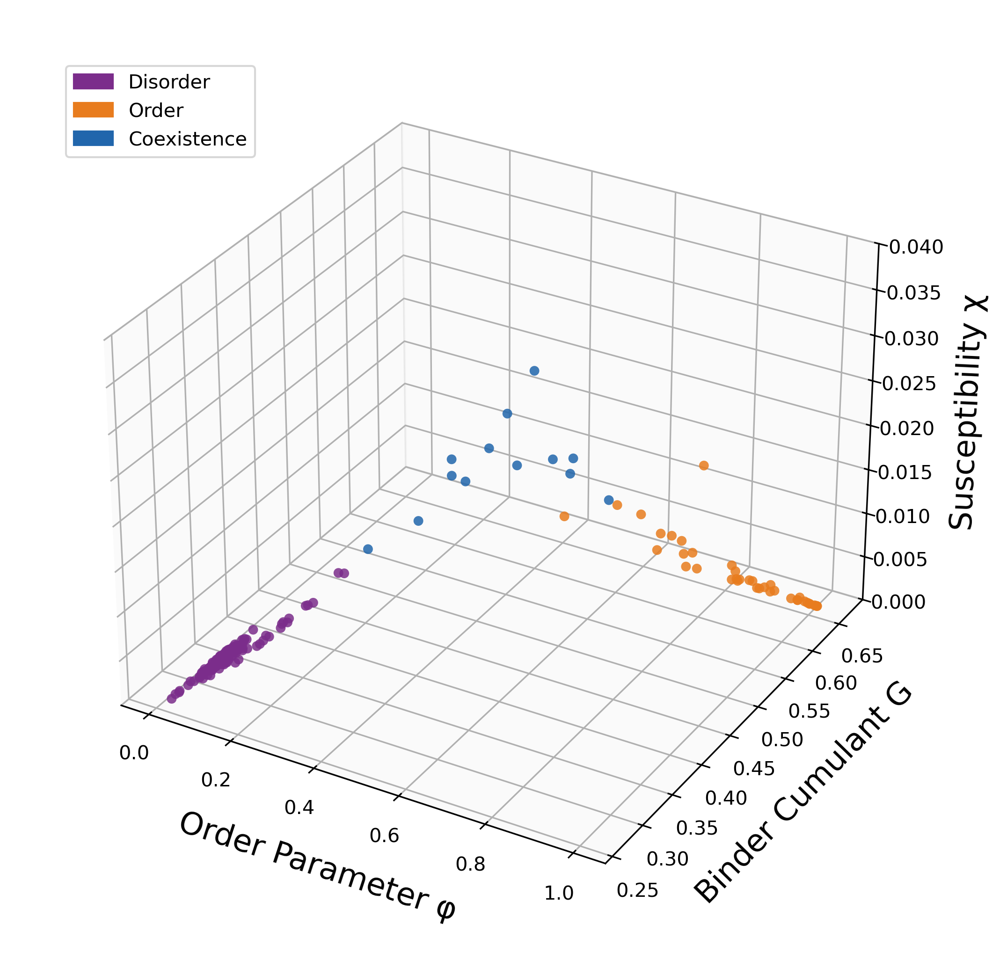
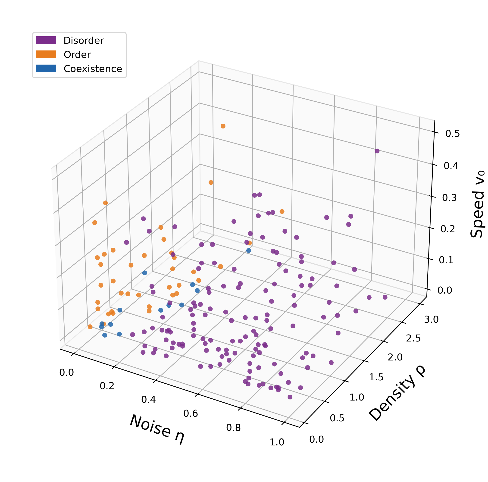
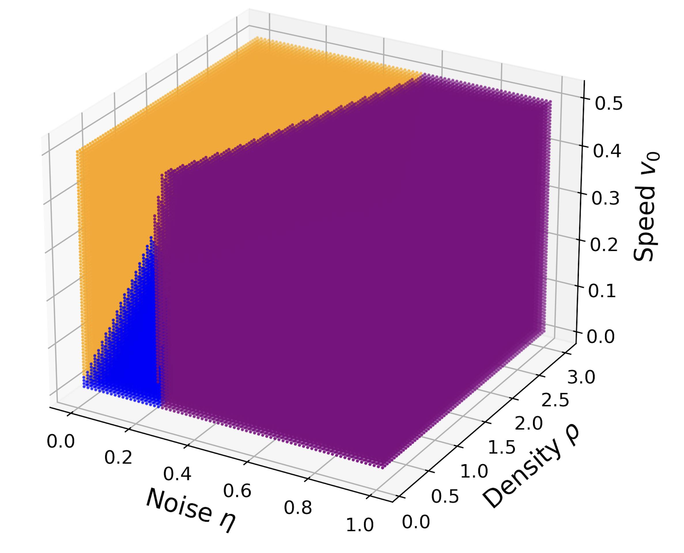
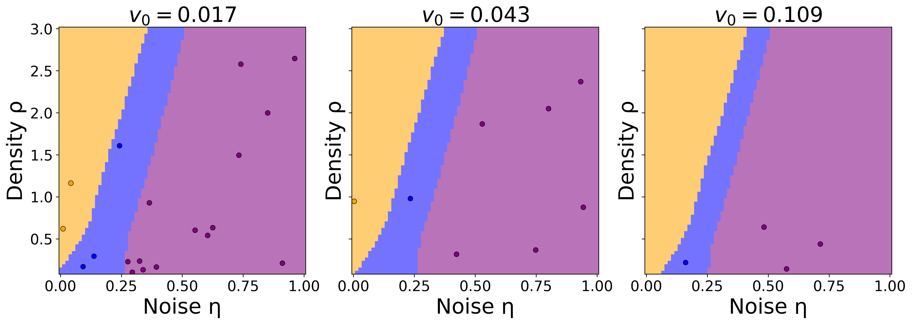

# ヴィクセックモデルの相図を機械学習で描く：集団運動の秩序-無秩序転移を解剖する

- 執筆日：2026年5月3日
- トピック：ヴィクセックモデルの機械学習による相分類
- タグ：Nonequilibrium and Dynamic Response / Nonequilibrium Phase Transitions / Machine Learning
- 注目論文：arXiv:2604.28167「Mapping the Phase Diagram of the Vicsek Model with Machine Learning」Bai & Le (2026)
- 参照論文数：6本

---

## 1. なぜ今この話題なのか

鳥の群れが整然と空を舞い、魚の群れが一体となって泳ぎ、細菌のコロニーが協調的な運動パターンを形成する——こうした**集団運動**（collective motion）は、自然界の至るところに観察される。これらの現象に共通しているのは、個々の構成要素は単純なルールにしか従っていないにもかかわらず、集団全体として複雑な秩序が自発的に生まれるという点である。この「自己駆動する粒子集団が示す非平衡相転移」を理解することは、物理学・生物学・工学の交差点に位置する重要課題として、近年ますます注目を集めている。

集団運動の研究に理論的な基盤を与えたのが、1995年にヴィクセック（Tamás Vicsek）らが提案した**ヴィクセックモデル**（Vicsek model）である。このモデルは驚くほどシンプルな規則——各粒子が近隣粒子の平均進行方向に揃えようとする——だけから出発しながら、ノイズや密度を変えると集団の秩序状態が劇的に変化するという豊かな相転移現象を示す。その「シンプルさと複雑さの共存」が、このモデルを能動物質（active matter）物理学における標準的なテスト台にしてきた。

しかし30年が経った今でも、この単純なモデルの相図（どのパラメータ条件でどの相が現れるか）を完全に描くことは難しい。というのも、相転移の性質（連続か非連続か）をめぐる論争が繰り返され、共存相の存在と構造が徐々に明らかにされてきた歴史があるからだ。さらにパラメータ空間が3次元（ノイズ強度 $\eta$、密度 $\rho$、速度 $v_0$）に広がるため、従来の数値シミュレーションだけでは計算コストが膨大になり、全体像の把握が困難であった。

そこに機械学習（ML）が新たな解決策として登場した。2016年以降、Carrasquilla & Melko [2]、van Nieuwenburg ら [3]、Wetzel [4] らが次々とMLを使った相分類手法を開拓し、イジングモデルなど平衡系での有効性を示してきた。この「物理への機械学習」潮流がいま、非平衡の能動物質系へと拡張されようとしている。本記事で取り上げるBai & Le (2026) [注目論文] は、その先端に位置する研究であり、K-Meansクラスタリングとニューラルネットワーク分類器を組み合わせることで、ヴィクセックモデルの3次元相図を初めてデータ駆動的に描き出した。

また、Carleo ら (2019) [6] が包括的にレビューするように、物理科学への機械学習の応用はすでに多岐にわたるが、相転移の教師なし分類という問題はその中でも特に挑戦的な領域の一つであり、非平衡系での実証例はまだ少ない。この文脈で本論文の位置づけは明確である。

---

## 2. 未解決問題は何か

ヴィクセックモデルの研究が直面してきた本質的な問いは、主に以下の3つに集約される。

**問い①：相転移の次数は連続か非連続か**

ヴィクセックは当初、秩序-無秩序転移は連続（2次）転移だと主張した。しかしGregoireとChaté（2004年）はより大規模なシミュレーションにより、これが実は非連続（1次）転移であることを示した。1次転移では系がある有限の変化を「跳んで」経験するため、相境界の性質が2次転移と根本的に異なる。この論争はいまだ完全には決着しておらず、有限系効果（finite-size effect）の扱いが鍵を握っている。

**問い②：共存相の正確な構造と範囲はどこか**

ヴィクセックモデルを気液転移として再解釈すると、秩序相と無秩序相の間に「共存相」（coexistence phase）が存在することが発見されている。この相では、秩序を持つ粒子の「バンド」が無秩序なガス状背景の中を周期的に走る。しかし、この共存相の正確な相境界は、特に速度 $v_0$ を変えた場合にどう変化するかが十分に調べられていなかった。

**問い③：3次元パラメータ空間全体を効率よくマッピングできるか**

ヴィクセックモデルには3つの自由パラメータ（$\eta, \rho, v_0$）があり、それぞれの組み合わせごとにシミュレーションを実行して相を判定するには膨大な計算が必要になる。また境界付近での判定は特に難しく、人手によるラベリングには恣意性が入り込む。「高次元パラメータ空間を疎なシミュレーション点から補完して全体像を描く」という問題を系統的に解けるかどうかが、方法論的な核心にある。

---

## 3. 注目論文の核心

Bai & Le (2026) は、上記3つの問いすべてに対して新しい手がかりを提供している。彼らの方法論と結果を詳しく見ていこう。

### シミュレーションとデータ構築

まず著者らは、ヴィクセックモデルのエージェントベースシミュレーションを実行した。系のサイズは $L \times L$ の2次元周期境界、粒子数 $N = \rho L^2$ である。パラメータ空間 $(\eta, \rho, v_0)$ を格子状にサンプリングし、合計193点のパラメータ点を得た。各点について5回の独立なシミュレーションを実施し、長時間の定常状態における3つの観測量を記録した。

- **定常秩序パラメータ** $\langle\phi\rangle$：全粒子の速度ベクトル和の大きさを規格化したもの。$\langle\phi\rangle \approx 1$ が秩序相、$\approx 0$ が無秩序相に対応する。
- **バインダーキュムラント** $G = 1 - \langle\phi^4\rangle/(3\langle\phi^2\rangle^2)$：秩序パラメータの揺らぎの尺度。有限系効果の除去に有用で、$G \approx 2/3$ が秩序相、$G \approx 0$ が無秩序相に対応する。
- **感受率** $\chi = N\langle(\phi^2 - \langle\phi\rangle^2)\rangle$：秩序パラメータの分散。相転移点近傍で極大を示すため、相境界の検出に効果的である。

### K-Meansによる教師なし相分類

次に著者らは、この3次元の観測量空間 $(\langle\phi\rangle, G, \chi)$ にK-Meansクラスタリングを適用した。クラスター数 $k$ を1から5まで変えながら、DBSCAN・GMM・スペクトルクラスタリング・K-Meansを比較した結果、$k=3$ のK-Meansが最も性能指標（シルエットスコア、Davies-Bouldin指標、Calinski-Harabasz指標）に優れていた。

このクラスタリングが特定した3つのクラスターは、物理的に意味のある相と対応していた：

- **無秩序相**（紫）：低い $\langle\phi\rangle$、低い $G$、低い $\chi$
- **秩序相**（橙）：高い $\langle\phi\rangle$、$G \approx 2/3$、低い $\chi$
- **共存相**（青）：中程度の $\langle\phi\rangle$ と $G$、高い $\chi$（相転移点近傍の特徴）

重要なのは、このラベリングが観測量の統計だけから得られた「教師なし」のものであり、事前に相の定義を与える必要がなかった点である。

*図1(a)：観測量空間 $(\langle\phi\rangle, G, \chi)$ でのK-Meansクラスタリング結果。紫が無秩序相、橙が秩序相、青が共存相。(Bai & Le 2026, arXiv:2604.28167, CC BY 4.0)*

*図1(b)：K-Meansクラスターラベルをパラメータ空間 $(\eta, \rho, v_0)$ に投影した結果。各点がシミュレーション点に対応する。(Bai & Le 2026, arXiv:2604.28167, CC BY 4.0)*

### ニューラルネットワーク分類器による補完

K-Meansによって193点にラベルが付与されたのち、著者らはこのラベル付きデータセットを使ってニューラルネットワーク分類器を訓練した。入力は3次元ベクトル $\mathbf{x} = (\eta, \rho, v_0)$、出力は3クラス（秩序・無秩序・共存）の確率スコアである。ネットワーク構造は、入力層(3)→隠れ層(128ニューロン、ReLU活性化)→出力層(3ニューロン、Softmax)という単純な順伝播型ネットワークである。

80%の訓練データ・20%のテストデータで学習した結果、テスト精度0.92を達成した。さらにこの学習済み分類器を、元のシミュレーション点より密な格子（パラメータ空間全域）に適用することで、シミュレーションを行っていない点での相を「補完」できる。これが「疎なシミュレーション点から密な相図を構築する」という本論文の主目的を達成するための核心部分である。

### 結果：3次元相図の構築

こうして得られた相図を図2・図3に示す。3次元空間では、広い秩序相の領域が高密度・低ノイズ側に広がり、無秩序相が低密度・高ノイズ側を占め、その間に薄い共存相の帯が走る。

*図2：機械学習が予測したヴィクセックモデルの3次元相図（$\eta, \rho, v_0$ 空間）。紫が無秩序相、橙が秩序相、青が共存相。各点がニューラルネットワークの予測を表す。(Bai & Le 2026, arXiv:2604.28167, CC BY 4.0)*

$v_0$ を固定した $(\eta, \rho)$ 断面図（図3）を見ると、$v_0$ の値によって相境界の形状が変化することが明瞭に見て取れる。特に $v_0$ が小さくなるにつれて、秩序相が維持できる臨界ノイズ強度 $\eta_c$ が下がる傾向が示されている。これは $v_0$ が小さいと粒子が局所的な近傍に長くとどまり、遠距離への配向情報の伝播が弱まるため、全体的な秩序が維持しにくくなるという物理的解釈と整合している。

*図3：$v_0 = 0.017, 0.043, 0.109$ における $(\eta, \rho)$ 平面上の相図断面。陰影がニューラルネットワークの予測領域、点がシミュレーション点。(Bai & Le 2026, arXiv:2604.28167, CC BY 4.0)*

### 新規性の整理

この研究が既存研究と比べて前進した点は主に3つある。第一に、ヴィクセックモデルの相図を $v_0$ を含む3次元パラメータ空間で体系的に描いた初めての試みである。第二に、K-Meansによる教師なしラベリングとニューラルネットワーク分類器を組み合わせた2段階パイプラインが、能動物質系への機械学習適用として機能することを実証した。第三に、共存相の存在と構造をデータ駆動的に確認し、相境界の補完可能性を示した。

---

## 4. 背景と研究史

ヴィクセックモデルの物理的背景と、機械学習を相転移研究に応用する流れを整理しておく。

### 能動物質物理学の確立

自己駆動粒子の集団運動を体系的な物理として整理したのが、Marchetti ら (2013) による能動物質の水力学的理論のレビュー [5] である。このレビューは、細菌・細胞骨格・鳥の群れ・人工的な活性コロイドなど多様な能動物質系に共通する枠組みを提供し、能動物質物理学の標準的な参照文献となった。特にTonerとTu (1995) が導出した水力学方程式は、2次元系でも長距離秩序が存在できることをMermin-Wagnerの定理に反して示し、能動物質が平衡系と根本的に異なる振る舞いをすることを理論的に確立した。ヴィクセックモデルの秩序相の存在はこの理論的支持を持つ。

ヴィクセックモデルそのものの研究史では、3段階の大きな転換があった。第1段階は Vicsek ら (1995) [1] による提案と2次相転移の主張。第2段階はGregoire & Chaté (2004) による1次転移の修正（元の2次転移の主張は有限系効果による誤認だと指摘）。第3段階はバンド共存相の発見であり、これにより単純な「秩序vs無秩序」の2相図が「秩序・無秩序・共存」の3相図へと更新された。注目論文はこの最新の理解を引き継ぎ、それを3次元パラメータ空間で機械学習によって体系化しようとするものである。

### 機械学習×相転移研究の展開

一方、機械学習を相転移の研究に使うという方向性を開いたのが Carrasquilla & Melko (2017) [2] である。彼らは2次元イジングモデルの相（強磁性・常磁性）を教師あり学習で分類し、ニューラルネットワークが相境界を高精度で学習できることを示した。このアプローチは正解ラベルの供給を必要とする：どのパラメータ点が秩序相で、どのパラメータ点が無秩序相かを事前に知っている必要がある。イジングモデルでは厳密解があるため検証が可能だが、論争中のヴィクセックモデルには直接適用しにくい。

van Nieuwenburg ら (2016) [3] が提案した「混乱法」（learning by confusion）はこの問題をうまく回避した。ある温度 $T^*$ を境界の候補として2クラス分類器を訓練する操作を多くの $T^*$ について繰り返すと、$T^*$ が実際の相転移点に近いほど分類器の精度が高くなる。この性質を使って相境界を正解ラベルなしに決定できる。ただしこの方法は1次元のパラメータ走査に特化しており、3次元パラメータ空間への直接拡張は難しい。

Wetzel (2017) [4] はさらに純粋に教師なしな方向を追求し、主成分分析（PCA）や変分オートエンコーダ（VAE）によって相転移を自動的に検出することを示した。これらは生成モデルの潜在空間が相の特徴を捉えるという考え方に基づく。

注目論文のアプローチはこれらの系譜の上に立ちながら、独自の位置を占める。教師なしクラスタリング（K-Means）で相ラベルを生成し、次いで教師あり学習（ニューラルネットワーク）で補完するという2段階構造は、両者の長所を組み合わせたものといえる。特に「物理的な観測量空間でクラスタリング」することで、クラスターが物理的意味を持つことを保証している点が巧みである。Marchetti ら [5] のレビューが指摘するように、能動物質系は対称性の破れのパターンが多様であり、相図が単純な平衡系より複雑になりやすい。だからこそ、データ駆動的なアプローチの価値が高い。

---

## 5. どの解釈が最も妥当か

本章では、注目論文が示した結論の確からしさを多角的に検討する。

### K-Meansラベリングの信頼性

注目論文の根幹をなすK-Meansクラスタリングが本当に正しい相を同定しているかという問いは重要である。著者らは複数のクラスタリング手法を比較して $k=3$ のK-Meansが最良だと示したが、「クラスターが物理的な相に一致している」ことの独立した検証はどこまでなされているか。

有利な点として、クラスターごとの観測量の統計（$\langle\phi\rangle$、$G$、$\chi$ の値）がそれぞれ理論的な相の予測と整合していることが確認されている。秩序相は $G \approx 2/3$（理論値）、無秩序相は $G \approx 0$、共存相は $\chi$ の極大、という対応はよく機能している。これはK-Meansが物理的に意味のある分類をしていることの間接的証拠である。

一方、懸念点もある。K-Meansは等方的な球形クラスターを仮定しており、観測量空間でのクラスターが非球形や非常に不均一なとき（特に共存相のような狭い領域）、誤分類が増える可能性がある。実際に共存相に帰属するデータ点の割合が相対的に少なく（論文中でも指摘されている）、共存相の相境界の精度は秩序相・無秩序相より低い可能性がある。

### ニューラルネットワークによる補完の妥当性

テスト精度0.92は高い数字だが、問題の性質を踏まえて解釈する必要がある。3クラス分類でクラス不均衡がある場合（秩序相と無秩序相が大部分を占める場合）、多数クラスへの偏った分類でも高い精度が得られる可能性があり、クラスごとのF1スコアなどの評価指標の確認が重要になる。論文ではこの点の詳細な議論はないため、特に共存相の分類精度がどの程度かは不明瞭なままである。

また補完（interpolation）という観点では、ニューラルネットワークが学習データの密なサンプリング領域から離れた場所でどれほど信頼できる予測を出すかは、本質的に不確かである。特に共存相のような細い帯状の領域は、もともとのシミュレーション点が疎な場合に見逃されやすく、その幅が過小評価されている可能性がある。

### 先行手法との比較

平衡系（イジングモデル）で確立された先行手法と比較して、ヴィクセックモデルへの適用が難しい理由の一つは、「正解が分かっていない」点にある。イジングモデルでは厳密解が存在するため、MLの結果を検証できる。ヴィクセックモデルでは論争が続いており、MLの出力を何で検証するかが問題になる。

Wetzel (2017) [4] のPCA/VAEアプローチや、van Nieuwenburg ら [3] の混乱法は、いずれも平衡系での有効性が示されてきたが、非平衡系・能動物質系への応用は本格的に始まったばかりである。注目論文は、この非平衡×能動物質という文脈での実証例として価値がある。一方で、混乱法がパラメータ1次元でスキャンするのに対し、本論文のアプローチは3次元空間全体の情報を同時に使えるという明確な利点がある。

注目論文はこの問題を、観測量との整合性で間接的に検証するという方略をとった。これは妥当な方法だが、「K-Meansが相の境界を正確に引けているか」という問いへの最終的な答えは出ていない。より大きな系のシミュレーション、有限系スケーリング解析、あるいは流体力学理論（Toner-Tu方程式）との比較が、結論の確認に向けた次のステップとなる。

### $v_0$ の効果についての解釈

注目論文の注目すべき結論の一つは、$v_0$ が相境界に影響を与えるというものである。これは当初のVicsekらの分析（$v_0$ はほぼ影響しない、と主張）を修正するものであり、より詳細な検証が求められる。このv₀依存性が有限系効果なのか、真に熱力学的限界での性質なのかを判別することが重要な今後の課題である。また $v_0 \to 0$ の極限でXYモデルに近づくという理論的予測との整合性も、検討に値する。

---

## 6. 何が一般化できるのか

### 他の能動物質系への展開

注目論文が示したパイプライン（シミュレーション→観測量計算→教師なしクラスタリング→ニューラルネットワーク分類→相図補完）は、ヴィクセックモデルに特化したものではなく、一般的な多体系に適用できる。例えば活性イジングモデル（Active Ising Model）、活性ブラウン粒子（Active Brownian Particles）、あるいはより生物学的なモデル（細菌の集団運動、神経細胞集団の同期）など、パラメータ空間が高次元で相境界が不明な系に広く応用できる。

Marchetti ら [5] のレビューが指摘するように、能動物質系は対称性の破れのパターンが多様であり、相図が単純な平衡系より複雑になりやすい。連続相転移・1次転移・トポロジカル欠陥の形成など、多様な相転移が混在することも多い。このような複雑な系では、データ駆動的な相図マッピングの価値は特に高い。

Carleo ら (2019) [6] によるレビューが概観するように、物理系への機械学習応用はすでに多岐にわたるが、「教師なし学習で相を同定する」という問題はその中でも特に挑戦的な領域であり、本論文はその非平衡系での実証例として今後繰り返し参照されうる。

### 方法論の限界と一般化の範囲

ただし一般化には限界もある。K-Meansの性能は、物理的に意味のある観測量を適切に選べるかどうかに強く依存する。今回はヴィクセックモデルの場合は $\langle\phi\rangle, G, \chi$ という明確な選択肢があったが、より複雑な系や未知の系では何を観測量とすべきかが自明でない場合もある。また、共存相のような少数データの相の分類精度が下がる問題は、クラス不均衡に対して頑健な学習戦略を要求する。

より長期的な視点では、「なぜこの観測量の組み合わせが機能するのか」という物理的理解を深めることが重要になる。機械学習が相図を描けることと、その相図が熱力学的に正確であることは、必ずしも同じではない。両者の橋渡しとなる理論的理解が、今後の発展の鍵を握っている。

---

## 7. 基礎から理解する

本節では、ヴィクセックモデルと機械学習相分類を理解するために必要な基礎概念を段階的に説明する。

### 7.1 自己駆動粒子と能動物質

まず「能動物質」（active matter）という概念から始めよう。通常の物質（パッシブ物質）では、粒子はエネルギーを外部から受け取って動く（例：温度によるブラウン運動）。一方、能動物質の構成要素は自らエネルギーを消費して自律的に動く。鳥、魚、細菌、人工的な活性コロイドなどがその例である。

能動物質が通常の物質と本質的に異なるのは、系が常に非平衡状態にある点である。平衡統計力学では詳細釣り合い条件（detailed balance）が成り立ち、エントロピー最大・自由エネルギー最小が安定状態を特徴づける。しかし能動物質では各粒子が常にエネルギーを注入・散逸しており、この条件が破れる。そのため、通常の熱力学的枠組みが直接適用できず、新しい理論的枠組みが必要とされる。Marchetti ら [5] が整理したように、この「非平衡かつ集団的」という性質が、能動物質物理学を新しい物理の分野として成立させた核心である。

### 7.2 ヴィクセックモデルの定義

ヴィクセックモデルは、こうした能動物質の最も基本的な理論モデルの一つである。$N$ 個の自己駆動粒子が、周期境界条件を持つ2次元正方形領域（$L \times L$）を動き回る。各粒子 $i$ はその位置 $\mathbf{r}_i(t)$ と速度の向き $\theta_i(t)$ によって記述される。速度の大きさは全粒子で共通の定数 $v_0$ である。

各時間ステップ $\Delta t$ で、粒子は以下の2つのルールに従って更新される：

$$\mathbf{r}_i(t+\Delta t) = \mathbf{r}_i(t) + v_0 \begin{pmatrix}\cos\theta_i(t) \\ \sin\theta_i(t)\end{pmatrix}$$

$$\theta_i(t+\Delta t) = \mathrm{Arg}\left(\sum_{j \in \mathcal{N}_i^R(t)} e^{i\theta_j(t)}\right) + \eta\,\xi_i(t)$$

ここで $\mathcal{N}_i^R(t)$ は時刻 $t$ に粒子 $i$ から半径 $R$ 以内にいる粒子の集合、$\mathrm{Arg}(\cdot)$ は複素数の偏角（近傍粒子の向きの平均を求める操作）、$\eta$ はノイズの強さ（0から大きい正の値まで）、$\xi_i(t) \sim \mathcal{U}[-1/2, 1/2]$ は一様乱数である。

言葉で言い換えると、「各粒子は近隣の粒子たちの平均進行方向にランダムノイズを加えた向きへ進む」というただ一つのルールである。隣人への同調（整列）とランダムなノイズ（乱れ）の競合が、このモデルのすべての豊かな振る舞いを生み出す。制御パラメータとして論文では $\eta$（ノイズ強度）、$\rho = N/L^2$（粒子密度）、$v_0$（速度）の3つが変化される。

### 7.3 秩序パラメータと相転移の概念

モデルの全体状態を特徴づけるために、**秩序パラメータ**（order parameter）$\phi$ が定義される：

$$\phi(t) = \frac{1}{Nv_0}\left|\sum_{i=1}^N \mathbf{v}_i(t)\right|$$

これは全粒子の速度ベクトルの和の大きさを規格化したものである。全粒子が完全に同じ方向を向いていれば $\phi = 1$（完全秩序）、方向がランダムにばらけていれば $\phi \approx 0$（完全無秩序）となる。

ここで**相転移**の概念を整理しよう。相転移とは、ある制御パラメータ（ここではノイズ強度 $\eta$）を変えたとき、系の状態が定性的に変化する現象である。水が0℃で氷から水へ変わる（1次転移）、あるいは鉄が磁石になる（強磁性相転移、連続転移）などが身近な例だ。

**2次転移（連続転移）** では秩序パラメータが転移点でゼロから連続的に立ち上がる。転移点では相関長が発散し、スケール不変性が現れるなどの普遍的な性質がある。**1次転移（非連続転移）** では秩序パラメータが転移点で不連続に飛び、2相の共存が可能で、ヒステリシスが見られる。共存状態では、異なる相の「ドメイン」が共存して混在する。

ヴィクセックモデルでは、ノイズ $\eta$ が小さく（かつ密度 $\rho$ が大きい）と粒子が整列しやすく、$\eta$ が大きいと整列が崩れる。この転移が連続か非連続かという議論が30年続いてきた核心である。

### 7.4 バインダーキュムラントと有限系スケーリング

コンピュータシミュレーションでは系のサイズ $L$ が有限であるため、どんな転移も「丸められて」見える。**有限系スケーリング**（finite-size scaling）はこの問題を系統的に扱う手法で、異なるサイズ $L$ でのデータを組み合わせて熱力学的極限（$L \to \infty$）での振る舞いを外挿する。

この際に役立つのが**バインダーキュムラント**（Binder cumulant）$G$ である：

$$G = 1 - \frac{\langle\phi^4\rangle}{3\langle\phi^2\rangle^2}$$

これは秩序パラメータの分布の「非ガウス度」を測る量である。秩序相では $\phi$ がほぼ一定（分布が鋭い）なので $G \approx 2/3$、無秩序相では $\phi$ がランダム（ガウス分布的）なので $G \approx 0$ となる。2次転移では、異なるサイズ $L$ でのバインダーキュムラント $G$ 対制御パラメータの曲線は転移点で交差するという重要な性質がある。この交差点を読み取ることで転移点を精度よく特定できる。1次転移では $G$ が負になるという特徴的な振る舞いを示し、これが転移次数の判定に使われる。

**感受率**（susceptibility）$\chi$ は秩序パラメータの揺らぎの大きさで、相転移点では揺らぎが大きくなるため $\chi$ が極大を示す。これが相境界の目印となる。注目論文では特にこの感受率の極大が共存相（バンド相）を識別するために最も重要な観測量として機能した。

### 7.5 機械学習による相分類：K-MeansとニューラルネットワーK

**K-Meansクラスタリング**は、データ点を $k$ 個のクラスターに分類する基本的な教師なし学習アルゴリズムである。アルゴリズムの手順は：(1) $k$ 個の重心（centroid）を初期配置する、(2) 各データ点を最も近い重心に帰属させる、(3) 各クラスターの重心をクラスター内の平均に更新する、(4) 収束するまで(2)(3)を繰り返す、というものである。

K-Means++初期化では、重心を互いに遠くなるように確率的に選ぶことで、より良い収束を保証する。注目論文ではデータ点は193個のシミュレーション点で、各点の特徴量は $(\langle\phi\rangle, G, \chi)$ の3次元ベクトルである。z-score正規化（各特徴量から平均を引いて標準偏差で割る：$Z = (X-\mu)/\sigma$）を行ったのち、K-Meansを適用すると、物理的に意味のある3クラスターが自動的に現れた。

**ニューラルネットワーク分類器**は、入力 $(\eta, \rho, v_0)$ から相ラベルへのマッピングを学習する。今回の「全結合フィードフォワードネットワーク（1隠れ層、128ニューロン、ReLU活性化、Softmax出力）」は標準的な構造である。ReLU活性化関数 $f(x) = \max(0, x)$ は非線形性を導入し、複雑なパラメータ-相の境界を学習できるようにする。Softmax出力は3クラスの確率分布を与える。

学習済みモデルは、シミュレーションを行っていない新しいパラメータ点に対しても相を予測できる（補完能力）。これが「疎なシミュレーション点から密な相図を構築する」という本論文の主目的を達成するための核心部分である。Carrasquilla & Melko [2] のアプローチがシミュレーション点での分類に注力したのに対し、注目論文はこの補完能力を積極的に活用している点が方法論的な進歩である。

---

## 8. 専門用語の解説

**1. 能動物質（Active Matter）**

自らエネルギーを消費して自律的に動く粒子からなる物質の総称。平衡統計力学の枠組みが適用できない非平衡系の典型例。鳥の群れ・細菌・活性コロイドなどが具体例。本論文のヴィクセックモデルはこの能動物質の最もシンプルな理論モデルであり、能動物質研究のベンチマークとして使われる。

**2. ヴィクセックモデル（Vicsek Model）**

1995年にVicsekらが提案した能動物質の最小モデル [1]。「各自己駆動粒子は近隣粒子の平均方向に揃えながらランダムノイズを加えて動く」というただ一つのルールから、豊かな相転移現象が生まれる。自由パラメータは $(\eta, \rho, v_0)$ の3つ。

**3. 秩序-無秩序転移（Order-Disorder Transition）**

制御パラメータ（ノイズ強度 $\eta$、密度 $\rho$ など）を変えたときに、系が揃った方向に集団運動する「秩序相」と、ランダムに動く「無秩序相」の間で起きる相転移。転移が連続（2次）か不連続（1次）かはヴィクセックモデルで30年にわたり論争が続く。

**4. 共存相（Coexistence Phase / Banding Phase）**

秩序相と無秩序相の間に存在する第3の相。秩序を持つ粒子の「バンド」（帯状構造）が無秩序なガス状の粒子の中を周期的に走る状態。液体と気体が共存する気液転移との類似から発見・整理された。本論文はこの相を機械学習によって自動的に識別することに成功した。共存相の感受率 $\chi$ が特に高い値を示すことがK-Meansによる識別の根拠となった。

**5. 秩序パラメータ（Order Parameter）**

系の「秩序度」を一つの数値で表す量。ヴィクセックモデルでは全粒子の速度ベクトルの和の規格化された大きさ $\phi$。秩序相では $\phi \approx 1$、無秩序相では $\phi \approx 0$、共存相では中間的な値をとる。相転移の検出と特徴づけに不可欠な概念で、凝縮体物理学全般に広く使われる。

**6. バインダーキュムラント（Binder Cumulant）**

$G = 1 - \langle\phi^4\rangle/(3\langle\phi^2\rangle^2)$ で定義される秩序パラメータの4次統計量。有限系スケーリング解析で相転移点を精度よく特定するために使われる。秩序相では 2/3、無秩序相では 0 に収束し、1次転移では負の値をとるという特徴的な振る舞いを示す。異なる系サイズでのG対制御パラメータ曲線の交点が転移点を与える。

**7. 感受率（Susceptibility）**

$\chi = N\langle(\phi^2 - \langle\phi\rangle^2)\rangle$ で定義される秩序パラメータの揺らぎの大きさ。相転移点近傍で極大を示す。本論文ではK-Meansが共存相（バンド相）を他の相と区別するための最も重要な観測量として機能した。感受率のピークが相境界の目印として使われる。

**8. K-Meansクラスタリング**

データ点を $k$ 個のクラスターに分類する教師なし学習アルゴリズム。各点を最近傍の重心に帰属させ、重心をクラスターの平均で更新する操作を繰り返す。本論文では $k=3$ で3つの相（秩序・無秩序・共存）が自動的に同定された。DBSCAN・GMM・スペクトルクラスタリングとの比較でK-Meansが最も性能指標に優れていたことが示されている。

**9. 有限系スケーリング（Finite-Size Scaling）**

熱力学的極限（系のサイズ $L \to \infty$）での相転移点や臨界指数を、有限のシミュレーションから外挿する手法。ヴィクセックモデルでは系のサイズ $L$ を変えながらバインダーキュムラント $G$ を測定し、異なる $L$ でのG対 $\eta$ 曲線の交点から転移点 $\eta_c$ を特定する。有限系効果の誤認がVicsekの当初の2次転移の主張につながった歴史的な教訓がある。

**10. 混乱法（Learning by Confusion）**

van Nieuwenburg ら [3] が提案した教師なし相転移検出法。仮の転移点 $T^*$ を設定して2クラス分類器を訓練する操作を $T^*$ を走査しながら繰り返し、分類精度が最大になる $T^*$ が真の転移点に対応する。事前ラベルが不要な点で優れているが、1次元パラメータ走査に特化しており、注目論文のような3次元パラメータ空間の全体マッピングには直接適用が難しい。

---

## 9. 今後の展望

注目論文が達成したことで最も確かと言えるのは、「機械学習の2段階パイプライン（K-Means＋ニューラルネットワーク）がヴィクセックモデルの相分類に機能する」という実証である。特に、共存相という薄い領域を教師なし学習が自動的に識別できたことと、3次元パラメータ空間 $(\eta, \rho, v_0)$ での補完が可能であることは、方法論の有効性を示す重要な結果である。また、$v_0$ が相境界の形状に影響を与えるという発見は、既存の理解を更新する新しい知見として注目に値する。一方でまだ未確定な点も多い。特にv₀依存性の詳細（どの程度の有限系効果が残っているか、熱力学的極限での相境界がv₀にどう依存するか）は、より大規模なシミュレーションと有限系スケーリング解析によって検証される必要がある。また、共存相の分類精度がクラス不均衡の影響を受けている可能性があり、クラスごとのF1スコアによる詳細な評価が望まれる。さらに、ニューラルネットワークの補完精度を独立に検証するベンチマークがあれば、結論の信頼性がより高まるだろう。

今後1〜3年で特に注目すべき展開として、まず本論文のパイプラインの他の能動物質モデル（活性イジングモデル、活性ブラウン粒子、3次元ヴィクセックモデル）への適用が挙げられる。理論面では、Toner-Tu水力学方程式が予言する相図とMLが描いた相図の定量的比較が、両者の整合性を確かめる試金石となるだろう。計算面では、アクティブラーニング（学習中に最も情報量の多いパラメータ点を選んで追加的にシミュレーションする手法）を組み込むことで、より少ないシミュレーション点から精度の高い相図を得る効率化も期待される。Carleo ら [6] がレビューで指摘した「物理の第一原理とデータ駆動手法の融合」という方向性が、この分野でもより本格化していくことが予想される。

---

## 参考論文一覧

1. [T. Vicsek et al. (1995) "Novel Type of Phase Transition in a System of Self-Driven Particles", Phys. Rev. Lett. 75, 1226](https://arxiv.org/abs/cond-mat/9411071) — 自己駆動粒子の集団運動モデルを初めて提案し、秩序-無秩序転移の存在を示した原著論文。ヴィクセックモデルの出発点。

2. [J. Carrasquilla & R. Melko (2017) "Machine learning phases of matter", Nat. Phys. 13, 431](https://arxiv.org/abs/1605.01735) — 教師ありニューラルネットワークがイジングモデルの相を高精度で分類できることを示した、機械学習×相転移研究の先駆的論文。

3. [E.P.L. van Nieuwenburg et al. (2017) "Learning phase transitions by confusion", Nat. Phys. 13, 435](https://arxiv.org/abs/1610.02048) — 正解ラベルなしに相転移点を特定できる「混乱法」を提案し、機械学習による教師なし相分類の道を開いた。

4. [S.J. Wetzel (2017) "Unsupervised learning of phase transitions: from principal component analysis to variational autoencoders", Phys. Rev. E 96, 022140](https://arxiv.org/abs/1703.02435) — PCAやVAEなどの生成モデルを用いた完全教師なし相転移検出を示し、機械学習の物理系への応用を広げた。

5. [M.C. Marchetti et al. (2013) "Hydrodynamics of soft active matter", Rev. Mod. Phys. 85, 1143](https://arxiv.org/abs/1207.2929) — 能動物質の水力学的理論を体系的にレビューし、Toner-Tu方程式を含む理論的枠組みを整理した包括的論文。能動物質物理学の標準的参照文献。

6. [G. Carleo et al. (2019) "Machine learning and the physical sciences", Rev. Mod. Phys. 91, 045002](https://arxiv.org/abs/1903.10563) — 物理科学全般への機械学習応用を体系的にレビューし、相転移・量子系・素粒子物理など幅広い応用を俯瞰したレビュー。
