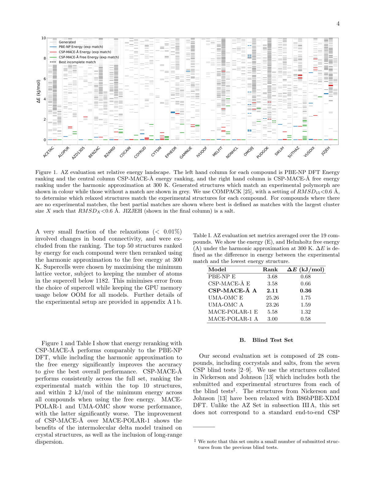
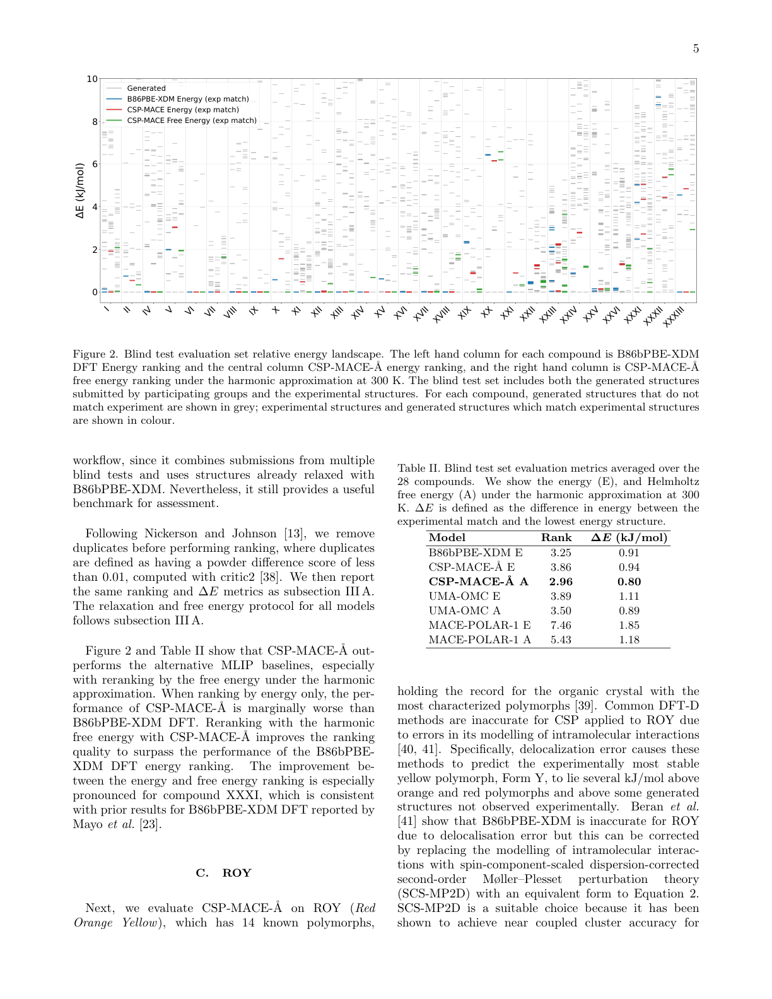
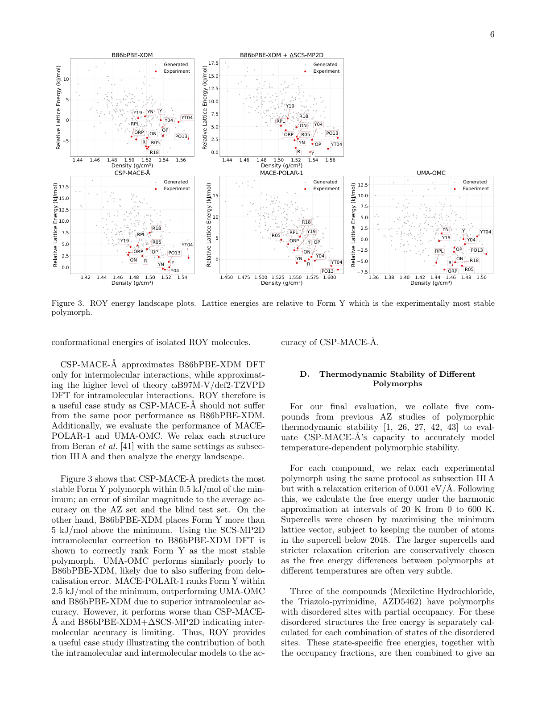

# 機械学習ポテンシャルでDFTを超えた結晶構造予測

- **執筆日**: 2026-06-01
- **要旨**: 有機分子結晶の安定な充填構造を予測する「結晶構造予測（CSP）」は、医薬品開発において多形スクリーニングの中心的課題である。従来は密度汎関数理論（DFT）によるエネルギー評価が精度の鍵を握っていたが、何千もの候補構造に対してDFT計算を実行するコストは膨大であった。本論文が提案するCSP-MACE-Å は、分子内相互作用と分子間相互作用を分離して学習する機械学習原子間ポテンシャル（MLIP）であり、19化合物からなるAstraZeneca評価セットでPBE DFTと同等の精度を、CSPブラインドテスト28化合物セットでB86bPBE-XDM DFTに迫る精度を実証した。DFTより4桁以上高速でありながらDFTレベルの精度を達成したことは、CSPワークフローの実用的加速と多形リスク評価への応用に向けた重要な一歩である。
- **タグ**: `main-area: materials-informatics` / `sub-area: crystal-structure-prediction; molecular-crystal; polymorphism` / `method-tag: MACE-MLIP; dispersion-correction; harmonic-free-energy`
- **anchor 論文**: [arXiv:2605.28905](https://arxiv.org/abs/2605.28905) — Midgley et al. (Ångström AI / Cambridge / AstraZeneca), 2026-05-27
- **参照論文数**: 7本
- **この記事の中心的な問い**: 機械学習ポテンシャルは、結晶構造予測における DFT のエネルギー評価を本当に置き換えられるか？　そのための障壁は何で、CSP-MACE-Å はどこまでそれを克服したのか？

---

## 1. なぜ今このテーマか

医薬品の固体形態は、溶解性・安定性・生体利用率に直結する。同一の有機分子でも結晶の積み重なり方が異なると（多形、または polymorphism と呼ぶ）、薬としての挙動は全く異なる。代表的な例として、HIV 治療薬リトナビルが 1998 年に市場で突然安定性の低い多形から安定多形へと転換し、製品の自主回収を余儀なくされた事件がある。このような事態を事前に回避するためには、製剤設計段階で考えられるすべての多形を探索・評価しておく必要がある。

結晶構造予測（Crystal Structure Prediction、CSP）とは、分子の二次元化学構造だけを出発点として、最も安定な結晶充填様式を理論的に予測する計算科学の手法である。CSP の基本的な流れは二段階に分かれる。まず「構造探索」段階では、ランダムパッキングや遺伝的アルゴリズムを用いて数万から数百万に及ぶ候補構造を生成する。次の「エネルギー評価」段階では、それらの候補構造をエネルギーの低い順に並べ替え、実験で観測される多形が上位に現れるかどうかを調べる。

問題はこの第二段階にある。高精度なエネルギー評価には DFT（密度汎関数理論）が不可欠だが、1 構造あたり数時間から数日を要するDFT計算を何千もの候補に適用することは計算資源の観点から非現実的である。Cambridge Crystallographic Data Centre（CCDC）が主催する CSP ブラインドテストは、1999 年から始まり 7 回の実施を通じてこの課題を継続的にモニターしてきた。第 7 回ブラインドテスト（2024 年）では初めて機械学習原子間ポテンシャル（MLIP）を用いたチームが参加したが、その精度は DFT ベースの手法に対して見劣りするものであった。

なぜ MLIP は CSP でうまくいかなかったのか。分子間相互作用、特に分散力（ファンデルワールス力）の精密な再現が難しかったからである。分子結晶の積み重なりを決定するエネルギー差は数 kJ/mol というわずかな値であり、分散力の長距離成分をニュートン-ラプラソン精度で記述しないと多形の相対安定性の序列が崩れる。既存の汎用 MLIP（MACE-POLAR-1 や Meta の UMA-OMC など）はこの要件を満たしていなかった。

CSP-MACE-Å は、この長年の障壁を正面突破しようとした。相互作用の種類ごとに「分子内」と「分子間」を明示的に分離し、それぞれを適切なアーキテクチャと訓練データで扱うという設計思想は、従来の汎用 MLIP とは一線を画す。

---

## 2. 何が新しいのか

### エネルギー分解という設計思想

CSP-MACE-Å の核心は、全エネルギーを分子内エネルギーと分子間エネルギーに分離して取り扱う点にある。

$$E^{\text{CSP-MACE-Å}}_{\text{total}} = E^{\text{CSP-MACE-Å}}_{\text{intra}} + E^{\text{CSP-MACE-Å}}_{\text{inter}}$$

この分離は単なる形式的分割ではない。分子内相互作用（共有結合、角度、二面角など）は分子間相互作用よりも一桁以上大きく、もし両者を一括して学習しようとすると分子間のわずかなエネルギー差が損失関数に埋もれてしまう。これが従来の汎用 MLIP が CSP で精度を発揮できなかった主因の一つであった。

**分子内モデル**には MACE-POLAR アーキテクチャを採用し、Meta AI が公開した OMol25 データセット（1 億件超の $\omega$B97M-V/def2-TZVPD レベルの DFT 計算）で学習した。OMol25 は溶媒和分子、金属錯体、生体分子などを含む広大な化学空間をカバーしており、有機薬物分子の分子内ポテンシャルエネルギー面を高精度で再現できる。

**分子間モデル**は三つの項から構成される。

$$E^{\text{CSP-MACE-Å}}_{\text{inter}} = E^{\text{MACE-POLAR}}_{\text{inter}} + E^{\text{XDM}}_{\text{inter}} + E^{\text{delta}}_{\text{inter}}$$

第一項は MACE-POLAR モデルからの分子間寄与である。第二項は XDM（eXchange-hole Dipole Moment）分散補正であり、

$$E^{\text{XDM}} = -\frac{1}{2}\sum_{n=6,8,10}\sum_{ij}\frac{C_{n,ij}}{R^n_{ij} + R^n_{\text{vdW},ij}}$$

ここで $R_{ij}$ は原子間距離、$C_{6,ij}$、$C_{8,ij}$、$C_{10,ij}$ は原子ペアの分散係数、$R_{\text{vdW},ij}$ は有効ファンデルワールス半径の和である。CSP-MACE-Å では、これらパラメータをÅngström AI の内部データセット（5 万件の B86bPBE-XDM DFT 計算）から推定した平均値に固定している。これにより、計算コストを最小化しつつ長距離分散の物理を正しく組み込んでいる。

第三項がデルタモデルであり、他の二項では再現できない短距離分子間相互作用の残差を学習する。デルタモデルの訓練ターゲットは、

$$E^{\text{delta-target}}_{\text{inter}} = E^{\text{DFT}}_{\text{inter}} - E^{\text{MACE-POLAR}}_{\text{inter}} - E^{\text{dispersion}}_{\text{inter}}$$

として定義される。このように、より精度の高い計算（B86bPBE-XDM DFT）との差分だけを学習させるデルタ学習（delta learning）の手法によって、少量の参照計算（5 万件）で高い補正精度を達成している。

### 評価設定

論文は二つの独立した評価セットを用いた。第一は、AstraZeneca が過去の CSP 研究で用いた 19 化合物（塩を 1 化合物含む）からなる AZ セットである。第二は、過去 7 回の CSP ブラインドテストから収集した 28 化合物（コクリスタル・塩を複数含む）からなるブラインドテストセットである。

各化合物について、既存の CSP ワークフローで生成された候補構造群をまず CSP-MACE-Å でエネルギー最小化し、上位 50 構造をさらに調和近似による自由エネルギーで並べ替えた。実験で知られる結晶構造（実験的多形）が生成候補の中に含まれているかどうかを COMPACK アルゴリズム（RMSD15 < 0.6 Å）で判定し、上位 10 位内に入るかを評価指標とした。

---

## 3. どこまで分かったのか

### AZ セットでの結果（Figure 1）

*Figure 1（arXiv:2605.28905, Fig. 1、CC BY 4.0）。横軸に AZ セット 19 化合物、縦軸に生成構造の相対エネルギー（kJ/mol）を示す。各化合物について左から、PBE-NP DFT エネルギー順位、CSP-MACE-Å エネルギー順位、CSP-MACE-Å 自由エネルギー順位の 3 列を並べた。実験的多形に対応する構造は着色点で示す。*

Figure 1 が示す最も重要な事実は、CSP-MACE-Å による自由エネルギー順位付けが 19 化合物すべてで実験的多形を上位 10 位以内に収めており、かつ最小エネルギーからの乖離が 2 kJ/mol 以内であることである。エネルギーのみで順位付けした場合でも、PBE-NP DFT と同等の性能を示す。

特筆すべきは自由エネルギー補正の効果である。調和近似による 300 K 自由エネルギーによる再順位付けは、エネルギー単独の順位付けより一貫して改善をもたらした。これは多形間のエネルギー差が非常に小さい場合に、零点エネルギーや格子振動の寄与が判定に効いてくることを示している。

### ブラインドテストセットでの結果（Figure 2）

*Figure 2（arXiv:2605.28905, Fig. 2、CC BY 4.0）。ブラインドテスト 28 化合物を対象とし、左から B86bPBE-XDM DFT、CSP-MACE-Å エネルギー、CSP-MACE-Å 自由エネルギーの 3 列を比較する。*

28 化合物のブラインドテストセットでは、エネルギーのみの順位付けでは CSP-MACE-Å が B86bPBE-XDM DFT をわずかに下回る場合があるが、自由エネルギー再順位付けによってこの差は解消され、DFT の純粋なエネルギー順位付けを上回ることが多い。特に化合物 XXXI については、自由エネルギー補正が決定的に重要であり、これは先行研究（Mayo et al.）の B86bPBE-XDM 結果とも整合する。

MACE-POLAR-1 および UMA-OMC（Meta の汎用 MLIP）との比較では、両モデルとも複数の化合物で実験的多形を上位 50 位に収められない場合があったのに対し、CSP-MACE-Å はほぼすべての化合物で上位 10 位内に捉えることに成功した。

### ROY 多形系での検証（Figure 3）

*Figure 3（arXiv:2605.28905, Fig. 3、CC BY 4.0）。ROY 化合物の多形エネルギーランドスケープを B86bPBE-XDM DFT（上段左）、同+SCS-MP2D 補正（上段右）、CSP-MACE-Å（下段左）、MACE-POLAR-1（下段中）、UMA-OMC（下段右）で比較する。*

ROY（5-methyl-2-[(2-nitrophenyl)amino]-3-thiophenecarbonitrile）は 13 種の既知多形をもつ有機化合物の中でも多形性が特に豊かな物質として知られる。ROY を用いた検証は、エネルギーランドスケープの精密さを試す厳しいテストである。

Figure 3 から読み取れる興味深い事実は、B86bPBE-XDM DFT が ROY の最安定形 Form Y を最小エネルギーより 5 kJ/mol 以上高いエネルギーに配置してしまうのに対して、CSP-MACE-Å は Form Y を 0.5 kJ/mol 以内の誤差で正しく予測することである。これは逆説的に見えるが、理由は明確だ。ROY は多形間で分子コンフォメーションが大きく異なるため、分子内エネルギーの精度が正確な安定性序列の決定に決定的な役割を果たす。CSP-MACE-Å は分子内エネルギーを $\omega$B97M-V/def2-TZVPD レベルで記述しており、これは B86bPBE-XDM よりも高精度な分子内記述を与える。ROY の例は、CSP-MACE-Å の設計思想（分子内・分子間の分離学習）が単なる工学的工夫ではなく、物理的に意味のある優位性をもたらすことを示している。

### 温度依存多形安定性の予測

論文の後半では、サルファチアゾール（5 つの多形をもち、温度によって安定性の序列が変わる）、メキシレチン塩酸塩、AZD1305（AstraZeneca の薬物候補）、トリアゾロピリミジン化合物、AZD5462 という 5 つの化合物について、調和近似による温度依存自由エネルギーを計算した結果を示す。

サルファチアゾールでは、実験的に確認されている多形安定性の温度依存トレンド（Form V と I の安定性が高温で増加し、残りが低下する）を CSP-MACE-Å が定性的に正しく再現した。ただし、低温・高温での多形の具体的な順序は完全には再現できておらず、PBE-TS DFT も同様の定性的挙動を示すものの定量的には不完全である。AZD5462 については、実験データと非常によく一致する自由エネルギー-温度関係が得られた。

これらの結果が示す重要点は、CSP-MACE-Å が「静的エネルギー順位付け」にとどまらず、「多形の温度依存熱力学」という、より実用的かつ困難な問いにも一定の答えを与えられることである。

---

## 4. 研究の流れの中でどう位置づくか

CSP の歴史を振り返ると、2000 年の第 1 回ブラインドテスト以来、手法は段階的に進化してきた。初期は経験的力場（Neumann-Perrin の可搬性力場など）が主流であり、比較的小分子に限定された精度を提供していた。2010 年代以降は DFT-D（分散補正 DFT）が標準となり、精度は飛躍的に向上した。一方で計算コストの問題は解決されなかった。

MACE アーキテクチャの登場（Batatia et al., 2022）は MLIP の精度と速度の両面で転換点をもたらした。MACE は高階等変メッセージパッシングニューラルネットワークを基礎とし、同精度の従来 MLIP に比べて計算速度と汎化性能で優れた。これを基盤として MACE-OFF（Kovács et al., arXiv:2312.15211, CC BY 4.0）が有機分子向けの汎用力場として開発され、分子結晶・液体・ペプチドへの応用が示された。MACE-OFF は分子結晶への応用可能性を示したが、長距離分散の精密な取り扱いが課題として残った。

並行して、Della Pia et al.（arXiv:2502.15530, CC BY 4.0）は MACE-MP-0 ファウンデーションモデルを X23 データセット（23 種の分子結晶）にファインチューニングし、わずか約 200 点のデータで亜化学精度の格子エネルギーと昇華エンタルピーを達成する手法を示した。この研究は、少量の高品質参照データとファウンデーションモデルを組み合わせることで、分子結晶の有限温度特性（非調和性・核量子効果を含む）を高精度で記述できることを証明した。

MolCryst-MLIPs（arXiv:2604.13897, CC BY 4.0）は、ベンズアミドや安息香酸など 9 種の分子結晶系について MACE-MH-1 ファウンデーションモデルからファインチューニングした MLIP データベースを構築し、MD シミュレーションによる多形ダイナミクス研究への応用を示した。これらの「化合物固有 MLIP」アプローチは精度で優れるが、未知分子に対して毎回訓練が必要という制限がある。

CSP-MACE-Å は、これら二つのアプローチの中間を狙っている。特定化合物に依存せず汎用的に使えるが、分子間相互作用の物理（分散力）を明示的にモデル化することで既存の汎用 MLIP の弱点を克服する。この設計思想は、第 7 回ブラインドテストで判明した「汎用 MLIP の分子間精度不足」という問題への直接的な応答である。

---

## 5. どこまで広がるのか

### 製薬 CSP ワークフローへの実装

最も直接的な応用は、製薬研究における CSP ワークフローの高速化である。DFT より 4 桁高速であれば、現在の数百構造から数万構造への候補評価規模の拡大が現実的となる。論文も指摘するように、これは単なる速度向上ではない。DFT のコストのために「現状では評価しきれず除外せざるを得なかった候補多形」を網羅的に評価できるようになり、CSP の精度そのものが改善される可能性がある。また、自由エネルギー計算を多数の候補構造に対して実施できるようになることで、温度依存多形リスク評価が常規的になりうる。

### 他の材料系・化学空間への展開

CSP-MACE-Å は有機分子結晶に特化して設計されているが、そのアーキテクチャ思想（エネルギー分解 + デルタ学習）は他の材料系にも適用できる可能性がある。たとえば、MOF（金属有機構造体）や HOF（水素結合有機構造体）など、金属を含む多成分結晶への展開には、金属-配位子相互作用の精密な記述という追加課題があるが、OMol25 のような広大な訓練データを活用することで対応できるかもしれない。

### 物性予測との統合

論文が展望として触れるように、CSP-MACE-Å をエネルギー評価器として使いながら、同時に溶解度・バイオアベイラビリティなどの物性を予測するモデルと組み合わせることで、「構造予測 → 物性評価」の統合パイプラインが実現できる。これは新薬候補の固体形態設計を根本的に変える可能性をもつ。

### 限界：一般化の課題

ただし、いくつかの重要な制限に注意が必要である。第一に、CSP-MACE-Å の分子間 XDM パラメータは 5 万件の内部データセットから推定した平均値に固定されており、分子の化学的多様性への対応には暗黙的な仮定がある。第二に、非常に柔軟な大分子や複雑なコンフォメーション空間をもつ化合物では、デルタモデルの汎化性能が未検証である。第三に、共結晶や塩では対イオンの長距離静電相互作用の寄与が大きく、評価セットでの結果が必ずしも一般的状況に対応するとは限らない。

---

## 6. 次に問うべきこと

### 分子間相互作用モデルの精度限界

現在の CSP-MACE-Å では XDM 分散パラメータを平均値で固定しているが、化学環境に応じた「可変パラメータ」を MACE ネットワーク自体が予測する仕組みに拡張することは可能である。MACE-POLAR-1 がすでに分極率の予測を通じた長距離静電を扱う試みをしているように、分散係数の系統的な機械学習は精度向上の自然な次のステップとなる。仮説として「化学環境依存の学習済み $C_6$, $C_8$, $C_{10}$ パラメータを用いれば、現在のデルタモデルの役割の一部を吸収し、より少ない参照計算で同等以上の精度が実現できる」という問いを立てることができる。これは量子化学計算と機械学習の深い統合を要求する課題であり、検証には多様な化学組成の分子結晶における格子エネルギーとフォノン分散の系統的測定・計算が必要になる。

### 柔軟分子・大分子への一般化

現在の評価セットに含まれる化合物の多くは比較的剛直な中分子（分子量 200–400 程度）である。高度に柔軟な分子、例えば複数の回転可能結合をもつ大分子医薬品（分子量 500 超）では、コンフォメーション空間が爆発的に広がり、分子内ポテンシャルエネルギー面の精確な表現がより重要になる。OMol25 がそのような分子を十分にカバーしているかは現時点では不明であり、系統的な検証が求められる。さらに、第 7 回ブラインドテストで難関とされた「大型柔軟分子を含む標的」への CSP-MACE-Å の性能を確認することが次の重要な実験的検証となる。

### コクリスタル・塩の特殊性

多成分結晶（コクリスタル・塩・溶媒和物）では、異なる分子間の電荷移動・イオン性相互作用・水素結合ネットワークが複雑に絡み合う。現在の CSP-MACE-Å は塩を含む評価セットでも一定の成果を示しているが、高度にイオン性の系や強い水素結合ドナー/アクセプターをもつ系での精度は未知数である。イオン性固体に対する MLIP の体系的な評価は、汎用ポテンシャルの重要な課題として残っている。

### 候補構造生成との統合

CSP-MACE-Å は候補構造の「評価器（ランカー）」として機能しているが、候補構造生成（サーチャー）自体の加速にも活用できる可能性がある。生成モデル（拡散モデルや flow matching）と組み合わせて、MLIP によってリアルタイムにエネルギーガイダンスを与えながら候補構造を生成するアプローチは、最近の FastCSP（Gharakhanyan et al., 2025）に見られるような次世代のサーチ戦略である。両方向の統合によって CSP の完全な end-to-end 加速が視野に入る。

### ハイスループット多形スクリーニングへの転換

従来の CSP は 1 化合物に数週間の計算を要するため、医薬品パイプラインの特定のフェーズ（臨床 Phase II 以降）でしか実施できなかった。CSP-MACE-Å が DFT の 4 桁高速化を実現するなら、候補化合物選択の早期フェーズ（hit-to-lead 段階）でも多形リスク評価を行うことが現実的になる。これは製薬業界の research and development 戦略を根本から変えうる転換点であり、ハイスループットスクリーニングとの統合が今後の重要な実装課題となる。

---

## 7. 基礎から理解する

### 分子結晶と多形性

有機分子が固体状態をとるとき、分子は特定の空間群の対称性に従って規則的に積み重なり結晶格子を形成する。同じ化合物でも分子の配向・充填様式が異なる複数の結晶形（多形）が存在しうる。多形間のエネルギー差は典型的に 1–10 kJ/mol 程度であり、この小ささが精度要求の高さの理由である。

分子結晶の安定性は格子エネルギー $E_{\text{latt}}$ で表される。$E_{\text{latt}}$ は孤立分子のエネルギー $E_{\text{gas}}$ と結晶 1 モルあたりのエネルギー $E_{\text{cryst}}$ の差として定義される：

$$E_{\text{latt}} = E_{\text{gas}} - E_{\text{cryst}}$$

なお、$E_{\text{latt}} > 0$ のとき結晶が気体より安定であることを意味する。ここで $E_{\text{cryst}}$ には分子内エネルギーと分子間エネルギーの両方が含まれる。CSP-MACE-Å のエネルギー分解はまさにこの二成分を明示的に扱うものである。

### 密度汎関数理論（DFT）と分散補正

DFT は量子力学的な電子密度 $\rho(\mathbf{r})$ から系のエネルギーを計算する第一原理的手法であり、原子間相互作用の精度は一般的に高い。しかし、DFT が苦手とするのは「非局在的分散力（ロンドン力）」の記述である。分子結晶における分子間エネルギーのかなりの部分を担うこの相互作用は、電子密度の瞬間的揺らぎに起因するため、局所的な密度汎関数だけでは正確に再現できない。

XDM（eXchange-hole Dipole Moment）分散補正は、Becke と Johnson が提案した手法で、電子密度から直接 $C_6$, $C_8$, $C_{10}$ 分散係数を計算する。B86bPBE-XDM は有機分子結晶の格子エネルギー計算でベンチマーク的な精度を示しており、CSP ブラインドテストでも多くの参加チームが採用している。

CSP-MACE-Å においても、この B86bPBE-XDM DFT を「教師」として分子間エネルギーのデルタモデルを学習しており、その精度を継承することが設計の要である。

### MACE アーキテクチャ

MACE（Message-passing Atomic Cluster Expansion）は Batatia et al.（2022）が提案した等変グラフニューラルネットワークである。「等変」とは、入力の回転・並進に対してエネルギー・力が正しく変換される（スカラー量は不変、ベクトル量・テンソル量は回転する）という物理的な対称性を内包することを意味する。

MACE が他の MLIP と異なる点は、高階の等変メッセージパッシングを採用していることである。各原子の局所環境を記述する特徴ベクトルは、周辺原子からのメッセージを回転等変な方法で集約することで構築され、二体・三体・高階の相互作用を効率的に捉える。これにより、従来の等変 MLIP と比べて同精度をより少ない計算コストで実現できる。

MACE-POLAR はこの MACE アーキテクチャに分極率（polarizability）の計算を組み込んだ拡張版であり、長距離静電相互作用の物理を部分的に内包する。CSP-MACE-Å の分子内モデルはこの MACE-POLAR を採用している。

### 調和近似による自由エネルギー

静的なエネルギー最小化（0 K での格子エネルギー）だけでは、有限温度での多形安定性は評価できない。熱力学的安定性を決めるのはギブス自由エネルギー $G = H - TS$ であり、ここで $H$ はエンタルピー、$T$ は温度、$S$ はエントロピーである。

調和近似では、結晶格子の振動を独立した調和振動子の集合として扱う。各振動モードの角周波数 $\omega_i$ から振動の自由エネルギー寄与が計算でき、

$$G^{\text{vib}}(T) = \sum_i \left[\frac{\hbar\omega_i}{2} + k_B T \ln\left(1 - e^{-\hbar\omega_i/k_BT}\right)\right]$$

となる。$\hbar$ はディラック定数、$k_B$ はボルツマン定数である。このフォノン自由エネルギーは結晶構造ごとに異なり、多形間のエネルギー差の小さい場合に決定的な役割を果たす。CSP-MACE-Å では上位 50 構造について 300 K での調和自由エネルギーを計算し、これが精度改善の主因となっている。

---

## 8. 専門用語の解説

**結晶構造予測（Crystal Structure Prediction, CSP）**  
分子の化学構造情報のみから、最も安定な結晶充填構造を理論計算で予測する手法。医薬品の多形スクリーニングに不可欠。CSP の困難さは候補構造空間の広大さと、多形間のわずかなエネルギー差の精度要求にある。

**多形（Polymorph）**  
同一化合物の異なる結晶形。結晶中での分子配向・充填様式が異なるため、物理化学的性質（溶解度・安定性・融点など）が異なる。医薬品では規制当局への多形の届出が義務付けられており、開発中に新多形が発現すると臨床試験の遅延・失敗につながる。

**機械学習原子間ポテンシャル（MLIP）**  
ニューラルネットワークなどの機械学習モデルを使い、第一原理計算（DFT 等）の精度で原子間ポテンシャルエネルギー面を近似する手法。DFT より数桁高速で、分子動力学シミュレーションや構造探索への応用が急速に広がっている。

**XDM 分散補正**  
eXchange-hole Dipole Moment 法に基づく分散（ロンドン力）補正。電子密度から原子ペアの分散係数 $C_6$, $C_8$, $C_{10}$ を計算し、DFT に欠落していた長距離分散相互作用を補う。有機分子結晶の格子エネルギー計算の精度向上に不可欠。

**デルタ学習（Delta Learning）**  
二種類の計算手法間の差分（残差）を機械学習で近似する手法。安価な手法（MACE-POLAR + 固定 XDM）の結果に、高精度な手法（B86bPBE-XDM DFT）との差分だけを学習したモデルで補正する。少数の高コスト計算で高精度を達成できるため、計算化学でよく用いられる。

**CSP ブラインドテスト**  
CCDC が主催する結晶構造予測の精度評価コンペティション。参加グループは未公開の実験結晶構造を予測し、後から正解と照合される。1999 年から 2024 年まで 7 回実施され、CSP 手法の進歩を牽引してきた。本論文で使用した 28 化合物の評価セットはこのブラインドテストの蓄積から構成されている。

**格子エネルギー（Lattice Energy）**  
結晶を無限に離れた孤立分子（気体）に分解するのに必要なエネルギー。多形間の相対安定性を決める主要な物理量。典型的な有機分子結晶では 50–200 kJ/mol 程度で、多形間の差は 1–10 kJ/mol 程度と小さい。

**調和近似（Harmonic Approximation）**  
結晶格子の振動を各原子が平衡位置の周りで独立に振動する調和振動子として扱う近似。フォノン分散関係の計算に基づき有限温度の熱力学量（ギブス自由エネルギー、エントロピー、熱容量）が計算できる。非調和効果（多形転移、熱膨張）は記述できないが、室温付近では多くの場合よい近似を与える。

**MACE（Message-passing Atomic Cluster Expansion）**  
Cambridge 大学 Csányi グループが開発した等変グラフニューラルネットワークアーキテクチャ。高階等変メッセージパッシングにより、同精度の従来モデルと比べて計算効率に優れる。MACE-MP-0 や MACE-OFF など、複数のファウンデーションモデルが公開されており、広い化学空間をカバーする。

**ファウンデーションモデル（Foundation Model）**  
大規模で多様なデータセットで事前学習された汎用機械学習モデル。特定の用途にはファインチューニングで対応する。MLIP の文脈では、OMol25（Meta, 1 億件超の DFT 計算）などで訓練した MACE-POLAR-1 や UMA-OMC がこれにあたる。汎用性が高い反面、特定の精密な応用（CSP など）には専用の改良が必要。

---

## 9. まとめ

CSP-MACE-Å は、有機分子結晶の構造予測（CSP）において MLIP が DFT と同等以上の精度を達成できることを初めて体系的に示した。その鍵は、分子内・分子間エネルギーを明示的に分解した設計と、高精度 DFT との差分を学習するデルタ学習の組み合わせにある。19 化合物の AZ 評価セットと 28 化合物のブラインドテストセットという独立した二つのベンチマークで、PBE DFT および B86bPBE-XDM DFT に匹敵する性能を達成し、既存の汎用 MLIP（MACE-POLAR-1、UMA-OMC）を上回る精度を示した。調和近似による自由エネルギー補正が精度向上に一貫して貢献することも、実用的に重要な知見である。

一方で、複数の未解決課題が残る。柔軟な大分子・高度にイオン性の多成分結晶・固定 XDM パラメータの化学的一般性、これらは今後の定量的な検証が求められる領域である。また、CSP-MACE-Å は候補構造のランキングに特化しており、候補構造の「生成」段階との統合は別個の問題として残っている。汎用 MLIP の分子間精度をどこまで高められるかという問いは、分散力の機械学習という深い問題と直結している。

それでも、DFT の 4 桁を超える高速化と DFT 水準の精度の両立という到達点は、製薬 CSP の実用的な変革を視野に入れたものである。多形リスク評価を医薬品開発の早期フェーズに組み込むこと、ハイスループット候補評価によって探索空間の死角を減らすこと、自由エネルギーに基づく温度依存安定性の常規的評価、これらが近い将来に実現しうる具体的な変化である。MLIP が CSP の高精度評価器として定着する転換点が到来しつつあることを、本論文は説得力をもって示している。

---

## 参考論文一覧

1. **[arXiv:2605.28905](https://arxiv.org/abs/2605.28905)** — Midgley et al. "DFT Accuracy on Crystal Structure Prediction with Machine Learning Interatomic Potentials" (2026年5月27日, CC BY 4.0)  
   **本記事の anchor 論文**。CSP-MACE-Å の設計・評価を詳述。エネルギー分解アーキテクチャとデルタ学習による分子間精度向上を報告。

2. **[arXiv:2312.15211](https://arxiv.org/abs/2312.15211)** — Kovács, Moore, Csányi et al. "MACE-OFF: Transferable Short Range Machine Learning Force Fields for Organic Molecules" (2023年12月, CC BY 4.0)  
   **背景**。MACE アーキテクチャを有機分子に展開した汎用力場の先行研究。分子結晶への応用可能性を示しつつ、長距離分散の課題が残ることを明示した。

3. **[arXiv:2502.15530](https://arxiv.org/abs/2502.15530)** — Della Pia, Shi, Kapil, Zen, Alfè, Michaelides "Accurate and efficient machine learning interatomic potentials for finite temperature modeling of molecular crystals" (2025年2月, CC BY 4.0)  
   **支持**。MACE-MP-0 の X23 データセットへのファインチューニングにより、約 200 点のデータで亜化学精度の昇華エンタルピーを達成。少量高精度データ戦略の有効性を実証。

4. **[arXiv:2604.13897](https://arxiv.org/abs/2604.13897)** — Lahouari et al. "MolCryst-MLIPs: A Machine-Learned Interatomic Potentials Database for Molecular Crystals" (2026年4月, CC BY 4.0)  
   **比較**。9 種の分子結晶に対して化合物固有 MACE モデルを構築したデータベース。高精度な化合物固有 MLIP と汎用 MLIP の精度比較の文脈を提供。

5. **[arXiv:2505.08762](https://arxiv.org/abs/2505.08762)** — Chang et al. (Meta AI) "The Open Molecules 2025 (OMol25) Dataset, Evaluations, and Models" (2025年5月)  
   **背景**。CSP-MACE-Å の分子内モデル訓練に使われた OMol25 データセットの詳細を記述。$\omega$B97M-V/def2-TZVPD レベルで 1 億点超の DFT 計算を収録。

6. **[arXiv:2605.22698](https://arxiv.org/abs/2605.22698)** — Brunken et al. "Machine Learning Interatomic Potentials: Advancing Open-Source Software for Efficient and Scalable Molecular Simulation" (2026年5月21日, CC BY 4.0)  
   **波及**。mlip v2 ライブラリの開発。Mixture-of-Experts を含む eSEN アーキテクチャや長距離静電の改良を報告し、MLIP のインフラ整備が急速に進んでいることを示す。

7. **第 7 回 CSP ブラインドテスト論文群**（IUCrJ, 2024-2025）  
   **背景**。CSP ブラインドテストにおける手法評価の歴史的な蓄積を提供。第 7 回で MLIP が初登場したものの DFT に及ばなかった事実が、CSP-MACE-Å の動機の直接的な源泉。
