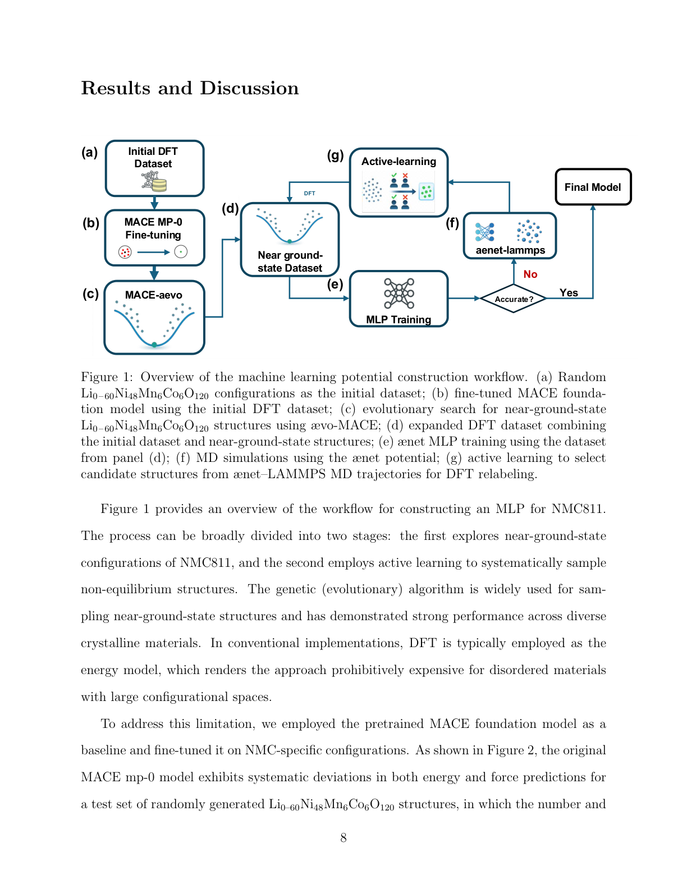
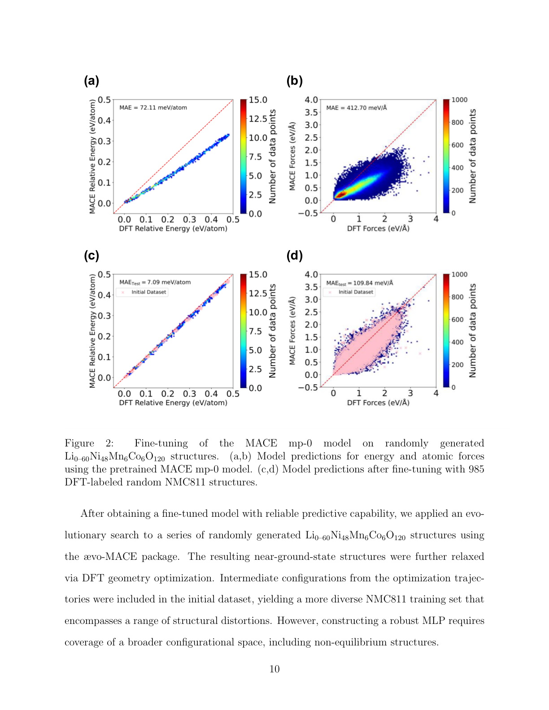
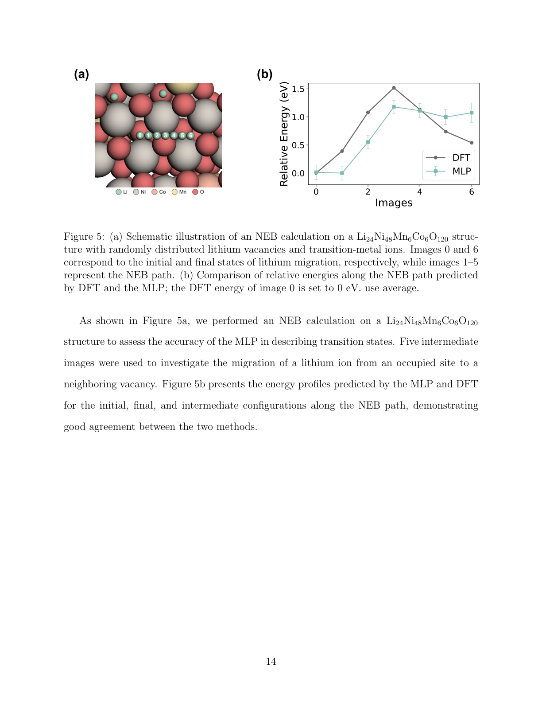
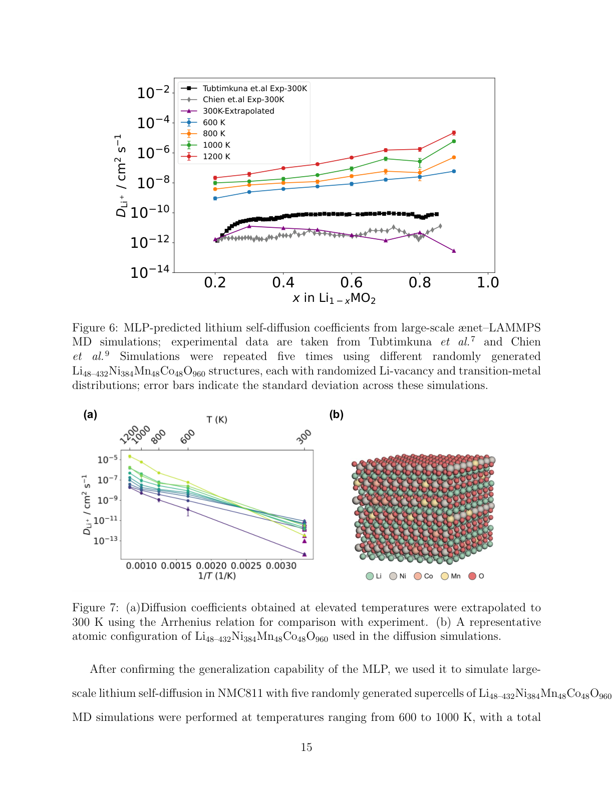
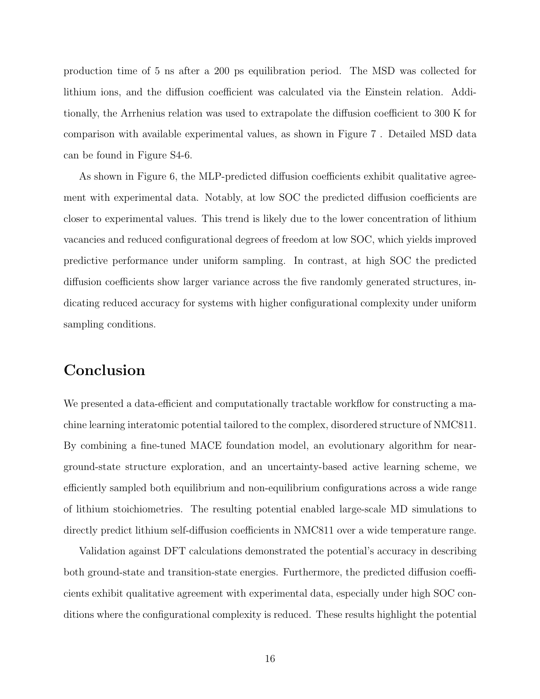

# リチウム拡散の機械学習ポテンシャル

- **執筆日**: 2026-06-01
- **要旨**: リチウムイオン電池の急速充電性能はNMC正極材料中のリチウムイオン拡散によって律速される。しかし従来のDFT分子動力学はアクセスできる時間・空間スケールが小さすぎるため、実際の拡散係数の系統的な測定が困難であった。本論文（arXiv:2605.19747）は、MACEファウンデーションモデルのファインチューニング・進化的構造探索・不確かさ駆動アクティブラーニングを組み合わせた効率的なワークフローでNMC811専用の機械学習ポテンシャルを構築し、5ナノ秒の大規模MD計算によってリチウム自己拡散係数の充電状態（SOC）依存性を初めて直接シミュレートした。実験値と定性的に整合する結果が得られ、低SOCでは定量的一致も示された。MLPが複雑な無秩序カソード材料の輸送特性を解明する強力なツールになりうることを実証した。
- **タグ**: `main-area: materials-informatics` / `sub-area: battery-cathode; Li-ion-diffusion; disordered-materials` / `method-tag: MACE-MLIP; active-learning; molecular-dynamics`
- **anchor 論文**: [arXiv:2605.19747](https://arxiv.org/abs/2605.19747) — He, van de Wetering, Nolsen, Artrith (Utrecht University), 2026-05-19
- **参照論文数**: 6本
- **この記事の中心的な問い**: 複雑な無秩序構造をもつNMC811正極材料において、機械学習ポテンシャルは DFT の精度を保ちながら実験的に未解決のリチウム拡散機構を明らかにできるか？　そのためのデータ効率的なワークフローはどう設計すればよいか？

---

## 1. なぜ今このテーマか

電気自動車の普及を支える最重要課題のひとつが「急速充電」である。現在の主流正極材料であるNMC（リチウムニッケルマンガンコバルト酸化物）系では、高レートでの充放電時に容量が急速に劣化するという問題が業界共通の課題となっている。この劣化の主因として近年注目されているのが、高速充電時のリチウムイオン（Li$^+$）拡散の律速効果である。

NMC811（LiNi$_{0.8}$Mn$_{0.1}$Co$_{0.1}$O$_2$）はその高エネルギー密度とコスト競争力から次世代電池の正極候補として広く研究されている一方で、Ni比率の高さに起因する構造不安定性と、ランダムに配置された遷移金属（Ni/Mn/Co）による固有の無秩序性が材料理解を困難にしている。

実験的なLi$^+$拡散係数の測定には、定電流間欠滴定法（GITT）・電気化学インピーダンス分光（EIS）・定電位間欠滴定法（PITT）などが用いられるが、測定原理上の仮定の違いから報告値が数桁もばらつく場合がある。McClelland et al.（2023）によるオペランドμSR測定のような直接観察手法も試みられているが、原子スケールの拡散機構と巨視的拡散係数の橋渡しはいまだ確立されていない。

理論側でも課題は深刻だ。Li$^+$拡散の基礎となるO（八面体サイト）→T（四面体サイト）→O ホッピング経路は古典的なNEB（Nudged Elastic Band）計算で示されているが、NMC811の無秩序構造下での拡散はホッピング経路が多様に分岐し、個々のNEB計算で全体を把握することが難しい。DFT分子動力学（DFT-MD）は原理的には最も直接的な方法だが、アクセスできるシミュレーション時間はせいぜいナノ秒以下、システムサイズも数十原子程度に限定され、統計的に意味のある拡散係数の算出には不十分である。

ここに機械学習ポテンシャル（MLP）の出番がある。MLPはDFTの精度を近似しながらDFTより数桁〜数万倍高速に原子間相互作用を評価でき、長時間・大規模MDシミュレーションを可能にする。しかしNMC811のような複雑な多成分無秩序系に対して、実際にDFT精度を保証するMLPをどのように効率的に構築するかは、本論文以前には明確な解答がなかった。

---

## 2. 何が新しいのか

### 三段階からなるデータ効率的ワークフロー

本論文の中心的な貢献は、NMC811のMLPを「少数のDFT計算」で構築する三段階ワークフローの提案と実証である（Figure 1参照）。

*Figure 1（arXiv:2605.19747, Fig. 1, CC BY 4.0）。MLP構築の全体ワークフロー。(a) ランダム配置の初期DFTデータセット、(b) MACE-MP-0ファインチューニング、(c) ævo-MACEによる近基底状態探索、(d) 拡充DFTデータセット、(e) ænetモデル訓練、(f) ænet–LAMMPS MDシミュレーション、(g) アクティブラーニングによる構造選択と DFT再ラベリング。*

**第一段階：MACEファウンデーションモデルのファインチューニング**

まず汎用ファウンデーションモデル MACE-MP-0 の「small」バリアントを985個のDFTラベル付きNMC811構造でファインチューニングした（Figure 2）。ファインチューニングのターゲットはエネルギーと原子力（応力は除く）で、損失関数のウェイトはエネルギー：力 = 10:1 に設定した。

*Figure 2（arXiv:2605.19747, Fig. 2, CC BY 4.0）。ランダム生成 Li$_{0-60}$Ni$_{48}$Mn$_6$Co$_6$O$_{120}$ 構造に対するモデル予測。(a,b) 事前学習済みMACE-MP-0モデルによるエネルギー・原子力の予測（ばらつきが大きい）、(c,d) 985個のDFTデータでファインチューニング後の予測（DFTとの一致が改善）。*

ファインチューニング前のMACE-MP-0は、無秩序NMC配置に対して系統的な誤差を示した。これはMACE-MP-0の訓練データ（主にMaterials Projectの規則構造）にNMCのような複雑な無秩序構造が不足していたためである。わずか985個のDFTデータで大幅に精度が改善されたことは、ファウンデーションモデルの転移学習（transfer learning）能力の高さを示している。

**第二段階：ævo-MACEによる近基底状態構造の系統的探索**

ファインチューニング済みMACEモデルをエネルギー評価器として用い、ævo-MACEパッケージの進化的アルゴリズムでLi$_{0-60}$Ni$_{48}$Mn$_6$Co$_6$O$_{120}$ の近基底状態構造を探索した。Li空孔と遷移金属配置のランダム性を保ちながら最低エネルギー構造を効率よくサンプリングすることで、後段の訓練に必要な平衡近傍構造の多様性を確保した。DFTではなくMLPを用いた探索により、計算コストを大幅に削減している。

**第三段階：ænetモデルの不確かさ駆動アクティブラーニング**

近基底状態データとランダム初期データを組み合わせてænetモデルを訓練し、これをænet–LAMMPSを通じた高温（1000〜2000 K）MDシミュレーションで稼働させ、非平衡構造をサンプリングした。アクティブラーニングの選択基準は力の予測不確かさ $\epsilon_t$（モデルアンサンブルの力予測の標準偏差の最大値）である。

$$\epsilon_t = \max_i \sqrt{\|\mathbf{F}_{w,i}(\mathbf{R}_t) - \langle\mathbf{F}_{w,i}(\mathbf{R}_t)\rangle\|^2}$$

不確かさが小さすぎる構造（すでに良く記述されている）と大きすぎる構造（非物理的な高エネルギー配置）を除外し、中間の「情報量が豊富な」構造だけをDFT再ラベリングの対象とした。35ラウンドのアクティブラーニングにより、MDの多様な温度・組成条件下で精度の高いMLPが完成した。

### NEB ベンチマークによる遷移状態の検証

構築されたMLPがLi$^+$ホッピング経路の遷移状態エネルギーを正しく再現できるかをNEB計算で検証した（Figure 5参照）。

*Figure 5（arXiv:2605.19747, Fig. 5, CC BY 4.0）。Li$_{24}$Ni$_{48}$Mn$_6$Co$_6$O$_{120}$ 超格子中のLiホッピングに対するNEBエネルギー曲線。DFT（実線）とMLP（破線）が良好に一致していることを示す。*

Li$^+$が一つのOサイトから隣接するOサイトへ移動する経路において、MLP予測はDFT値と良好に一致した。これはMLPが単に平衡近傍での精度だけでなく、拡散律速となる遷移状態の鞍点エネルギーも正しく捉えていることを示し、拡散係数計算の信頼性を担保する重要な検証である。

---

## 3. どこまで分かったのか

### Li$^+$ 拡散係数の SOC 依存性（Figure 6）

*Figure 6（arXiv:2605.19747, Fig. 6, CC BY 4.0）。ænet–LAMMPS大規模MD（5 ns, Li$_{48-432}$Ni$_{384}$Mn$_{48}$Co$_{48}$O$_{960}$）から得たLi自己拡散係数のSOC依存性。各温度（600〜1200 K）での結果に加え、実験値（Tubtimkuna et al., Chien et al.）との比較を示す。*

以下のことが明らかになった。

第一に、拡散係数は SOC（$x$ in Li$_{1-x}$MO$_2$）に依存して大きく変化する。低SOC（$x \lesssim 0.4$、Liリッチ）では実験値との定量的な一致が比較的良く、高SOC（$x \gtrsim 0.6$、Li欠乏）では予測値のばらつきが大きくなる。これは高SOC域での配置的無秩序度が増すことで、均一サンプリングでは代表的な構造を十分に捉えきれないためと解釈されている。

第二に、絶対値を300 Kへ外挿した場合（アレニウスプロット、Figure 7）、実験値と定性的に整合する。

*Figure 7（arXiv:2605.19747, Fig. 7, CC BY 4.0）。(a) 高温MDから300 Kへのアレニウス外挿による拡散係数、(b) 拡散シミュレーションに使用した Li$_{48-432}$Ni$_{384}$Mn$_{48}$Co$_{48}$O$_{960}$ の代表的原子配置（青：Li, 灰・紫・緑：Ni/Mn/Co, 赤：O）。*

ただし、いくつかの重要な注意点がある。第一に、拡散係数はアレニウス外挿を用いているため、実際の300 K近傍の拡散機構が高温と同じ活性化機構に従うという仮定が入っている。第二に、シミュレーションセルはランダムに生成された構造であり、実験で観察される局所秩序（短距離順序）を必ずしも反映していない可能性がある。第三に、DFT計算にはPBE+U（ハバードU補正）を用いており、混合原子価Ni の電子状態の記述精度に依存する不確かさが残る。

関連研究との比較では、Jaberi et al.（2024）が多スケール計算によってNMC層状酸化物のLi輸送を解析した研究がある。また、McClelland et al.（2023）のオペランドμSR実験では動的Liホッピングが直接観察されており、本論文の計算結果と定性的に整合する傾向がある。しかし、実験・理論双方で報告値にばらつきが大きく、SOC全域での定量的な拡散係数のコンセンサスは依然として確立されていない。

---

## 4. 研究の流れの中でどう位置づくか

NMC系正極材料のLi拡散研究は、理論・実験ともに長い歴史をもつ。理論の文脈では、Van der Ven と Ceder（2001）がLiCoO$_2$をモデル系として第一原理によるLi拡散理論（非希薄担体を考慮した理論）を確立し、O-T-O ホッピング機構を明示した。この枠組みはNMC系にも拡張されてきたが、複数の遷移金属が混在する無秩序系でのNEB計算は計算量が膨大となり、現実的な統計サンプリングが困難であった。

MLPの文脈では、Artrith ら（同論文著者グループ）が以前から固体電池材料へのMLP適用を推進してきた（Guo et al., 2021）。近年は MACE ファウンデーションモデルの登場によって、化合物固有 MLP の構築コストが劇的に下がった。Seongok et al.（arXiv:2510.05020, CC BY 4.0）は LiF のインタースティシャル Li 拡散に対して MACE のファインチューニング戦略を比較し、短いファインチューニングでも高い精度が達成できることを示した。本論文の手法はこの流れを NMC811 に拡張したものである。

アクティブラーニング戦略の観点からは、arXiv:2601.06916（CC BY 4.0）がMaterials Project データベースからの多様性サンプリングに基づくアクティブラーニングフレームワークを提案し、少数のラベル付きデータで競合的な精度を達成できることを示している。本論文のアクティブラーニング設計（不確かさ閾値の二段階切り替え）はより実用志向であり、非物理的配置の混入を防ぐ改良が含まれる。

より最近では、arXiv:2605.20384（CC BY 4.0）が局所エントロピー駆動MDと大域データセット認識フィルタリングを組み合わせた新しいアクティブラーニング手法を提案しており、本論文のアプローチとの直接的な比較が今後の重要な検証となる。

多スケール計算の文脈では、arXiv:2511.20863（MACE + マルコフ状態モデルによるLi輸送の原子スケール〜メゾスケール接続）の研究がある。こちらはMACEポテンシャルを用いて数十ナノ秒の軌跡を生成し、マルコフ状態モデルでホッピング機構を抽出するという、本論文とは相補的なアプローチをとる。両者を組み合わせることで、原子ホッピング機構から電極スケールの電気化学特性までの一貫した計算が可能になる可能性がある。

---

## 5. どこまで広がるのか

### 他のNMC組成・正極材料への展開

本論文が提案するワークフロー（ファウンデーションモデルファインチューニング → 進化的構造探索 → アクティブラーニング）はNMC811に特化したものではなく、NMC111・NMC622・NMC955・次世代の高Ni組成など他のNMC系や、LiNiO$_2$・Li(Ni,Co)O$_2$などの関連正極材料にも原則として適用可能である。特にNiの比率が高い正極材料ほど無秩序性と不安定性が顕著であり、本ワークフローの適用価値が高い。

電子エントロピーの影響については、arXiv:2603.26471（CC BY 4.0）が NaFePO$_4$ を例に、混合原子価系では電子エントロピー（電荷秩序化に伴うエントロピー）が通常のMLIPでは正しく記述されないことを示した。NMC系のNiも$2+/3+/4+$の混合原子価をとりうるため、SOCが高い状態での電荷秩序の影響は今後の精密化の課題となる。

### 電解質・界面・劣化メカニズムへの接続

本論文の対象はバルクNMC811のLi拡散に限定されているが、実際の電池劣化では正極–電解質界面（CEI）の形成・亀裂・遷移金属溶出などが重要な役割を果たす。表面・界面系にMLPを拡張するためには、電解質分子との相互作用を記述する追加の訓練データが必要になるが、OMol25のような大規模訓練データセットをベースとすることで対応できる可能性がある。

### 設計指針への接続

Li$^+$拡散係数のSOC依存性が定量的に求まれば、ドーピング（Zr, Al, Mgなど）が拡散経路に与える影響をMLPシミュレーションで評価できる。これは経験的な「どの元素をドープすれば急速充電性能が改善するか」という問いに、原子レベルの機構論的な根拠を与える。コンピュータ支援設計（材料インフォマティクス）と連携した高スループットスクリーニングとして展開できる余地がある。

---

## 6. 次に問うべきこと

### 高SOCでの予測精度の改善

本論文の最も明確な未解決課題は、高SOC（$x > 0.6$）域での拡散係数予測の分散が大きいことである。著者は原因をランダムなサンプリングの不十分さに帰しているが、根本には「どのLi欠損配置が実験条件下で実現されるか」という熱力学的問いが横たわる。近基底状態探索をSOC全域で系統的に行い、実験的なリチウム化・脱リチウム化の経路を模擬した配置を訓練データに組み込むことで、高SOCでの精度改善が期待できる。検証には放電状態（高SOC）のNMC811に対する中性子回折やμSRを組み合わせた実験的な拡散係数測定が決め手になる。

### 局所的な化学環境と拡散異方性

NMC811中のLi$^+$拡散はNi・Mn・Co の局所配置に依存して異方性をもちうる。本論文では、異なる局所配置を平均化したバルクの拡散係数を報告しているが、Ni-rich ドメインと Mn-rich ドメインで拡散速度が異なるという仮説は検証されていない。MLP シミュレーションを局所構造解析（ボロノイ分割や Steinhardt 秩序パラメータ）と組み合わせることで、「どの局所配置がLi$^+$拡散のボトルネックになるか」を定量化できると予想される。これはドーピング戦略の設計指針に直結する問いである。

### 電荷秩序と電子的自由度の影響

arXiv:2603.26471 が指摘するように、混合原子価系では電荷秩序化に伴う電子エントロピーが熱力学的安定性に寄与する。本論文ではDFT+U（Hubbard U補正）で磁気モーメントを固定した計算を用いており、Niの実際の電子状態変化はMLPには陰的にしか反映されていない。この近似の影響を評価するためには、スピン依存MLIPや電子エントロピーを明示的に扱う手法との比較が必要であり、特に高SOCでの構造・輸送特性の記述精度に対して重要な意味をもちうる。

### 多スケール連携と電極スケールへの橋渡し

原子スケールのMLPシミュレーションで得た拡散係数を電極スケールの電気化学モデルと接続することが、実用的な急速充電設計への道筋となる。arXiv:2511.20863 が示したようなマルコフ状態モデルとの組み合わせ、あるいは連続媒体モデル（多孔質電極理論）へのパラメータ受け渡しが次のステップとなる。ナノ粒子スケールでの濃度勾配・格子歪みの影響も含めて記述するためには、さらなる多スケール理論枠組みの整備が必要である。

### 実験との定量的照合

本論文が最終的に比較対象とするのは実験的な拡散係数であるが、GITT・EIS・μSRなどの実験手法はそれぞれ異なる物理量（見かけの拡散係数 vs. 真の自己拡散係数）を測定している。MLPが算出する自己拡散係数 $D$ と実験値の対応関係を理論的に明確にすることが、両者の定量的比較を意味のあるものにするための前提条件として残っている。

---

## 7. 基礎から理解する

### リチウムイオン電池の正極と充電状態

リチウムイオン電池では、充電時にリチウムイオンが正極（カソード）から抜け出て、放電時には戻ってくる。NMC系正極はR$\bar{3}$m空間群の層状岩塩型構造をもち、Liイオン層とNi/Mn/Co（遷移金属）層が交互に積層している。Liイオンは遷移金属層を挟んだ二次元的な平面内を移動する。

充電状態（State of Charge, SOC）は $x$ in Li$_{1-x}$MO$_2$（ここでM = Ni$_{0.8}$Mn$_{0.1}$Co$_{0.1}$）で表される。$x=0$が完全充電（Li空孔なし、フル充電状態から見ると$x=1$で完全脱Li）、$x=1$ が完全放電という慣例もあるが、本論文では $x$ が Li欠損（空孔）の割合を表す（$x=0$: Liリッチ, $x=1$: Li欠乏）。

### Li$^+$ の O-T-O ホッピング機構

Liイオンが層状酸化物中を移動するとき、最も重要な経路は八面体サイト（O site）→四面体サイト（T site）→八面体サイト（O site）の経路（O-T-O ホッピング）である。四面体サイトは隣接するLi層と遷移金属層の両方に面しており、そこを経由してLiが移動する際にはすでに隣に空孔（Li vacancy）が必要となる「空孔機構」をとる。

この遷移状態の活性化エネルギー $E_a$ はNEB計算で推定できる。$E_a$ が小さいほどLi$^+$が速く動けるが、NMC811の無秩序構造では局所的な遷移金属配置によって $E_a$ が広い分布をもち、実効的な拡散係数を単一のNEB計算で表現することはできない。

### 分子動力学と拡散係数の算出

分子動力学（MD）では、ニュートンの運動方程式を時間発展させて原子の軌跡を追跡する。Liイオンの平均二乗変位（MSD）$\langle(\delta r)^2\rangle$ は時間の関数として計算され、長時間の直線的な増加からアインシュタイン関係式

$$D = \frac{1}{6}\lim_{t\to\infty}\frac{d}{dt}\langle(\delta r)^2\rangle$$

によって拡散係数 $D$ を求める。$D$ の単位は cm$^2$/s である。本論文では5 nsの長時間シミュレーションにより、統計的に信頼できるMSDの直線領域を確保している。

### アレニウス則と温度外挿

原子の拡散はしばしば熱活性化過程であり、拡散係数の温度依存性はアレニウス則

$$D(T) = D_0 \exp\left(-\frac{E_a}{k_B T}\right)$$

で記述される。ここで $D_0$ は頻度因子、$E_a$ は活性化エネルギー、$k_B$ はボルツマン定数、$T$ は絶対温度である。MD では高温（600〜1200 K）で十分なLiホッピングイベントが観測できるため、$\ln D$ vs $1/T$ のプロットの傾きから $E_a$ を推定し、これを300 K に外挿することで室温近傍の実験値と比較する。

ただし、この外挿には「活性化エネルギーが温度に依存しない」という仮定が含まれる。相転移（層状→岩塩型などの構造変化）が起こりうる高SOC・高温域ではこの仮定が成立しない可能性があり、実験との乖離の原因のひとつとなりうる。

### 機械学習ポテンシャルとアクティブラーニング

機械学習ポテンシャル（MLP）は原子座標から原子間ポテンシャルエネルギーを学習するニューラルネットワークである。DFTで計算したエネルギーと力を教師データとして使い、未知配置でも正確な予測が得られるよう汎化させる。

アクティブラーニングは、「どの訓練データを追加するか」をモデル自身の不確かさに基づいて決定する手法である。モデルアンサンブル（複数の独立モデル）を用いて各原子配置に対する予測のばらつき（不確かさ）を定量化し、不確かさが中程度の構造を選択してDFT計算を実行する。これにより、情報量の少ない構造へのDFT計算を省略して訓練効率を高める。

---

## 8. 専門用語の解説

**NMC（ニッケルマンガンコバルト酸化物）**  
LiNi$_x$Mn$_y$Co$_{1-x-y}$O$_2$ の総称。現在のリチウムイオン電池で最も広く使われる正極材料の一つ。Ni比率が高いほど高容量だが、構造不安定性や安全性の課題がある。NMC811はNi:Mn:Co = 8:1:1の組成で次世代電動車向けに注目される。

**充電状態（State of Charge, SOC）**  
電池の残存容量を表す指標。NMC正極では $x$ in Li$_{1-x}$MO$_2$ に対応する。SOCが高い（Liが多い）状態から低い（Liが少ない）状態へ変化するのが充電過程に対応し、この論文では $x=0$（完全充電）から $x=1$（完全放電）の範囲でMLPシミュレーションを行っている。

**機械学習ポテンシャル（Machine Learning Potential, MLP）**  
ニューラルネットワークなどの機械学習モデルを用いてDFTの精度で原子間ポテンシャルを近似する手法。DFTより数桁〜数万倍高速で、大規模・長時間のMDシミュレーションを可能にする。ænet（Artrith-Urban neural network）、MACE、DeePMDなどさまざまなフレームワークがある。

**ファウンデーションモデルとファインチューニング**  
ファウンデーションモデルとは、多様な化学系を含む大規模データで事前学習された汎用MLPである（例：MACE-MP-0）。特定の系への適用では少量の高品質データで追加学習（ファインチューニング）することで精度を向上させる。これは大規模言語モデルのファインチューニングと同じ考え方であり、DFT計算コストの削減に寄与する。

**アクティブラーニング（Active Learning）**  
機械学習モデルの不確かさを指標として、最も情報量の高いデータを能動的に選択して訓練する手法。ランダムサンプリングに比べてはるかに少ないラベル付きデータで高い精度を達成できる。電池材料MLPの構築では、MD軌跡から不確かさの大きい構造を選択してDFT再計算し、反復的に精度を向上させる。

**進化的（遺伝的）アルゴリズムによる構造探索**  
生物の進化（突然変異・選択・交叉）を模倣して、エネルギーの低い原子配置を探索する最適化手法。NMC811のようにLi空孔と遷移金属の配置が膨大な数の組み合わせをもつ系では、全探索は不可能であり、進化的アルゴリズムによる効率的なサンプリングが必要となる。

**NEB（Nudged Elastic Band）法**  
2つの安定状態（初期・終状態）を繋ぐ最小エネルギー経路と遷移状態エネルギー（活性化エネルギー）を計算する量子化学計算手法。Li$^+$が一サイトから隣接サイトへ移動する際の障壁高さを精密に求めるために使われ、拡散係数の理論的推定の基礎となる。

**平均二乗変位（Mean Square Displacement, MSD）**  
MD シミュレーションで粒子の時間経過に伴う位置変化の二乗平均 $\langle(\delta r)^2\rangle$。長時間での直線的増加の傾きから拡散係数（アインシュタイン関係式）が求まる。ランダムウォーク的な拡散では $\langle(\delta r)^2\rangle \propto t$ が成り立つ。

**アレニウス則**  
反応速度定数（ここでは拡散係数）の温度依存性を表す経験則 $k = A\exp(-E_a/k_BT)$。$E_a$（活性化エネルギー）が大きいほど温度依存性が強い。NMC系では0.3〜0.5 eVの$E_a$が報告されており、室温と高温での拡散係数は約1〜3桁異なる。

**Li$^+$自己拡散係数**  
電場や濃度勾配がない条件でのLiイオンのランダムな熱的移動の速さを表す。実験的にはGITT・EIS・核磁気共鳴（NMR）・μSRなどで測定されるが、それぞれ「見かけの」拡散係数を与えるため、真の自己拡散係数との対応は理論的な考察を要する。MLPシミュレーションはMSDから直接自己拡散係数を算出できる点で優れている。

**DFT+U（Hubbard U補正）**  
強相関電子系（NiやMnのd電子）を扱うためのDFT拡張。局所的なCoulomb相互作用パラメータ $U$ を導入することで、通常のGGAが過小評価する電子局在化を補正する。NMC系では $U_{\text{eff}}$ = 3.9 eV（Ni）・2.0 eV（Mn）などの標準値が使われるが、$U$ の選択が結果に影響する不確かさが存在する。

---

## 9. まとめ

NMC811正極材料のLi$^+$拡散は急速充電性能を左右する重要因子であるが、その複雑な無秩序構造ゆえに実験・理論ともに系統的な理解が難しい状況にあった。本論文はMACEファウンデーションモデルのファインチューニング・進化的構造探索・アクティブラーニングを組み合わせたワークフローにより、NMC811専用のMLPをデータ効率的に構築し、5 ns超の大規模MDによるリチウム自己拡散係数のSOC依存性を初めて直接シミュレートした。低SOC域では実験値と定量的な整合が見られ、NEBベンチマークも遷移状態エネルギーの良好な再現を示した。

一方で、高SOC域での予測精度の分散の大きさと、アレニウス外挿に内在する仮定の問題が未解決課題として残る。また、本論文の計算は平均的な無秩序構造を対象としており、局所的な遷移金属配置パターンや電荷秩序化の影響、電解質との界面過程は対象外である。これらの問題に答えるためには、スピン依存MLP・電子エントロピーの明示的取り扱い・多スケール連携などの次世代手法が求められる。

それでも、DFTの精度を保ちながら実験的に困難な系での輸送特性をMLPシミュレーションで直接評価できるという事実の実証は重要である。本ワークフローはNMC系全般・他の正極材料・固体電解質系へと拡張可能であり、原子スケールからの電池材料設計にMLPが果たす役割が急速に大きくなってきていることを示している。

---

## 参考論文一覧

1. **[arXiv:2605.19747](https://arxiv.org/abs/2605.19747)** — He, van de Wetering, Nolsen, Artrith "Direct Simulation of LiNi0.8Mn0.1Co0.1O2 Transport Properties Using an Efficient and Accurate Machine Learning Potential" (2026年5月19日, CC BY 4.0)  
   **本記事の anchor 論文**。MACEファインチューニング・進化的構造探索・アクティブラーニングを組み合わせてNMC811専用MLPを構築し、大規模MDでLi自己拡散係数を算出。

2. **[arXiv:2510.05020](https://arxiv.org/abs/2510.05020)** — Seongok et al. "Comparing fine-tuning strategies of MACE machine learning force fields for Li diffusion in LiF" (2025年10月, CC BY 4.0)  
   **比較**。LiF中のLi拡散に対してMACEファインチューニング戦略を比較。少量のデータでも高精度を実現できることを示し、本論文の設計思想を支持する。

3. **[arXiv:2601.06916](https://arxiv.org/abs/2601.06916)** — Khan, D'Souza, Choyal "Active Learning Strategies for Efficient Machine-Learned Interatomic Potentials Across Diverse Material Systems" (2026年1月, CC BY 4.0)  
   **比較・異手法**。多様な材料系に対するアクティブラーニング戦略の系統的比較。多様性サンプリングの優位性を示し、本論文のアクティブラーニング設計と対照的な視点を提供。

4. **[arXiv:2603.26471](https://arxiv.org/abs/2603.26471)** — Imbalzano et al. "Importance of Electronic Entropy for Machine Learning Interatomic Potentials" (2026年3月, CC BY 4.0)  
   **競合仮説・限界**。混合原子価カソード材料（NaFePO$_4$）において、電子エントロピーを無視するMLIPが熱力学的安定性を誤って記述することを示す。NMC系MLPへの重要な示唆を与える。

5. **[arXiv:2605.20384](https://arxiv.org/abs/2605.20384)** — Anstine et al. "Dataset-Aware Entropy-Maximized Active Learning for Machine-Learned Interatomic Potentials" (2026年5月, CC BY 4.0)  
   **異手法・波及**。局所エントロピー駆動MDと大域データセット認識フィルタリングを組み合わせた新しいアクティブラーニング手法。本論文の不確かさ駆動アクティブラーニングとの比較として今後注目される。

6. **[arXiv:2511.20863](https://arxiv.org/abs/2511.20863)** — Eder et al. "Bridging Atomistic and Mesoscale Lithium Transport via Machine-Learned Force Fields and Markov State Models" (2025年11月)  
   **波及・多スケール**。MACE + マルコフ状態モデルで原子スケールのLiホッピング機構をメゾスケールの輸送特性に接続。本論文と相補的なアプローチで、実験値との定量的照合における次の展開を示す。
