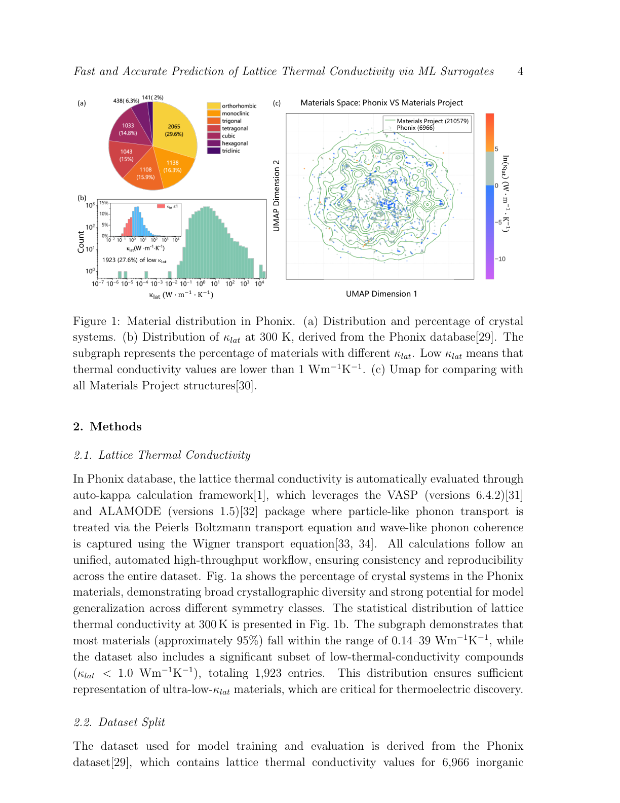
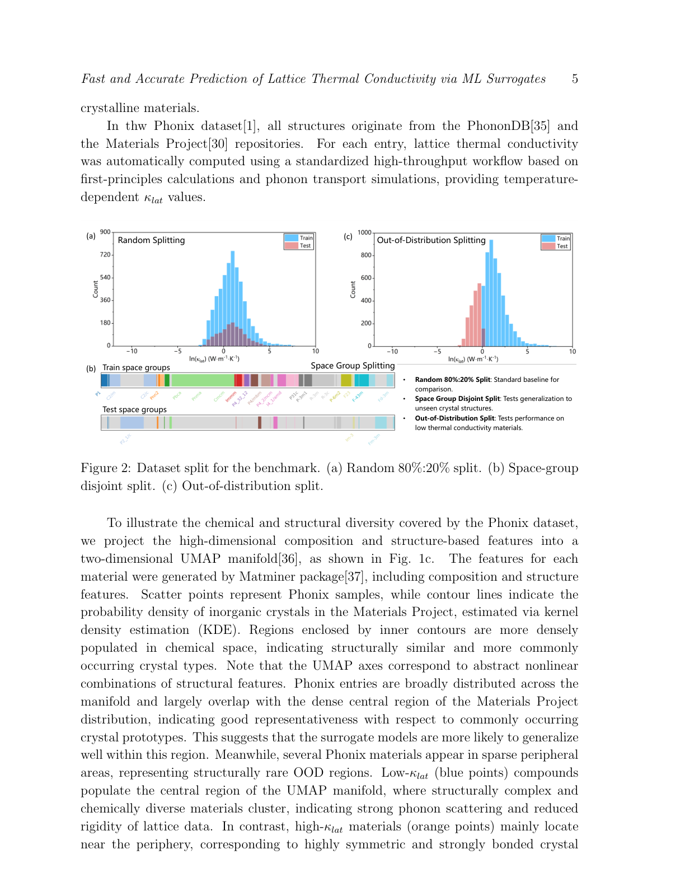
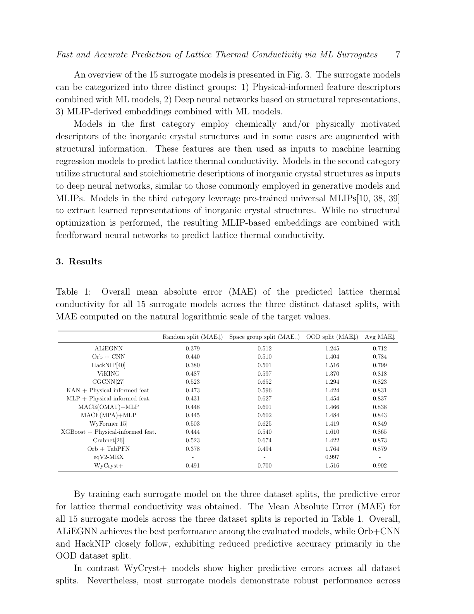
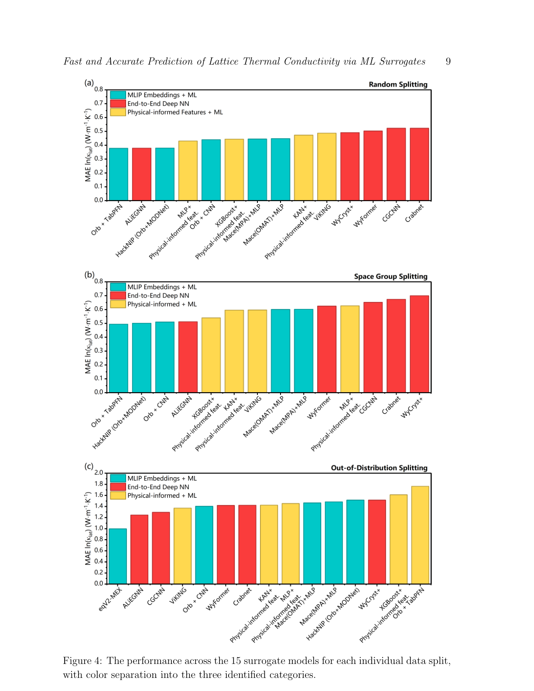

# 格子熱伝導率の機械学習予測：15モデルのベンチマークが示す限界と可能性

- **執筆日**: 2026-06-01
- **要旨**: 熱電変換材料の探索や電子デバイスの熱管理において、格子熱伝導率 $\kappa_{\text{lat}}$ の高精度予測は中心的な課題である。第一原理計算による $\kappa_{\text{lat}}$ 評価は非調和相互作用の処理が必要で計算コストが高く、生成モデルが生み出す膨大な候補材料をスクリーニングするには不向きである。本論文（arXiv:2605.11610）は、非調和フォノン特性の第一原理データ6,966件を収録したPhonixデータベースを用いて、物理特徴量モデル・深層ニューラルネットワーク・汎用MLIPエンベディング活用モデルという三類の15サロゲートモデルを包括的にベンチマークした。ランダム分割ではMLIPエンベディングモデルが最良、しかし低 $\kappa_{\text{lat}}$ 材料の分布外（OOD）予測ではそれが最悪の部類に転落する——この逆転が示す問いこそが本記事の核心である。
- **タグ**: `main-area: materials-informatics` / `sub-area: lattice-thermal-conductivity; phonon; thermoelectrics` / `method-tag: surrogate-model-benchmark; graph-neural-network; MLIP-embedding`
- **anchor 論文**: [arXiv:2605.11610](https://arxiv.org/abs/2605.11610) — Wang, Yamazaki, Petersen, Ohnishi, Hippalgaonkar, Shiomi et al. (東大・NTU・BEARS), 2026-05-12
- **参照論文数**: 6本
- **この記事の中心的な問い**: 機械学習サロゲートモデルは、生成モデルが提案する未踏の化学空間を含む大規模な材料候補に対して $\kappa_{\text{lat}}$ を正確に予測できるか？　特に低熱伝導率材料という分布外領域での汎化は、なぜ困難で、何が突破口となるか？

---

## 1. なぜ今このテーマか

熱電材料はエネルギーハーベスティング（廃熱発電）や固体冷却素子として注目されているが、実用化の最大の障壁の一つが「適切な材料の発見」にある。高性能熱電材料の設計原理はシンプルだ：電気伝導率は高く、ゼーベック係数は大きく、熱伝導率は小さくする。熱電性能指数 $ZT = S^2 \sigma T / (\kappa_e + \kappa_{\text{lat}})$ において、$S$ はゼーベック係数、$\sigma$ は電気伝導率、$T$ は温度、$\kappa_e$ は電子熱伝導率、$\kappa_{\text{lat}}$ は格子熱伝導率（フォノンによる熱伝導）である。$ZT > 1$ を実現するには $\kappa_{\text{lat}}$ を極限まで下げることが事実上不可欠であり、低 $\kappa_{\text{lat}}$ 材料の発見が熱電材料研究の中心課題となっている。

同時に、生成AIモデル（拡散モデルや変分オートエンコーダ）が無機結晶の化学空間を大規模に探索できるようになったことで、候補材料の数は爆発的に増加している。問題は「候補構造を生成すること」ではなく、「生成された膨大な候補のどれが有望かを高速に判別すること」に移っている。

従来、$\kappa_{\text{lat}}$ の高精度計算には非調和フォノン計算（ALAMODE等のパッケージを用いた二次・三次の原子間力定数の第一原理計算 + Peierls–Boltzmann輸送方程式）が必要で、1化合物あたり数時間から数十時間の計算を要する。機械学習原子間ポテンシャル（MLIP）を用いても中間コストのフォノン計算は可能だが、強非調和系での精度は保証されない。このボトルネックを打破するためのアプローチが「MLサロゲートモデル」——構造情報から直接 $\kappa_{\text{lat}}$ を予測するエンドツーエンドの機械学習回帰モデル——であり、本論文はその性能を体系的に評価した初の包括ベンチマークである。

---

## 2. 何が新しいのか

### Phonixデータベース：非調和フォノン特性の系統的第一原理計算集

本論文の土台となるのは Ohnishi et al.（2026, npj Computational Materials）が構築したPhonixデータベースである。6,966件の無機結晶に対して、VASP + ALAMODEを用いた自動化ハイスループットワークフローで非調和フォノン特性を計算した。計算されたPhononDBとMaterials Projectに由来する構造の $\kappa_{\text{lat}}$ 分布を Figure 1 に示す。

*Figure 1（arXiv:2605.11610, Fig. 1, CC BY 4.0）。(a) Phonixに収録された結晶系の分布（立方晶・三方晶・六方晶など多様な対称性）。(b) 300 K での $\kappa_{\text{lat}}$ の分布（常用対数スケール）。全体の約27.6%（1,923件）が $\kappa_{\text{lat}} < 1\ \text{Wm}^{-1}\text{K}^{-1}$ の低熱伝導率材料。(c) Phonix（散布点）とMaterials Project全体（等高線）のUMAPによる化学空間比較。*

注目すべきは分布の歪みである（Figure 1b）。$\kappa_{\text{lat}}$ は数桁の範囲に広がっており、対数スケールでも非対称な分布を示す。特に $\kappa_{\text{lat}} < 1\ \text{Wm}^{-1}\text{K}^{-1}$ という超低熱伝導率の領域（約28%）は熱電探索の観点から最も価値が高いが、データ密度が低く予測が困難な領域でもある。

### 三種類のデータ分割による評価設計

単純なランダム分割だけで評価すれば、モデルは「すでに知っている材料タイプ」の近くでのみ良いスコアを出し、真の汎化能力が見えない。本論文は三種類の分割を設計した（Figure 2）。

*Figure 2（arXiv:2605.11610, Fig. 2, CC BY 4.0）。(a) ランダム80/20分割（ベースライン）、(b) 空間群非重複分割（未知の結晶対称性への汎化を評価）、(c) 分布外（OOD）分割（低 $\kappa_{\text{lat}}$ 材料を全てテスト側に配置）。*

空間群非重複分割（space-group disjoint split）は訓練・テスト間で空間群が重複しないように設計され、未知の結晶対称性をもつ構造への汎化を評価する。OOD分割は低 $\kappa_{\text{lat}}$ 材料をすべてテストセットに集中させ、強非調和領域での予測性能を専門的に試す。この三種類の分割が、異なる「困難さのレベル」での評価を可能にする。

### 15サロゲートモデルの分類と特徴

15モデルは三カテゴリに分類される（Figure 3）。

*Figure 3（arXiv:2605.11610, Fig. 3, CC BY 4.0）。15サロゲートモデルを三カテゴリ（物理インフォームド特徴量+ML、エンドツーエンドDNN、MLIPエンベディング+NN）に分類した概要図。*

第一カテゴリ（物理インフォームド特徴量 + ML）は、SOAP記述子・組成特徴量・空間群情報などの手作り特徴量をXGBoost・MLP・KAN（Kolmogorov-Arnold Networks）に入力する。化学的直感をモデルに内包できる利点があるが、特徴量エンジニアリングの労力が必要である。

第二カテゴリ（エンドツーエンドDNN）は、原子座標と元素情報から直接 $\kappa_{\text{lat}}$ を予測するグラフニューラルネットワーク（GNN）や変換器ベースのモデル（CGCNN・ALiEGNN・VIKING・WyCryst+・Wyformer等）である。MLIP同様の構造表現を使うが、$\kappa_{\text{lat}}$ 予測に特化して訓練される。

第三カテゴリ（MLIPエンベディング + NN）は、MACE-MP-0・Orb等の汎用MLIPを特徴抽出器として使い、その隠れ表現（エンベディング）を軽量フィードフォワードNNに接続する。汎用MLIPの学習した豊かな構造表現を転用できる利点がある。

---

## 3. どこまで分かったのか

### ベンチマーク結果の全体像（Figure 4）

評価指標は自然対数スケールの $\kappa_{\text{lat}}$ の平均絶対誤差（MAE）である。$\kappa_{\text{lat}}$ は数桁に及ぶ分布をもつため、対数スケールでの評価が適切である。

*Figure 4（arXiv:2605.11610, Fig. 4, CC BY 4.0）。15サロゲートモデルの三つのデータ分割（ランダム・空間群・OOD）における性能比較。モデルはカテゴリ別に色分けされている。縦軸は $\ln(\kappa_{\text{lat}})$ スケールのMAE。*

性能比較から浮かぶ最も重要な知見は次の通りである。

ランダム分割と空間群非重複分割ではMLIPエンベディングモデルが最良（MAE $\approx 0.38$〜$0.51$）、エンドツーエンドDNNが最弱の傾向があるが、ALiEGNN（等変GNN + 結合角情報）は例外的に高性能を発揮する。

OOD分割ではこの順位が逆転する。エンドツーエンドDNNが最良（MAE $\approx 1.2$〜$1.4$）となり、MLIPエンベディングモデルが最悪の部類（MAE $\approx 1.4$〜$1.5$）に転落する。

この逆転が示す物理的意味は深い。MLIPエンベディングは汎用MLIPが大量の第一原理データ（主に安定構造・平衡近傍）から学習した豊かな構造表現を内包するが、強非調和で低 $\kappa_{\text{lat}}$ の材料系は訓練データに希薄であり、その物理を適切に捉えていない可能性がある。一方、物理インフォームド特徴量（SOAP・組成特徴量）は汎用MLIPほど訓練データに依存せず、一定の汎化を保てる可能性がある。ALiEGNN が全体で最高の平均性能（平均MAE $0.712$）を示したのは、結合角情報を球面調和関数で明示的にエンコードする設計が、フォノン分散と非調和散乱の両者に寄与する局所環境の角度依存性を捉えるのに適しているためと解釈されている。

### 論文が示す結論の強さと限界

論文の最大の強みは「同一のデータセット・評価プロトコルで 15 モデルを比較した」点にある。これにより、モデル比較の公平性が担保されており、アーキテクチャ選択の影響を系統的に評価できる。

ただし重要な注意点がある。第一に、Phonix データベース自体も Materials Project・PhononDB 由来のバイアスをもっており、実験で合成された材料の多様性を必ずしも反映しない。第二に、すべてのモデルは DFT 計算値を教師データとして学習しており、DFT 自体の誤差（擬ポテンシャル・交換相関汎関数の近似など）が引き継がれる。第三に、OOD 予測の MAE が 1.2〜1.5（対数スケール）であることは、実際の $\kappa_{\text{lat}}$ 値で約 3〜4 倍の不確かさに相当し、低 $\kappa_{\text{lat}}$ 材料の高スループットスクリーニングには十分な精度とは言えない。

関連研究との比較では、arXiv:2509.03401（Comprehensive Assessment of Foundation Models for Phonons, CC BY 4.0）が MACE・CHGNet・EquiformerV2・MatterSim を対象に フォノン計算の上流（原子間力定数の精度）まで掘り下げた評価を行っており、本論文（下流の $\kappa_{\text{lat}}$ 直接予測）と相補的な視点を与える。同研究は EquiformerV2 が LTC 予測で最良であることを示しており、本論文でのMLIPエンベディングモデルの優位性（特にOrb + CNNの上位ランク）と対応関係がある。

---

## 4. 研究の流れの中でどう位置づくか

格子熱伝導率の計算科学は、2000 年代の Green-Kubo 法を用いた MD シミュレーションから、2010 年代の Peierls–Boltzmann 方程式に基づく第一原理計算法（Esfarjani・Chen・Shiomi らの方法）へと進化してきた。この手法によって、ダイヤモンド・BN・Si など多くの材料の $\kappa_{\text{lat}}$ が実験値と定量的に一致することが確認された。しかしこの精度は、3 次の原子間力定数（3FC）の第一原理計算を必要とし、材料 1 種あたりのコストは数百 CPU 時間に及ぶ。

Phonix データベース（Ohnishi et al. 2026）の登場は、自動化ワークフローによる大規模非調和フォノンデータの蓄積という観点でのゲームチェンジャーである。VASP と ALAMODE を組み合わせた統一的なワークフローで 6,966 件の材料を計算し、一貫した品質のデータを提供した。これは本論文のサロゲートモデル訓練の基盤となった。

サロゲートモデルの方向では、arXiv:2405.12143（Tl$_9$SbTe$_6$ など超低熱伝導率材料の研究、CC BY 4.0）が示すように、フォノンの非調和散乱機構（4 フォノン過程・コヒーレント輸送）を理解するための理論計算と ML の組み合わせが進んでいる。

MLIP を中間ステップに用いる方向性も重要である。arXiv:2604.01017（Parameter-Efficient Fine-Tuning of MLIPs for Phonon Properties, CC BY 4.0）は、汎用MLIPをフォノン計算用にパラメータ効率の良いファインチューニングで適応させる手法を提案した。MLIP でフォノンを計算し、それをサロゲートに入力するハイブリッドパイプラインへの布石となる研究である。

本論文が切り拓いた最大の問いは「汎化問題」である。arXiv:2601.08486（Multi-task Fine-Tuning for OOD Generalization, CC BY 4.0）が原子スケールモデルの OOD 汎化の根本的な困難を指摘したように、低 $\kappa_{\text{lat}}$ 材料への予測は既存の手法の限界を露わにする。

---

## 5. どこまで広がるのか

### 生成モデルとの結合によるインバース設計ループ

本論文が解決しようとした動機——生成モデルが提案する大量の候補を高速スクリーニングする——という枠組みでは、サロゲートモデルが生成モデルの「フィルタ」として機能する。低 $\kappa_{\text{lat}}$ に条件付けられた生成モデル（例：arXiv:2605.01286 の diffusion framework for inverse design）と本論文のサロゲートモデルを組み合わせることで、生成→スクリーニング→選別→DFT検証という閉ループが実現できる。ただし、OOD 予測の精度が足りないままでは、このループの「フィルタ」が機能しない——この矛盾が技術的課題として残る。

### フォノン以外の物性予測への展開

$\kappa_{\text{lat}}$ の予測に開発した枠組みは、他のフォノン関連物性（フォノン状態密度・ゼロ点エネルギー・熱膨張係数など）にも適用できる。特に熱電性能指数 $ZT$ の全要素（$S^2\sigma$ と $\kappa$）を統合的に予測するマルチタスク学習への展開は自然な次のステップである。さらに、音響フォノンの寿命（フォノン-フォノン散乱レート）を別途予測して $\kappa_{\text{lat}}$ に組み込む物理インフォームドアプローチも考えられる。

### 材料探索空間と化学的多様性

Phonix データベースは Materials Project と PhononDB 由来の無機結晶を対象としており、有機-無機ハイブリッド材料・非晶質材料・二次元材料・超格子・ナノ構造体はカバーしていない。これらの「次の化学空間」への展開は、専用のデータ収集と新たな記述子・モデル設計を必要とする。特に二次元材料（グラフェン誘導体・TMD など）や超格子では界面フォノン散乱が支配的となり、バルク $\kappa_{\text{lat}}$ の枠組みが直接適用できない可能性がある。

---

## 6. 次に問うべきこと

### なぜ MLIPエンベディングはOODで失敗するのか

本論文の最も鋭い未解決問いは、「MLIPエンベディングがなぜランダム分割で優れ、OODで失敗するのか」である。著者はMLIPの訓練データに強非調和材料が少ないためと示唆するが、これは直感的な説明にすぎない。定量的な検証として、MLIPの訓練データと低 $\kappa_{\text{lat}}$ 材料の化学空間の重複を UMAP などで可視化し、どの程度の「化学的距離」で性能劣化が起きるかを定量化することが必要である。もしMACEがOMol25のような広大な訓練データで学習したにもかかわらずOODで劣化するなら、問題はデータ量ではなく「フォノン非調和性に関連する特徴量がMLIPエンベディングに内包されていない」という根本的な表現能力の問題である可能性がある。

この仮説が正しければ、解決策は「非調和材料を含む専用フォノンデータセットでMLIPを事前学習または補助タスクとして学習する」ことになる。arXiv:2601.08486（マルチタスクファインチューニング）や arXiv:2604.01017（パラメータ効率的ファインチューニング）の知見がこの方向に示唆を与える。

### 低 $\kappa_{\text{lat}}$ 材料の物理記述は何が必要か

低 $\kappa_{\text{lat}}$ 材料はしばしば「ガラスライク」なフォノン挙動、強い非調和格子振動（大きな原子変位パラメータ）、局所的な無秩序、または複数の散乱機構（4フォノン過程・コヒーレント輸送）をもつ。これらの特性は原子の静的座標だけでは記述できない。フォノン固有値・状態密度・局所変位の統計情報など、動的情報を構造記述子に組み込む研究方向が今後重要になると考えられる。

具体的な仮説として、「アインシュタイン温度や低エネルギーフォノンの密度をサロゲートの補助予測ターゲットとして設定するマルチタスク学習が、低 $\kappa_{\text{lat}}$ のOOD予測を改善する」という問いを立てることができる。これは中間物理量を予測するインターミディエートレイヤーを設けた物理インフォームドアーキテクチャの設計に帰着し、第三種類のハイブリッドアプローチとして既存のカテゴリ三分類を超えた新しい方向性を示す。

### データセットのバイアスと訓練分布の改善

6,966 件のデータは対数スケールの $\kappa_{\text{lat}}$ 分布で不均一であり、高 $\kappa_{\text{lat}}$ 側に偏っている（約 72% が $\kappa_{\text{lat}} > 1\ \text{Wm}^{-1}\text{K}^{-1}$）。OOD 分割では低 $\kappa_{\text{lat}}$ 材料が全てテストに回るためモデルは一度も低領域を訓練で見ない設定になっているが、仮に $\kappa_{\text{lat}} < 0.5\ \text{Wm}^{-1}\text{K}^{-1}$ という超低 $\kappa_{\text{lat}}$ 材料を意図的にオーバーサンプリングした追加データセットでファインチューニングした場合に性能がどう変化するかは未検証である。アクティブラーニングによる「探索的なデータ収集」戦略との組み合わせが次の研究方向として有望である。

---

## 7. 基礎から理解する

### フォノンと格子熱伝導率

固体中の原子は平衡位置の周りで振動している。この振動が量子化されたものをフォノン（phonon）と呼ぶ。フォノンは波数 $\mathbf{q}$・偏光枝 $s$ で特徴付けられ、分散関係 $\omega_s(\mathbf{q})$ をもつ。

格子熱伝導率 $\kappa_{\text{lat}}$ はフォノンの熱流として記述される。Peierls–Boltzmann 輸送方程式の枠組みでは、

$$\kappa_{\text{lat}} = \frac{1}{NV} \sum_{\mathbf{q},s} C_{\mathbf{q}s} v_{\mathbf{q}s}^2 \tau_{\mathbf{q}s}$$

ここで $C_{\mathbf{q}s}$ はフォノン $(\mathbf{q},s)$ の熱容量、$v_{\mathbf{q}s}$ は群速度、$\tau_{\mathbf{q}s}$ は緩和時間（寿命）、$N$ は波数点数、$V$ はユニットセル体積である。低 $\kappa_{\text{lat}}$ は、群速度が小さい（重い原子・弱い結合）か、緩和時間が短い（強いフォノン-フォノン散乱）場合に実現される。

### 非調和性と三次の原子間力定数

前述の式において $\tau_{\mathbf{q}s}$ を決めるのがフォノン-フォノン散乱（アンハーモニック散乱）であり、これを記述するのが三次の原子間力定数（3FC）である。原子のポテンシャルエネルギーをテイラー展開すると、

$$U = U_0 + \frac{1}{2!}\sum_{ij\alpha\beta} \Phi_{ij}^{\alpha\beta} u_i^\alpha u_j^\beta + \frac{1}{3!}\sum_{ijk\alpha\beta\gamma} \Psi_{ijk}^{\alpha\beta\gamma} u_i^\alpha u_j^\beta u_k^\gamma + \cdots$$

ここで $u_i^\alpha$ は原子 $i$ の $\alpha$ 方向変位、$\Phi_{ij}^{\alpha\beta}$ が二次（調和）原子間力定数、$\Psi_{ijk}^{\alpha\beta\gamma}$ が三次（非調和）原子間力定数である。$\Phi$ はフォノン分散を決め、$\Psi$ が散乱レート $1/\tau$ を決める。フォノン計算の第一原理的な標準法では、 $\Phi$ と $\Psi$ をDFT変位計算から抽出し、ALAMODE 等で緩和時間を計算する。この手順のコストが高いことが、大規模スクリーニングの障壁となっている。

### サロゲートモデルと特徴量の設計

サロゲートモデルは「構造入力 → $\kappa_{\text{lat}}$ 出力」という直接的な写像を機械学習で学ぶ。問題は「構造をどう表現するか」にある。

物理インフォームド特徴量（SOAP, 組成特徴量, 空間群情報）は研究者が材料物理の知識を選択し設計した表現である。SOAP（Smooth Overlap of Atomic Positions）は局所原子環境を数学的に記述する記述子であり、回転・並進・反転に対して不変である。

グラフニューラルネットワーク（GNN）は結晶を原子をノード・化学結合をエッジとするグラフとして表現し、メッセージパッシングによって特徴量を学習する。ALiEGNN はこれに加えて結合角情報（三体相関）を球面調和関数で明示的に組み込む（等変モデル）。等変性とは、入力の回転に対して出力ベクトル・テンソルが適切に変換されることを意味し、物理的な対称性を尊重した表現となる。

MLIPエンベディング手法は汎用MLIPの隠れ表現を特徴量として転用する。MLIPは原子力の予測のために大量の第一原理データで学習されており、原子間ポテンシャルエネルギー面の豊かな表現を内包するが、これが必ずしも $\kappa_{\text{lat}}$ に最適な表現とは限らない。

### 熱電性能指数 $ZT$ と材料探索の構造

熱電材料研究では、電子物性（$S^2\sigma$）と熱伝導率（$\kappa = \kappa_e + \kappa_{\text{lat}}$）のトレードオフが中心課題である。BiTe系（$ZT \approx 1$）が現在の標準材料だが、$ZT > 2$ を目指した次世代材料の開発が世界規模で進んでいる。$\kappa_{\text{lat}}$ の低減策には、重い原子（格子振動を遅くする）・ラットリングモード（籠状構造内の原子が弱く結合してフォノン散乱源となる）・ナノ構造化・合金化などがある。ML 予測は、これらの設計アイデアを体系的かつ高速に探索する手段として期待されている。

---

## 8. 専門用語の解説

**格子熱伝導率（$\kappa_{\text{lat}}$）**  
フォノンが担う熱伝導率の成分。金属では電子による熱伝導（$\kappa_e$）が支配的だが、半導体・絶縁体ではフォノンが主役。$\kappa_{\text{lat}}$ はフォノンの群速度・熱容量・緩和時間（寿命）の積の和で与えられ、材料組成・構造・非調和性に強く依存する。

**フォノン（phonon）**  
固体格子の量子化された集団振動の準粒子。横波・縦波の音響枝と光学枝に分類される。フォノン間の散乱（3フォノン過程・4フォノン過程）が熱伝導の主要な抵抗機構であり、非調和性が強いほど散乱が頻繁に起こり $\kappa_{\text{lat}}$ が小さくなる。

**非調和原子間力定数（Anharmonic IFCs）**  
原子変位のポテンシャルエネルギーをテイラー展開した際の高次項（三次以上）の係数。フォノン-フォノン散乱レートを決定し、$\kappa_{\text{lat}}$ の計算には三次（3FC）が不可欠。第一原理計算では変位法や密度汎関数摂動理論（DFPT）で求める。

**Peierls–Boltzmann 輸送方程式**  
フォノンの輸送を運動論的に記述する偏微分方程式。フォノン分布関数の時間発展を散乱項（衝突積分）を含む形で表す。厳密解は計算量が大きいが、緩和時間近似（RTA）により実用的な計算が可能。RTA は各フォノンの散乱を独立とみなす近似であり、強く散乱が相関する系では補正が必要。

**Phonixデータベース**  
6,966件の無機結晶の非調和フォノン特性を第一原理計算で整備した公開データベース（Ohnishi et al. 2026）。VASP + ALAMODE を用いた自動化ワークフローで温度依存 $\kappa_{\text{lat}}$ を計算。Materials Project と PhononDB 由来の構造を網羅的にカバーし、ML 訓練・ベンチマークの基盤として機能する。

**サロゲートモデル（Surrogate Model）**  
高コストな物理シミュレーション（DFT, フォノン計算等）を近似する、入力→出力のエンドツーエンド機械学習回帰器。計算コストをシミュレーションの数桁以下に削減するが、学習データの分布外での精度低下（OOD 問題）が本質的な課題。

**SOAP記述子（Smooth Overlap of Atomic Positions）**  
Bartók et al.（2013）が提案した、局所原子環境を回転・並進・反転不変に表現する記述子。ガウス型の原子密度を球面調和関数で展開し、ドット積をとることで不変量を構成する。MLIPや物性予測モデルで広く使われる。

**ALiEGNN**  
Atomistic Line Equivariant Graph Neural Network の略称。本論文で最高の平均性能を示した DNN モデル。EGNN の等変メッセージパッシングに、ALiGNN に着想を得た結合角情報（球面調和関数による角度埋め込み）を追加した構造。等変性を保ちながら三体相関を明示的に捉える。

**分布外汎化（Out-of-Distribution Generalization）**  
訓練データと異なる分布をもつテストデータへの予測性能。$\kappa_{\text{lat}}$ 予測では低熱伝導率材料が典型的なOOD問題を構成し、既存モデルの性能が大幅に劣化する。根本的な改善には訓練データの多様性拡大または物理制約の明示的な組み込みが必要とされる。

**熱電性能指数 $ZT$**  
熱電材料の性能を表す無次元指数 $ZT = S^2\sigma T/(\kappa_e + \kappa_{\text{lat}})$。$S$: ゼーベック係数（温度差→電圧変換の効率）、$\sigma$: 電気伝導率、$T$: 絶対温度、$\kappa_e$: 電子熱伝導率、$\kappa_{\text{lat}}$: 格子熱伝導率。$ZT > 1$ が実用的な熱電効率の目安とされ、$ZT$ の最大化には $\kappa_{\text{lat}}$ の最小化が特に効果的。

---

## 9. まとめ

本論文は、Phonix データベースの 6,966 件の第一原理データを用いて、15 種のサロゲートモデルを格子熱伝導率 $\kappa_{\text{lat}}$ 予測でベンチマークした包括的な比較研究である。最も際立った知見は、ランダム・空間群非重複分割での優位性が OOD（低 $\kappa_{\text{lat}}$ 材料）分割では反転し、MLIPエンベディングモデルが最悪の部類に転落するという事実である。一方、等変 GNN である ALiEGNN は全分割で安定した高性能を示し、結合角情報の明示的な組み込みが $\kappa_{\text{lat}}$ 予測に有効であることを示した。

未解決課題は依然として深刻である。OOD 領域での MAE は 1.2〜1.5（対数スケール）と大きく、低 $\kappa_{\text{lat}}$ 材料の高スループットスクリーニングにはさらなる精度向上が必要である。この問題の根源が「MLIPエンベディングが強非調和物理を適切に捉えていないこと」にあるなら、非調和特性を補助タスクとして学習させた専用事前学習モデルの構築が打開策となりうる。データ側では、低 $\kappa_{\text{lat}}$ 材料を意図的に収集したアクティブラーニングアプローチとの組み合わせが有望である。

生成モデルが提案する大規模候補空間のスクリーニングという本来の動機に照らせば、サロゲートモデルは必要条件の一つに過ぎず、構造生成・スクリーニング・合成可能性評価・実験検証の循環ループ全体の設計こそが最終的な課題である。本論文はそのボトルネックの一つを明確に可視化したという点で、材料インフォマティクスの次の重要課題を照らし出している。

---

## 参考論文一覧

1. **[arXiv:2605.11610](https://arxiv.org/abs/2605.11610)** — Wang, Yamazaki, Petersen, Ohnishi, Hippalgaonkar, Shiomi et al. "Fast and Accurate Prediction of Lattice Thermal Conductivity via Machine Learning Surrogates" (2026年5月12日, CC BY 4.0)  
   **本記事の anchor 論文**。Phonixデータベースを用いた15サロゲートモデルの包括ベンチマーク。OODでのMLIPエンベディング劣化という核心的知見を報告。

2. **Ohnishi et al. (2026) npj Computational Materials** — "Phonix Database: Anharmonic Phonon Properties from First Principles" (2026)  
   **背景**。Phonix データベースの構築論文。6,966件の無機結晶の非調和フォノン特性を自動化ワークフローで計算し、本論文ベンチマークの基盤を提供。

3. **[arXiv:2509.03401](https://arxiv.org/abs/2509.03401)** — Chen et al. "A Comprehensive Assessment and Benchmark Study of Large Atomistic Foundation Models for Phonons" (2025年9月, CC BY 4.0)  
   **比較**。MACE・CHGNet・EquiformerV2・MatterSim を対象に、フォノン計算（原子間力定数精度）まで掘り下げた評価。本論文と相補的な「上流精度評価」の視点を与える。

4. **[arXiv:2604.01017](https://arxiv.org/abs/2604.01017)** — Vandermause et al. "Parameter-Efficient Fine-Tuning of Machine-Learning Interatomic Potentials for Phonon and Thermal Properties" (2026年4月, CC BY 4.0)  
   **異手法**。汎用MLIPをフォノン計算用にパラメータ効率よくファインチューニングする手法を提案。MLIPサロゲートの精度改善への橋渡しとなる。

5. **[arXiv:2601.08486](https://arxiv.org/abs/2601.08486)** — Zhang et al. "Multi-task Fine-Tuning Enables Robust Out-of-Distribution Generalization in Atomistic Models" (2026年1月, CC BY 4.0)  
   **競合仮説・解決策**。マルチタスクファインチューニングが OOD 汎化を改善することを示す。本論文のMLIPエンベディングOOD問題の根本的な解決策候補を提示。

6. **[arXiv:2405.12143](https://arxiv.org/abs/2405.12143)** — Ouyang et al. "Machine Learning for Predicting Ultralow Thermal Conductivity and High ZT in Complex Thermoelectric Materials" (2024年5月, CC BY 4.0)  
   **応用・波及**。超低熱伝導率材料Tl$_9$SbTe$_6$をケーススタディに、MLとフォノン計算の統合による熱電材料設計の可能性を示す。本論文の応用先を具体的に示す研究。
